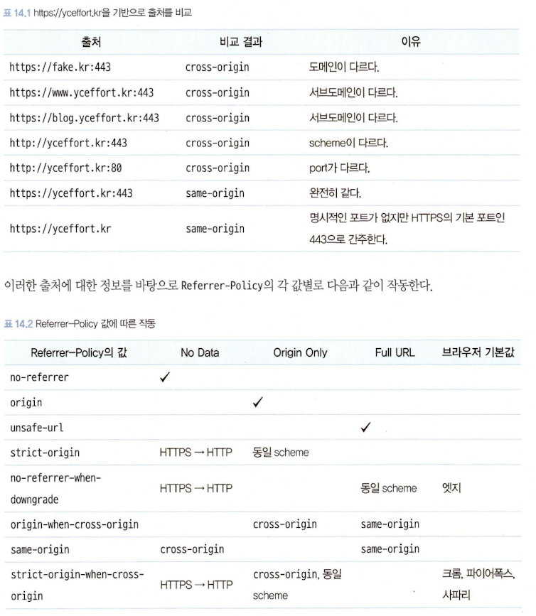

# 14장. 웹사이트 보안을 위한 리액트와 웹페이지 보안 이슈

## XSS(Cross-Site Scripting)

- 웹 애플리케이션에서 가장 많이 보이는 취약점 중 하나
- 웹사이트 개발자가 아닌 제3자가 웹사이트에 악성 스크립트를 삽입해 실행할 수 있는 취약점

### XSS 이슈는 어떻게 발생할 수 있을까?

공통적인 문제는 웹사이트 개발자가 만들지 않은 코드를 삽입한다는 것에 있다.

1. **dangerouslySetInnerHTML prop**
   - 특정 브라우저 DOM의 innerHTML을 특정한 내용으로 교체할 수 있는 방법
   - 오직 \_\_html을 키를 가지고 있는 객체만 인수로 받을 수 있으며, 이 인수로 넘겨받은 문자열을 DOM에 그대로 표시하는 역할을 한다.
   - 그러나 위험성은 dangerouslySetInnerHTML이 인수로 받는 문자열에는 제한이 없다는 것이다.
2. **useRef를 활용한 직접 삽입**
   - DOM에 직접 내용을 삽입할 수 있는 방법으로 useRef가 있다.
   - useRef를 사용하면 직접 DOM에 접근할 수 있으므로 inerHTML에 보안 취약점이 있는 스크립트를 삽입하면 동일한 문제가 발생한다.

### 리액트에서 XSS 문제를 피하는 방법

- 제3자가 삽입할 수 있는 HTML을 안전한 HTML 코드로 한 번 치환하는 것이다. 이러한 과정을 새니타이즈(sanitize) 또는 이스케이프(escape)라고 한다.
- 가장 확실한 방법은 npm에 있는 라이브러리를 사용하는 것이다.
  - DOMpurity
  - sanitize-html
  - js-xss
- `sanitize-html`은 허용할 태그와 목록을 일일히 나열하는 이른바 허용 목록(allow list) 방식을 채택하기 때문에 훨씬 안전하다.
- 허용 목록에 추가하는 것을 깜박한 태그나 속성이 있다면 단순히 HTML이 안 보이는 사소한 이슈로 그치겠지만 차단 목록(block list)으로 해야 할 것을 놓친다면 그 즉시 보안 이슈로 연결되기 때문이다.
- 단순히 보여줄 때뿐만 아니라 사용자가 콘텐츠를 저장할 때도 한 번 이스케이프 과정을 거치는 것이 더 효율적이고 안전하다.
- XSS 위험성이 있는 콘텐츠를 데이터베이스에 저장하지 않는 것이 예기치 못한 위협을 방지하는 데 훨씬 도움이 될 뿐만 아니라, 한 번 이스케이프하면 그 뒤로 보여줄 때마다 일일이 이스케이프 과정을 거치지 않아도 되므로 훨씬 효율적이다.
- 이러한 치환 과정은 되도록 서버에서 수행하는 것이 좋다.
- 따라서 서버는 ‘클라이언트에서 사용자가 입력한 데이터는 일단 의심한다.’라는 자세로 클라이언트의 POST 요청에 있는 HTML을 이스케이프 하는 것이 제일 안전하다.

### 📍 리액트의 JSX 데이터 바인딩

- XSS와 관련해 리액트의 숨겨진 매커니즘이 있다.
- 왜 dangerouslySetInnerHTML이라는 속성이 별도로 존재하는걸까?
- 그 이유는 기본적으로 리액트는 XSS를 방어하기 위해 이스케이프 작업이 존재하기 때문이다.

```jsx
const html = `<span><svg/onload=alert(origin)></span>`;

function App() {
  return <div id={html}>{html}</div>;
}
```

- 만약 리액트가 위 코드를 이스케이프하지 않았다면 svg의 onload가 실행됐을 것이다. 그러나 위 코드는 실행되지 않고
  ```jsx
  <div id="<span><svg/onload=alert(origin)></span>"><span><svg/onload=alert(origin)></span></div>
  ```
  으로 렌더링된다.
- 즉, `<div>{html}</div>`와 같이 HTML에 직접 표시되는 textContent와 HTML 속성값에 대해서는 리액트가 기본적으로 이스케이프 작업을 해주는 것을 알 수 있다.
- 그러나 dangerouslySetInnerHTML이나 props로 넘겨받는 경우 개발자의 활용도에 따라 원본 값이 필요할 수 있기 때문에 이러한 작업이 수행되지 않는다.

## getServerSideProps와 서버 컴포넌트를 주의하자

- 서버에는 일반 사용자에게 노출되면 안되는 정보들이 담겨 있기 때문에 클라이언트, 즉 브라우저에 정보를 내려줄 때는 조심해야 한다.
- getServerSideProps가 반환하는 값 또는 서버 컴포넌트가 클라이언트 컴포넌트에 반환하는 props는 반드시 필요한 값으로만 철저하게 제한되어야 한다.
- 이는 보안 측면의 이점 뿐만 아니라 성능 측면에서도 이점을 가져다 줄 수 있다.
- 이러한 방식의 접근법은 비단 getServerSideProps와 서버 컴포넌트 뿐만 아니라 리덕스에서 서버 사이드에서 가져온 상태로 가져오는 `window.__PRELOADED_STATE__`와 같은 값을 데이터를 초기화할 때도 적용된다.
- `window.__PRELOADED_STATE__`의 값은 XSS에 취약할 수 있기 때문에 반드시 새니타이즈를 거치고, 꼭 필요한 값만 제공해야 한다.

## `<a>` 태그의 값에 적절한 제한을 둬야 한다

- href에 사용자가 입력한 주소를 넣을 수 있다면 이 또한 보안 이슈로 이어질 수 있다.
- 따라서 href로 들어갈 수 있는 값을 제한해야 한다.
- 그리고 피싱 사이트로 이동하는 것을 막기 위해 가능하다면 origin도 확인해 처리하는 것이 좋다.

```jsx
function isSafeHref(href: string) {
  let isSafe = false;
  try {
    // javascript:가 오면 protocol이 javascript:가 된다.
    const url = new URL(href);
    if (["http:", "https:"].includes(url.protocol)) {
      isSafe = true;
    }
  } catch {
    isSafe = false;
  }

  return isSafe;
}

function App() {
  const unsafeHref = "javascript:alert('hello');";
  const safeHref = "https://www.naver.com";
  return (
    <>
      {/* 위험한 href로 분류되어 #이 반환된다. */}
      <a href={isSafeHref(unsafeHref) ? unsafeHref : "#"}>위험한 href</a>
      {/* 안전한 href로 분류되어 원하는 페이지로 이동할 수 있다. */}
      <a href={isSafeHref(safeHref) ? safeHref : "#"}>안전한 href</a>
    </>
  );
}
```

## HTTP 보안 헤더 설정하기

- HTTP 보안 헤더란 브라우저가 렌더링하는 내용과 관련된 보안 취약점을 미연에 방지하기 위해 브라우저와 함께 작동하는 헤더를 의미한다.
- 대표적으로 HTTP 보안 헤더로 무엇이 있는지 먼저 살펴보고, 이를 Next.js 등에 어떻게 적용해 사용할 수 있는지 살펴보자.

### Strict-Transport-Security

- HTTP의 Strict-Transport-Security 응답 헤더는 모든 사이트가 HTTPS를 통해 접근해야 하며, 만약 HTTP로 접근하는 경우 이러한 모든 시도는 HTTPS로 변경되게 한다.
- 사용법은
  ```jsx
  Strict-Transport-Security: max-age=<expire-time>; includeSubDomains
  ```
- `<expire-time>`은 이 설정을 브라우저가 기억해야 하는 시간을 의미하며, 초 단위로 기록된다.
- 이 기간 내에는 HTTP로 사용자가 요청한다 하더라도 브라우저는 이 시간을 기억하고 있다가 자동으로 HTTPS로 요청하게 된다.
- 만약 헤더의 이 시간이 경과하면 HTTP로 로드를 시도한 다음에 응답에 따라 HTTPS로 이동하는 등의 작업을 수행할 것이다.
- 권장값은 2년이다.
- includeSubDomains가 있을 경우 이러한 규칙이 모든 하위 도메인에도 적용된다.

### X-XSS-Protection

- 현재 사파리와 구형 브라우저에서만 제공되는 기능이다.
- XSS 취약점이 발견되면 페이지 로딩을 중단하는 헤더다.

### X-Frame-Options

- 페이지를 frame, iframe, embed, object 내부에서 렌더링을 허용할지를 나타낼 수 있다.
- 예를 들어, 네이버와 비슷한 주소를 가진 페이지가 있고, 이 페이지에서 네이버를 iframe으로 렌더링한다고 가정할 경우, 사용자는 이 페이지를 진짜 네이버로 오해할 수 있고 공격자는 이를 활용해 사용자의 개인정보를 탈취할 수 있다.
- X-Frame-Options는 외부에서 자신의 페이지를 위와 같은 방식으로 삽입되는 것을 막아주는 헤더다.
- `X-Frame-Options : DENY` : 무조건 막는다
- `X-Frame-Options: SAMEORIGIN` : 같은 origin에 대해서만 프레임을 허용한다.

### Permissions-Policy

- 웹사이트에서 사용할 수 있는 기능과 사용할 수 없는 기능을 명시적으로 선언하는 헤더

```jsx
# 모든 geolocaion 사용을 막는다.
Permissions: geolocaion=()

# geolocaion을 페이지 자신과 몇 가지 페이지에 대해서만 허용한다.
Permissions: geolocaion=(self "https://a.yceffort.kr" "https://b.yceffort.kr")
```

### X-Content-Type-Options

- 이 헤더를 이해하려면 MIME이 무엇인지 알아야한다.
- MIME이란 Multipurpose Internet Mail Extensions의 약자로, Content-type의 값으로 사용된다.
- 원래는 메일을 전송할 때 사용하던 인코딩 방식으로, 현재는 Content-type에서 대표적으로 사용되고 있다.
- X-Content-Type-Options란 Content-type 헤더에서 제공하는 MIME 유형이 브라우저에 의해 임의로 변경되지 않게 하는 헤더다.
- 즉, 웹서버가 브라우저에 강제로 이 파일을 읽는 방식을 지정하는 것이 바로 이 헤더다.
- 아래와 같이 헤더를 설정해두면 파일의 타입이 CSS나 MIME이 text/css가 아닌 경우, 혹은 파일 내용이 script나 MIME 타입이 자바스크립트 타입이 아니면 차단하게 된다.
  ```jsx
  X-Content-Type-Options: nosniff
  ```

### Referrer-Policy

- HTTP 요청에는 Referrer라는 헤더가 존재하는데, 이 헤더에는 현재 요청을 보낸 페이지의 주소가 나타난다.
- 이 헤더는 사용자가 어디서 와서 방문 중인지 인식할 수 있는 헤더지만, 반대로 사용자 입장에서는 원치않는 정보가 노출될 위험도 존재한다.
- Referrer-Policy 헤더는 이 Referrer 헤더에서 사용할 수 있는 데이터를 나타낸다.
- Referrer를 이야기할 때 출처(origin)을 빼놓을 수 없다.
- 먼저 https://yceffort.kr 이라는 주소의 출처는 다음과 같이 구성돼 있다.
  - scheme: HTTPS 프로토콜을 의미한다.
  - hostname: `yceffort.kr`이라는 호스트명을 의미한다.
  - port: 443 포트를 의미한다.
- 이 scheme, hostname, port의 조합을 출처라고 한다.
- 그리고 두 주소를 비교할 때 same-origin인지, cross-origin인지는 다음과 같이 구분할 수 있다.
  
- 구글에서는 이용자의 개인정보 보호를 위해 strict-origin-when-cross-origin 혹은 그 이상을 명시적으로 선언해 둘 것을 권고한다.
- 만약 이 값이 설정돼 있지 않다면 브라우저의 기본값으로 작동하게 되어 웹사이트에 접근하는 환경별로 다른 결과를 만들어 내어 혼란을 야기할 수 있으며, 이러한 기본값이 없는 구형 브라우저에서는 Referer 정보가 유출될 수도 있다.

### Content-Security-Policy

- 콘텐츠 보안 정책(Content-Security-Policy, 이하 CSP)는 XSS 공격이나 데이터 삽입 공격과 같은 다양한 보안 위협을 막기 위해 설계됐다.
- \*-src
  - font-src, img-src, script-src 등 다양한 src를 제어할 수 있는 지시문
  - 만약 해당 -src가 선언돼 있찌 않다면 default-src로 한 번에 처리할 수 있다.
  - default-src는 다른 여타 \*-src에 대한 폴백 역할을 한다.
- form-action : 폼 양식으로 제출할 수 있는 URL을 제한할 수 있다.

### 보안 헤더 설정하기

- Next.js

  - 애플리케이션 보안을 위해 HTTP 경로별로 보안 헤더를 적용할 수 있다. 이 설정은 next.config.js에서 다음과 같이 추가할 수 있다.

  ```jsx
  const securityHeaders = [
  	{
  		key: 'key',
  		value: 'value',
  	},
  ]

  module.exports = {
  	async headers() {
  		return [
  			{
  				// 모든 주소에 설정한다.
  				source: '/:path*',
  				headers: securityHeaders.
  			},
  		]
  	},
  }
  ```

  - 여기서 설정할 수 있는 값은 다음과 같다.

    - X-DNS-Prefetch-Control
    - Strict-Transport-Security
    - X-XSS-Protection
    - X-Frame-Options
    - Permissions-Policy
    - X-Content-Type-Options
    - Referrer-Policy
    - Content-Security-Policy: ContentSecurityPolicy의 경우 선언할 수 있는 지시어가 굉장히 많기 때문에 다음과 같이 개별적으로 선언한 이후에 묶어주는 것이 더 편리하다.

      ```jsx
      const ContentSecurityPolicies =[
      	{ key: ’default-src’, value: "'self'" },
      	{ key: ’script-src’, value: "'self'" },
      	{ key: ’child-src’, value: 'example.com' },
      	{ key: ’style-src‘, value: "'self' example.com" },
      	{ key: ’font-src’, value: "'se1f'" },
      ]

      const securityHeaders = [
      	{
      		key: 'Content-Security-Policy',
      		value: ContentSecurityPolicies.map(
      			(item) => `${item.key} ${item.value};`,
      		).join(' '),
      	},
      ]
      ```

- NGINX : 정적인 파일을 제공하는 NGINX의 경우 경로별로 add_header 지시자를 사용해 원하는 응답 헤더를 추가할 수 있다.

### 보안 헤더 확인하기

- 가장 빠른 방법은 보안 헤더의 현황을 알려주는 https://securityheaders.com/ 을 방문하는 것이다.

## 취약점이 있는 패키지의 사용을 피하자

- 깃허브의 Dependabot이 발견한 취약점은 필요하다면 빠르게 업데이트해 조치해야 한다.
- 그리고 이러한 업데이트가 웹사이트의 기능에 문제가 생기지 않도록 적절한 테스트 코드도 준비해야 한다.

## OWASP Top 10

- OWASP은 Open Worldwid (Web) Application Security Project라는 오픈소스 웹 애플리케이션 보안 프로젝트를 의미한다.
- 주로 웨베엇 발생할 수 있는 정보 노출, 악성 스크립트, 보안 취약점 등을 연구하며, 주기적으로 10대 웹 애플리케이션 취약점을 공개하는데 이를 OWASP Top 10이라고 한다.
- 매번 보안 취약점의 빈도에 따라 순위를 매기며, 이 순위는 발표가 있을 때마다 조금씩 바뀐다.

1. A01:2021-Broken Access Control
   - 사용자가 자신의 권한 밖의 행동을 할 수 있는 취약점을 의미한다.
2. A02:2021-Cryptographic Failures
   - ‘민감 데이터 노출’이라는 이름으로 알려졌으나, 이번에 ‘암호화 실패’라는 이름으로 변경됐다.
   - 이를 예방하기 위해서는 HTTP를 HTTPS로 강제로 리다이렉트하는 HSTS(HTTP Strict Transport Security)를 사용하고, 암호화 시 암호문이 고정되지 않도록 해야 하며, 신뢰할 수 있는 인증서를 사용하는 등의 노력이 필요하다.
3. A03:2021-Injection
   - XSS와 같이 사용자가 제공하는 데이터를 조작한 경우를 모두 인젝션(injection)으로 분류한다.
   - XSS에서 소개했던 것처럼 사용자가 입력하는 데이터는 모두 의심하고 바로 사용하지 말고 한 단계 검증을 거친 이후에 사용해야 한다.
4. A04:2021-Insecure Design
   - 코드 구현 단계가 아닌 기획 설계 단계에서 발생한 보안 취약점을 의미한다.
5. A05:2021-Security Misconfiguration
   - 보안 설정 오류는 애플리케이션 설정 시에 잘못된 설정으로 인해 발생하는 취약점을 의미한다.
   - 불필요한 포트를 열어두거나, MySQL과 같은 데이터베이스 마스터 계정을 아이디나 암호 변경 없이 사용하거나, 보안 헤더를 누락하는 등의 잘못된 설정을 의미한다.
   - 애플리케이션을 처음 설치할 때 불필요한 계정이나 샘플, 문서 등을 제거해 두고, 적절한 보안 헤더를 미리 설정해 두는 것이 중요하다.
6. A06:2021-Vulnerable and Outdated Components
   - 취약점이 있거나 지원이 종료된 소프트웨어를 사용하는 경우에 발생하는 보안 취약점
   - 불필요한 소프트웨어는 사전에 미리 제거해두고, 주요 라이브러리는 항상 보안 취약점이 있는지 점검하며 주기적으로 패치 업데이트를 수행해야 한다.
7. A07:2021-Identification and Authentication Failures
   - 사용자의 신원 확인에 실패하거나, 암호 생성 정책이 없는 경우, 무작위 대입으로 암호를 찾을 수 있는 경우, 인증 및 세션 관리가 잘못되어 유출되는 등의 인증 관련 보안 취약점
8. A08:2021-Software and Data Integrity Failures
   - 소프트웨어와 데이터 무결성 오류는 애플리케이션이 신뢰할 수 없는 소스, 저장소, CDN, 플러그인, 라이브러리에 의존하거나 잘못된 CI/CD 파이프라인을 사용하는 경우에 발생한다.
   - 반드시 무결성 검증 절차를 거쳐서 보안 취약점이 발생하지 않도록 사전에 예방해야 한다.
9. A09:2021-Security Logging and Monitoring Failures
   - 보안 로깅 및 모니터링 오류는 주요 기능에 대한 적절한 로깅이 추가돼 있지 않거나 로깅 정보가 부족해 사전에 공격을 감지하지 못하는 취약점을 의미한다.
   - 의심스러운 활동을 사전에 감시할 수 있도록 적절한 형식과 보관 주기로 로깅을 수행해야 하며, 이러한 모니터링은 신속하게 대응할 수 있도록 준비를 갖춰야 한다.
10. A10:2021-Server-Side Request Forgery
    - 서버 측 요청 변조
    - 서버에서 이뤄지는 요청을 변조해 원래 가야 할 서버가 아닌 공격자가 의도한 서버로 요청이 가게 하거나 또는 위조된 요청을 보내는 취약점을 의미한다.

# 15장. 마치며

## 리액트 프로젝트를 시작할 때 고려해야 할 사항

1. 유지보수 중인 서비스라면 리액트 버전을 최소 16.8.6에서 최대 17.0.2로 올려두자
   - 17버전은 새로운 기능 출시 및 호환성이 깨지는 변경 사항을 최소한으로 맞춘 업데이트이다
2. 인터넷 익스플로러 11 지원을 목표로 한다면 각별히 더 주의를 기한다.
   - 인터넷 익스플로러 11을 지원하지 않는 대표적인 라이브러리 : 리액트, Next.js, query-string
3. 서버 사이드 렌더링 애플리케이션을 우선적으로 고려한다.
   - 기본 HTML에 온전히 자바스크립트로 렌더링과 라우팅을 수행하는 싱글 페이지 애플리케이션은 대부분의 경우 라이트하우스와 WebPageTest, 구글 개발자 도구에서 좋은 결과를 얻기 어렵다.
   - 많은 사용자를 감당해야하고, 혹은 그럴 계획이 있다면, 그리고 서버를 준비할 수 있는 충분한 여유가 된다면 시작부터 서버 사이드 렌더링을 고려하는 것이 좋다.
4. 상태 관리 라이브러리는 꼭 필요할 때만 사용한다.
   - 상태 관리 라이브러리가 필요한지 여부란, 다시 말하자면 애플리케이션에서 관리할 상태가 많은지 여부를 말한다.
   - 오히려 상태가 적은 애플리케이션에 상태 관리 라이브러리를 추가하는 것은 되려 부자연스러운 프로젝트 구조를 야기할 수 있으며, 쓸데없이 번들링 크기만 키우는 꼴이 될 수 있다.
5. 리액트 의존성 라이브러리 설치를 조심한다.
   - peerDependencies가 설치하고자 하는 프로젝트의 리액트 버전과 맞는지 확인해야 한다.
   - 이 버전이 맞지 않다면 정상적인 방법으로 설치가 불가능하고, 설령 억지로 설치한다 하더라도 향후 문제를 일으킬 가능성이 크다.

## 언젠가 사라질 수도 있는 리액트

- 리액트는 그래서 정말 완벽한 라이브러리인가? → 반대 입장
  - 클래스형 컴포넌트에서 함수형 컴포넌트로 넘어오면서 느껴지는 혼란
  - 너무 방대한 자유가 주는 혼란
- 웹 개발자로서 가져야할 유연한 자세
  - 최근에는 느린 자바스크립트를 대신할 하나의 방안으로 웹어셈블리(WebAssembly)가 떠오르고 있다.
  - 웹어셈블리는 C, C++, 러스트 같은 시스템 프로그래밍 언어로 작성된 프로그램을 웹에서 사용할 수 있게 해준다.
  - 자바스크립트보다 훨씬 더 빠른 언어로 작성돼 있기 때문에 일반적으로 웹에서 자바스크립트 기반으로 처리하기 어려운 작업을 웹어셈블리를 활용해 처리할 수 있다.
  - 이로 인해 자바스크립트 개발자들 사이에서 러스트를 배우는 것이 유행처럼 떠오르고 있다.
  - 그러나 웹어셈블리는 자바스크립트를 대체하는 것이 아닌, 자바스크립트와 함께 상호 보완적으로 실행되는 도구라고 보는 것이 적절하다. (성능이 필요한 작업은 웹어셈블리로, 그 밖의 일반적인 작업은 자바스크립트로 하는 등)
