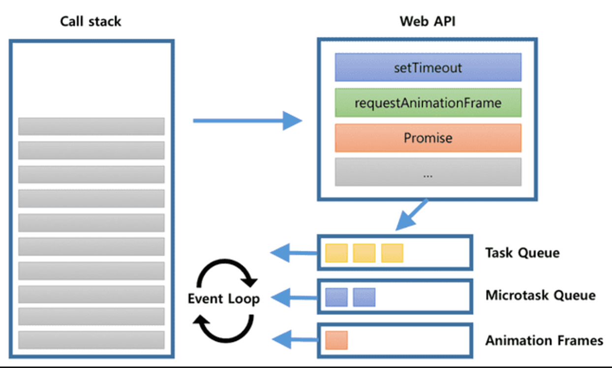

## 1.1 자바스크립트의 동등비교

### 자바스크립트의 데이터 타입

1. 원시타입
   - boolean
   - null
   - undefined
   - number
   - string
   - symbol
   - bigint
2. 객체 타입
   - object

## 1.2 함수

> 작업을 수행하거나 값을 계산하는 등의 과정을 표현하고, 하나의 블록으로 감싸서 실행 단위로 만들어 놓은 것

### 함수 정의 방법

1. 함수 선언문
2. 함수 표현식
   - 함수 표현식에서는 할당하려는 함수의 이름을 생략하는 것이 일반적
     ⇒ 자동으로 변수와 같은 이름으로 함수가 선언됨
3. Function 생성자
4. 화살표 함수
   - 화살표 함수에서의 this는 상위 스코프의 this를 따름

### 다양한 함수들

1. 즉시 실행 함수(IIFE)
   - 함수를 정의하고 그 순간 즉시 실행되는 함수를 의미
2. 고차 함수
   - 함수를 인수로 받거나 결과로 새로운 함수를 반환하는 역할을 하는 함수

### 함수 생성 시 주의사항

- 함수의 부수효과를 최대한 억제하기
- 가능한 한 함수를 작게 만들기
- 누구나 이해할 수 있는 이름을 붙이기

## 1.3 클래스

> 특정한 형태의 객체를 반복적으로 만들기 위해 사용되는 것

### constructor

- 인스턴스 객체를 생성하고 초기화 하는 메서드

### property

- 클래스로 인스턴스를 생성할 때 내부에 정의할 수 있는 속성값

### getter / setter

1. getter
   - 클래스에서 무언가 값을 가져올 때 사용
   - get을 앞에 붙어여 사용하며, 뒤이어 getter의 이름을 선언해야 함
2. setter
   - 클래스 필드에 값을 할당할 때 사용
   - set이란 키워드를 선언한 후 그 뒤를 이어서 이름 붙이기

### **Instance method**

- 클래스 내부에서 선언한 메서드
  ⇒ JS의 prototype에 선언되므로 프로토타입 메서드로 불리기도 함

```jsx
Exam ex = new Exam();
ex.example = "예시";
```

### **Static method**

- 클래스의 인스턴스가 아닌 이름으로 호출할 수 있는 메서드

```jsx
Math.random();
```

### extends

- 기존 클래스를 상속 받아서 자식 클래스에서 상속받은 클래스를 기반으로 확장하는 개념

## 1.4 클로저

> 상위 스코프의 식별자를 참조하는 하위 스코프가 외부에서 지속적으로 참조되어 상위스코프보다 더 오래 살아있는 것

```jsx
function outerFunction() {
	var x = ’hello’;
	function innerFunction() {
		console.log (x);
	}

	return innerFunction;
}

const innerFunction = outerFunction();
innerFunction(); // "hello"
```

### 변수의 유효 범위, 스코프

1. 전역 스코프
   - 전역 레벨에 선언하는 것
   - 해당 스코프에 변수를 선언하면 어디서든 호출 가능
2. 함수 스코프
   - JS는 기본적으로 함수 레벨 스코프를 따름
   - `{}` 블록이 스코프 범위를 결정하지 않음

### 리액트에서의 클로저

- useState

  - 대표적인 클로저 사용 훅

  ```jsx
  function Component() {
    const [state, setState] = useState();

    function handleClick() {
      // useState 호출은 위에서 끝났지만，
      // setState는 계속 내부의 최신값(prev)을 알고 있다.
      // 이는 클로저를 활용했기 때문에 가능하다.
      setState((prev) => prev + 1);
    }

    //...
  }
  ```

### 주의 사항

- 외부 함수를 기억하고 이를 내부 함수에서 가져다 쓰는 메커니즘은 성능에 영향을 미침
  ⇒ 꼭 필요한 작업만 남겨두지 않는다면 메모리를 불필요하게 잡아먹는 결과 야기
  ⇒ 적절한 스코프로 가둬두지 않는다면 성능에 악영향을 미침

## 1.5 이벤트 루프와 비동기 통신의 이해

- 동기
  - 한번에 하나의 함수만 실행
    → 하나의 함수가 실행되는 동안 나머지는 blocking
  - 싱글스레드, 싱글 프로세스
- 비동기
  - 한번에 여러 개의 함수 실행
    → I/O를 수행하는 비동기 함수는 background에 넘김(Non-blocking)
  - 싱글스레드, 멀티 프로세스
  - 스레드가 실행되고 있을 때 다른 작업을 실행할 수 있는 것

### 이벤트 루프



- JS 엔진 내부에서 비동기 요청을 처리하진 않음 → 콜 스택에 들어오는 요청을 순차적으로 처리하는 역할
- 비동기 요청은 런타임 환경(브라우저, Node.js)에서 제공하는 Web API가 처리하게 됨

**동작 과정**

1. 콜 스택에 현재 실행 중인 컨텍스트가 있는지, 테스크 큐에 대기 중인 함수가 있는지 반복하며 확인
2. 만약 콜 스택이 비어있고, 테스크 큐에 대기중인 함수가 있다면 순차적으로 콜스택으로 이동 후 실행
3. 테스크 큐와 마이크로 테스크 큐에 대기 중인 함수가 있다면, 마이크로 테스크 큐를 우선적으로 처리 후 테스크 큐 처리

**Web API**

- 비동기 작업을 처리하기 위해 브라우저가 제공하는 API
- 처리 가능한 비동기 작업들: DOM, AJAX, Timer
- 브라우저는 Web API의 비동기 작업을 JS 엔진과 별개의 스레드에 위임
- 해당 스레드가 비동기 작업을 완료하면 함께 전달받은 콜백함수를 콜백 큐에 넣음

**콜백 큐(Callback Queue)**

- Web API에서 비동기 작업이 처리된 후의 콜백 함수가 보관되는 영역
- 이벤트 루프 과정을 통해 콜백 함수들을 호출 스택으로 전달하기도 합니다.
- 우선순위 : **Microtask Queue > Animation Frames > Task Queue (브라우저마다 다를 수 있음)**

  **1. Task Queue**

  - **Timer 관련 비동기 콜백 함수**들이 저장
    - setTimeout()
    - setInterval()
    - setImmediate()
  - 이벤트 루프의 우선순위는 가장 낮음

  **2. Microtask Queue (Job Queue)**

  - **Promise 등의 비동기 콜백 함수**들이 저장
    - Promise
    - async / await
    - process.nextTick
    - Object.observe
    - MutationObserver
  - 이벤트 루프의 우선순위는 가장 높음

## 1.6 리액트에서 자주 사용하는 자바스크립트 문법

### 구조 분해 할당

- 배열 또는 객체의 값을 분해해 개별 변수에 즉시 할당하는 것을 의미

```jsx
//배열 구조 분해 할당

const array = [1, 2, 3, 4, 5];
const [first, second, third, ...arrayRest] = array;
// first 1
// second 2
// third 3
// arrayRest [4, 5]
-------------------
//객체 구조 분해 할당

const object ={
	a: 1,
	b: 1,
	c: 1,
	d: 1,
	e: 1,
};

const { a, b, c, ...objectRest } = object;
// a 1
// b 2
// c 3
// objectRest = {d: 1, e: 1}
```

### 전개 구문

- 배열, 객체, 문자열과 같이 순회할 수 있는 값에 대해 전개해 간결하게 사용할 수 있는 구문

```jsx
// 배열 전개 구문
const arr1 =[’a’, ’b’];
const arr2 [...arr1, 'c' 'd', 'e']; //[’a’, ’b’, ’c’, ’d’, ’e’]

//객체의 전개 구문
const obj1 = {
	a: 1,
	b: 2,
};

const obj2 ={
	c: 3,
	d: 4,
};

const newObj = { ...obj1, ...obj2 };
// { "a": 1, "b": 2, "c": 3, "d": 4 }
```

### 객체 초기자

- 객체 선언 시, 넣고자 하는 키와 값을 가지고 있는 변수가 존재한다면 값을 간결하게 넣는 방식

```jsx
const a = 1;
const b = 2;
const obj = {
  a,
  b,
};
// {a: 1, b: 2}
```

## 1.7 선택이 아닌 필수, 타입스크립트

> JS에 타입을 부여한 언어로, JS의 확장된 언어로 볼 수 있음

### 제네릭

- 함수나 클래스 내부에서 단일 타입이 아닌 다양한 타입에 대응할 수 있도록 도와주는 것
  ⇒ 선언 시점이 아닌 생성 시점에 타입을 명시하여 하나의 타입만이 아닌 다양한 타입 사용 가능

```jsx
function a<Type>(arg: Type): Type {
  return arg;
}

let myIdentity: <Type>(arg: Type) => Type = a;
```

### 인덱스 시그니처

- 객체의 키를 정의하는 방식

  ```jsx
  type Hello = {
  	//인덱스 시그니처
  	[key: string]: string
  }

  const hello: Hello = {
  	hello: ’hello',
  	hi: ’hi',
  }

  hello[’hi’] // hi
  hello[’안녕'] // undefined
  ```
