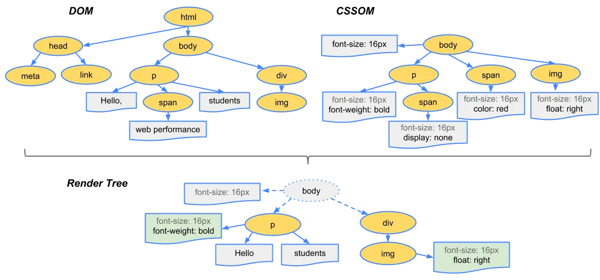
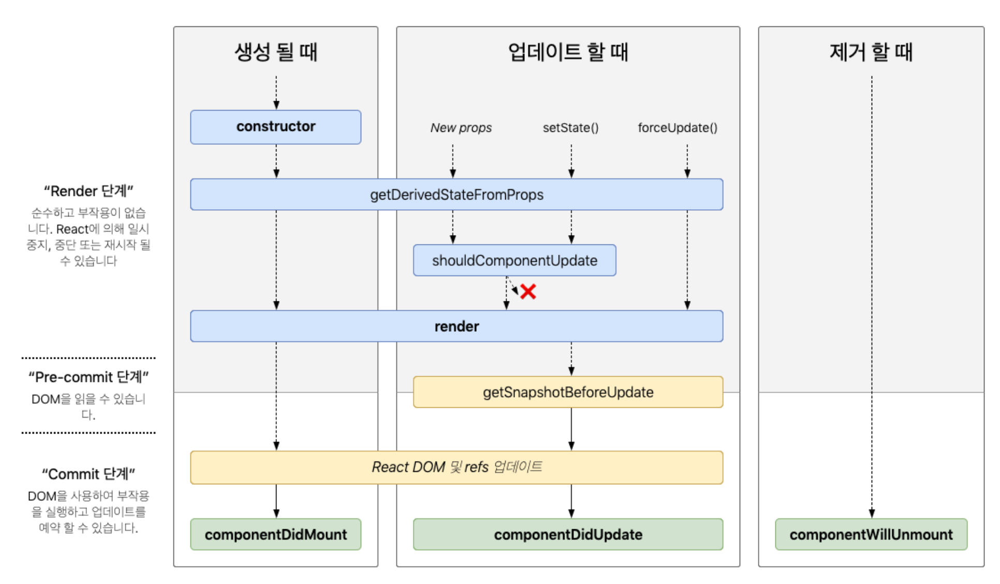

# 2장. 리액트 핵심 요소 깊게 살펴보기

## 2.1 JSX란?

> Javascript Syntax eXtension로 JavaScript의 확장된 문법
> `JSXElement`, `JSXAttributes`, `JSXChildren`, `JSXStrings`라는 4가지 컴포넌트를 기반으로 구성

### JSXElement

- JSX를 구성하는 가장 기본 요소로 HTML의 요소와 비슷한 역할
- JSXElement가 되기 위해서는 `JSXOpeningElement,` `JSXClosingElement`, `JSXSelfClosingElement`, `JSXFragment` 중 하나여야 함

### JSXElemntName

- JSXElement의 요소 이름으로 사용할 수 있는 것을 의미
- 숫자로 시작하거나 `$`와`_` 외의 다른 특수문자로는 불가능

### JSXAttributes

- JSXElement에 부여할 수 있는 속성
- JSXSpreadAttributes : 자바스크립트의 전개 연산자와 동일한 역할
- JSXAttribute : 키와 값으로 짝을 이루어서 표현한다.

### JSXChildren

- JSXElement의 자식값을 나타냄

### JSXStrings

- HTML에서 사용 가능한 문자열은 모두 가능
- 현재의 JSX는 HTML처럼 `\`을 문자열로 처리하지 않음

### JS에서 JSX로 변환되는 방법

- JSXElement를 첫 번쨰 인수로 선언해 요소 정의
- 옵셔널인 JSXChildren, JSXAttributes, JSXStrings는 이후 인수로 넘겨주어 처리

## 2.2 가상 DOM과 리액트 파이버

### DOM과 브라우저 렌더링 과정

> DOM이란 웹페이지에 대한 인터페이스오 브라우저가 웹페이지의 콘텐츠와 구조를 어떻게 보여줄지에 대한 정보를 담고 있는 것

**브라우저 단계 요약**

1. HTML 마크업을 처리하고 DOM 트리를 빌드
2. CSS 마크업을 처리하고 CSSOM 트리를 빌드
3. DOM 및 CSSOM을 렌더링 트리로 결합
4. 렌더링 트리에서 레이아웃을 실행하여 각 노드의 도형을 계산
5. 개별 노드를 화면에 페인팅

### 가상 DOM

- 웹페이지가 표시해야 할 DOM을 메모리에 저장하고 리액트가 실제 변경에 대한 준비가 완료됐을 때 실제 브라우저 DOM에 반영

  ⇒ 메모리에서 계산하는 과정을 한 번 거치게 된다면, 실제로 여러 번 발생했을 렌더링 과정을 최소화할 수 있고 브라우저와 개발자의 부담을 덜 수 있음

### 리액트 파이버

> 가상 DOM과 렌더링 과정 최적화를 가능하게 해주는 것

- 파이버 재조정자(fiber reconciler)가 관리하며 가상 DOM과 실제 DOM을 비교해 차이가 있으면 파이버를 기준으로 화면에 렌더링 요청

## 2.3 클래스형 컴포넌트와 함수형 컴포넌트

### 클래스형 컴포넌트의 생명주기 메서드

- 마운트(mount): 컴포넌트가 마운팅(생성)되는 시점
- 업데이트(update): 이미 생성된 컴포넌트의 내용이 변경(업데이트)되는 시점
- 언마운트(unmount): 컴포넌트가 더 이상 존재하지 않는 시점

### render()

- 생명주기 메서드 중 하나로 리액트 클래스형 컴포넌트의 필수값
- 컴포넌트가 UI를 렌더링 하기 위해 사용
- 마운트와 업데이트 과정에서 일어남
- 항상 순수해야하며, 부수 효과가 없어야 함

  ⇒ 같은 입력값(props or state)이 들어가면 항상 같은 결괌루을 반환해야 함

### **componentDidMount()**

- 컴포넌트가 마운트되고 준비되는 즉시 실행

  ⇒ state를 변경했다면 state가 변경되고 그 즉시 다시 한번 리렌더링을 시도

- 성능 문제를 일으킬 수 있음

### **componentDidUpdate()**

- 컴포넌트 업데이트가 일어난 이후 바로 실행

### **componentWillUnMount()**

- 컴포넌트가 언마운트되거나 더 이상 사용되지 않기 직전에 호출
  ⇒ this.setState 호출 불가

### **shouldComponentUpdate()**

- state, props의 변경으로 리렌더링 되는 것을 막고 싶을 때 해당 생명주기 메서드 사용

### **static getDerivedStateFormProps()**

- render를 호출하기 직전에 호출
- 반환되는 객체는 해당 객체의 내용이 모두 state로 들어가게 됨

### **getSnapShotBeforeUpdate()**

- DOM이 업데이트되기 직전에 호출
- `componenWillUpdate()`를 대체할 수 있는 메서드
- 윈도우 크기 조절, 스크롤 위치 조정하는 등의 작업을 처리하는 데 유용

### **getDerivedStateFromError()**

- 에러가 발생했을 때 호출되는 에러 메서드
- 해당 메서드를 사용해서 에러 처리 로직을 구현 가능

  ⇒ 렌더링 과정에서 호출되는 메서드라 부수 효과를 발생시켜선 안됨(에러 로깅 등 불가)

### **componentDidCatch()**

- 에러가 발생했을 때 실행
- `getDerivedStateFromError()`에서 에러를 잡고 state를 결정한 이후에 실행

### 클래스형 컴포넌트의 한계

- 데이터의 흐름을 추적하기 어려움

  ⇒ 코드를 읽는 과정에서 state가 어떤 식의 흐름으로 변경되어 렌더링이 일어나는지 일어나지 않는지 판단하기 어려움

- 애플리케이션 내부 로직의 재사용이 어려움

  ⇒ 공통 로직이 많아질수록 이를 감싸는 고차 컴포넌트 혹은 props가 많아지는 wrapper hell에 빠져들 위험성이 커짐

- 기능이 많아질수록 컴포넌트의 크기가 커짐
- 클래스는 함수에 비해 상대적으로 어려움
- 코드 크기를 최적화하기 어려움
- 핫 리로딩을 하는데 상대적으로 불리함

  ⇒ 핫 리로딩이란 코드에 변경사항이 발생했을 때 앱을 다시 시작하지 않고서도 해당 변경된 코드만 업데이트해 변경 사항을 빠르게 적용하는 기법

### 함수형 컴포넌트 vs. 클래스형 컴포넌트

- 생명주기 메서드의 부재

  ⇒ 클래스형 컴포넌트의 생명주기 메서드가 함수형에서는 존재하지 않음

- 함수형 컴포넌트와 렌더링된 값

  ⇒ 클래스형 컴포넌트는 props의 값을 항상 this로 가져오지만(불변 값)
  this가 가르키는 객체는 변경 가능한 값임(mutable)

## 2.4 렌더링은 어떻게 일어나는가?

### 리액트의 렌더링이란?

- 브라우저가 렌더링에 필요한 DOM 트리를 만드는 과정을 의미

### 리액트의 렌더링이 일어나는 이유

1. 초기 렌더링
2. 리렌더링

   - setState
   - forceUpdate

     ⇒ `render` 내에서 `forceUpdate()`가 사용되면 무한 루프에 빠지므로 render 내부에서 사용하지 말아야 함

   - useState()의 setter
   - useReducer()의 dispatch
   - key props의 변경

### 렌더와 커밋

- **렌더(Render)**

  - 컴포넌트를 렌더링하고 변경사항을 계산하는 모든 작업

    ⇒ 렌더링 프로세스에서 컴포넌트를 실행하여 해당 결과와 이전 가상 DOM을 비교하는 과정을 거쳐 변경이 필요한 컴포넌트 체크

  - 비교하는 것은 크게 `type, props, key`로 세 가지 중 하나라도 변경된 것이 있으면 변경이 필요한 컴포넌트로 체크해둠

- **컴포넌트를 렌더링 하는 작업은 별도로 렌더링을 피하기 위한 조치가 돼 있지 않는 한 하위 모든 컴포넌트에 영향을 미침**

  ⇒ 부모가 변경됐다면 props가 변경됐는지와 상관없이 무조건 자식 컴포넌트도 리렌더링
