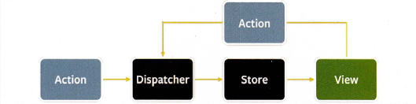

## 4장. 서버 사이드 렌더링

### SPA vs SSR

- SPA
  - 렌더링과 라우팅에 필요한 대부분의 기능을 서버가 아닌 브라우저의 자바스크립트에 의존하는 방식
  - 최초에 서버에서 최소한의 데이터를 불러온 이후로부터는 이미 가지고 있는 자바스크립트 리소스와 브라우저 API를 기반으로 모든 작동이 이뤄짐
  - JAM(JavaScript, API, Makup) 스택 등장 ⇒ 서버 확장성 문제에서 자유로워짐
  - 장점 : 훌륭한 사용자 경험 제공 ← 한 번 로딩된 이후에는 서버를 거쳐 필요한 리소스를 받아올 일이 적어지기 때문
  - 단점 : 최초에 로딩해야 할 자바스크립트 리소스가 커짐
- SSR
  - 최초에 사용자에게 보여줄 페이지를 서버에서 렌더링해 빠르게 사용자에게 화면을 제공하는 방식
  - 장점
    - 최초 페이지 진입이 비교적 빠름
    - 검색 엔진과 SNS 공유 등 메타데이터 제공이 쉬움
    - 누적 레이아웃 이동이 적음 : 사용자가 예상치 못한 시점에서 페이지가 변경되어 불편을 초래하는 것
    - 사용자의 디바이스 성능에 비교적 자유로움
    - 좀 더 안전한 보안
  - 단점
    - 소스코드를 작성할 때 항상 서버를 고려해야 함
    - 적절한 서버가 구축돼 있어야 함
    - 서비스 지연에 따른 문제

### SSR을 위한 리액트 API

- **renderToString**
  - 서버 사이드 렌더링을 구현하는 데 가장 기초적인 API
  - 인수로 넘겨받은 리액트 컴포넌트를 렌더링해 HTML 문자열로 반환하는 함수
  - 뛰어난 초기 렌더링 성능 ← 먼저 완성된 HTML을 서버에서 제공할 수 있으므로
  - 검색 엔진과 SNS 공유 등 메타데이터 제공이 쉬움
  - data-reactroot : hydrate 함수에서 루트를 식별하는 기준점이 됨
- **renderToStaticMarkup**
  - renderToString 함수와 유사하지만, 리액트에서만 사용하는 추가적인 DOM 속성을 만들지 않는다는 차이가 있음
  - 리액트의 이벤트 리스너가 필요 없는 완전히 순수한 HTML을 만들 때만 사용됨
- **renderToNodeStream**
  - renderToString과 결과물이 완전히 동일
  - renderToString과 달리 브라우저에서 사용 불가능
  - 결과물의 타입이 ReadableStream으로 Node.js에서만 사용 가능
  - 스트림 : 큰 데이터를 다룰 때 데이터를 청크(chunk, 작은 단위)로 분할해 조금씩 가져오는 방식
- **renderToStaticNodeStream**
  - renderToNodeStream과 제공하는 결과물은 동일하나, 리액트 자바스크립트에 필요한 속성이 제공되지 않음
- **hydrate**
  - renderToString과 renderToNodeStream으로 생성된 HTML 콘텐츠에 자바스크립트 핸들러나 이벤트를 붙이는 역할
  - reder와 인수를 넘기는 방식이 유사함
  - 이미 렌더링된 HTML을 기준으로 이벤트를 붙이는 작업만 실행 ↔ render : 빈 HTML에 정보를 렌더링
  - 서버에서 완성한 HTML과 하이드레이션 대상이 되는 HTML의 결과물이 동일한지 비교하며 렌더링 진행

---

### Next.js

- **Next.js의 \_app.tsx과 \_document.tsx의 차이**

|                          **\_app.tsx**                           |                           **\_document.tsx**                           |
| :--------------------------------------------------------------: | :--------------------------------------------------------------------: |
| Next.js를 초기화하는 파일로, Next.js 설정과 관련된 코드를 모아둠 | Next.js로 만드는 웹사이트의 뼈대가 되는 HTML 설정과 관련된 코드를 추가 |
|        경우에 따라 서버와 클라이언트 모두에서 렌더링 가능        |                       반드시 서버에서만 렌더링됨                       |
|              ⇒ 이벤트 핸들러를 추가하는 것은 불가능              |

- **next의 SSR과 CSR**
  - 서버 라우팅 : 최초 페이지 렌더링이 서버에서 수행됨
  - 클라이언트 라우팅 : 내부 페이지 이동 방식
    - a 태그 대신 next/link를 통한 페이지 이동
    - window.location.push 대신 router.push 사용
- **Data Fetching**

  - pages/ 폴더에 있는 라우팅이 되는 파일만 사용할 수 있음
  - 예약어로 지정되어 반드시 정해진 함수명으로 export를 사용해 함수를 파일 외부로 내보냄
  - 서버에서 미리 필요한 페이지를 만들어 제공 가능
  - 해당 페이지에서 요청이 있을 때마다 서버에서 데이터를 조회해 미리 페이지를 만들어 제공할 수 있음

---

## 5장. 리액트와 상태 관리 라이브러리

### 상태 관리는 왜 필요한가?

**Flux 패턴의 등장**

- 양방향 데이터 바인딩으로 인한 상태 변경 코드 추적이 어려움을 문제의 원인으로 판단, 단방향 데이터 바인딩 방식 도입
- `action` : 어떠한 작업을 처리할 액션과 그 액션 발생 시에 함께 포함시킬 데이터
- `dispatcher` : 액션을 스토어에 보내는 역할
- `store` : 액션의 타입에 따라 값을 어떻게 변경할지가 정의됨
- `view` : 스토어에서 만들어진 데이터를 가져와 화면을 렌더링

**Redux**

- Flux 구조를 구현한 라이브러리로, 데이터의 흐름을 단방향으로 강제함
- ELM 아키텍처 도입 : `model`, `view`, `update`
- 하나의 상태 객체를 스토어에 저장해두고, 이 객체를 업데이트하는 작업을 디스패치해 업데이트를 수행함
- props-drilling 문제 해결
- 하고자 하는 일에 비해 보일러플레이트가 너무 많다는 단점이 존재

**Context API**

- props-drilling 문제를 해결하고 싶지만, Redux의 보일러플레이트가 부담스러워 등장하게 된 기능
- 상태 주입을 도와주는 기능(상태관리X)으로, 렌더링을 막아주는 기능이 존재하지 않음

**React Query, SWR**

- HTTP 요청에 특화된 상태 관리 라이브러리

**Recoil, Zustand, Jotai, Vatio**

- 훅을 활용해 작은 크기의 상태를 효율적으로 관리

### 리액트 훅으로 시작하는 상태관리

- **useState와 useReducer** : `지역 상태`로, 해당 컴포넌트 내에서만 유효하다는 한계 존재

- **Recoil**

  - atom(최소한의 상태 단위)은 key 값을 필수로 가짐

  - selector 함수를 사용해, 한 개 이상의 atom 값을 바탕으로 새로운 값을 조립할 수 있음
- **Jotai**
  - 작은 단위의 상태를 위로 전파하는 구조
  - Recoil의 한계를 보완한 라이브러리
    - Recoil의 atom 개념을 도입하면서도 API가 간결
    - Recoil과 달리 selector 함수 없이도 atom만으로 또 다른 파생된 atom 생성 가능
    - 타입이 잘 지원되며, 리액트 18의 변경된 API를 원활하게 지원
  - atom 생성 시, 별도의 key를 넘겨주지 않음 (객체를 키로 활용하는 WeakMap 방식 활용)
- **Justand**
  - 하나의 스토어를 중앙 집중형으로 활용해 스토어 내부에서 상태를 관리 (리덕스와 비슷)
  - partial : state의 일부분만 변경하고 싶을 때 사용
  - replace : state를 완전히 새로운 값으로 변경하고 싶을 때 사용
  - API가 복잡하지 않고 사용이 간단헤 쉽게 접근할 수 있음
