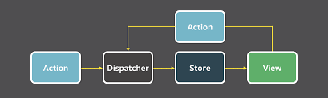

# 04. 서버 사이드 렌더링

## 4.1 서버 사이드 렌더링이란?

### 싱글 페이지 애플리케이션의 세상(SPA)

> 렌더링과 라우팅에 필요한 대부분의 기능을 서버가 아닌 브라우저의 JS 에 의존하는 방식

- 서버에서 HTML 을 내려 받지 않고, 하나의 페이지에서 모든 작업을 처리하는 방식
- 최초에 리소스할 JS가 크지만, 한번 로딩 된 이후에는 서버를 거쳐 필요한 리소스를 받아올 일이 적어, 훌륭한 UI/UX 제공 가능

**전통적인 방식의 어플리케이션과 싱글 페이지 어플리케이션의 작동 비교**

- 전통적 방식: 페이지 전환 시 서버에서 다시 요청하여 새로 그리기에 부자연스러운 모습
- 싱글 페이지: 최초 한번 리소스를 다운 받으면 페이지 전환 시 추가 다운로드 없이 페이지 전환이 일어나므로 더욱 매끄러움 (ex. Gmail 페이지)

### 서버 사이드 렌더링(SSR)이란?

**서버 사이드 렌더링의 장점**

1. 최초 페이지 진입이 비교적 빠르다

   - 사용자가 최초 페이지에 진입했을 때 페이지에 유의미한 정보가 그려지는 시간(First Contentful Paint)이 더 빨라질 수 있음

     ⇒ 서버가 사용자에게 렌더링을 제공할 수 있을 정도의 충분한 리소스가 확보돼 있다는 일반적인 가정 하에 비교한 것

2. 검색 엔진과 SNS 공유 등 메타 데이터 제공이 쉽다
   - 검색 엔진에 제공할 정보를 서버에서 가공해서 HTML 답으로 제공할 수 있으므로 검색 엔진 최적화에 대응하기가 매우 용이
3. 누적 레이아웃 이동이 적다

   - **누적 레이아웃 이동이란?**

     사용자에게 페이지를 보여준 이후 뒤늦게 어떤 HTML 정보가 추가되거나 삭제되어 마치 화면이 덜컥거리는 듯한 부정적인 UX

4. 사용자의 디바이스 성능에 비교적 자유롭다
   - JS 리소스 실행은 사용자의 디바이스에서만 실행되므로 절대적으로 사용자 디바이스 성능에 의존적
   - SSR 수행 시 부담을 서버에 나눌 수 있음
5. 보안에 좀 더 안전하다
   - 인증 혹은 민감한 작업을 서버에서 수행하고 결과만 브라우저에 제공해 보안 위협을 피할 수 있음

**서버 사이드 렌더링의 단점**

1. 소스코드 작성 시 항상 서버를 고려해야 한다
   - `window` 객체 또는 `sessionStorage` 과 같이 브라우저에만 있는 객체 사용이 제한
   - 외부 의존 라이브러리 또한 서버에 대한 고려가 필요
2. 적절한 서버가 구축돼 있어야 한다
3. 서비스 지연에 따른 문제
   - SPA는 지연 시 ‘로딩 중’과 같은 작업이 진행중임을 안내
   - SSR은 지연 시 어떠한 정보도 제공이 불가하므로 부정적인 UX 제공 가능

### SPA와 SSR을 모두 알아야 하는 이유

**SSR 역시 만능이 아니다**

- 잘못된 웹페이지 설계는 오히려 성능을 해칠 수 있음

  ⇒ 서버와 클라이언트 두 군데 모두 관리 포인트만 늘어나는 역효과를 낳을 수 있음

- 웹페이지의 설계와 목적, 우선순위에 따라 SPA가 효과적일 수도 있음

**SPA 와 SSR 어플리케이션**

1. 가장 뛰어난 SPA는 SSR로 생성되는 MPA(Multi Page Application) 보다 낫다

   - 최초 렌더링 부분만 최적화하여 보여주고, 나머지는 게으른 로딩으로 렌더링 하도록 처리

     ⇒ 뛰어난 성능과 매끄러운 사용자 경험 제공 가능

2. 평균적인 SPA는 MPA보다 느리다
   - 성능 최적화가 안된 SPA는 서버에서 빠르게 렌더링이 되는 MPA보다 느릴 가능성이 높음
   - MPA 라우팅으로 인한 문제를 해결하기 위한 API
     - 페인트 홀딩(Paint Holding) : 같은 출처의 라우팅은 새로운 화면을 그릴 때 빈 화면이 아닌 이전 페이지의 모습을 잠깐 보여주는 방법
     - Back Forward Cache(BFCache) : 브라우저 앞, 뒤로 가기 실행 시 캐시에 저장된 페이지를 보여주는 기법
     - Shared Element Transitions : 페이지 라우팅 발생 시, 동일 요소는 콘텍스트를 유지하여 부드럽게 보여주는 기법

**현재의 SSR**

- 최초 웹사이트 진입 시 SSR 방식으로 서버에 완성된 HTML을 제공받은 후, 라우팅에서 서버에서 내려받은 JS를 바탕으로 SPA처럼 작동

## 4.2 서버 사이드 렌더링을 위한 리액트 API 살펴보기

### [renderToString](https://react.dev/reference/react-dom/server/renderToString)

> 리액트 컴포넌트를 랜더링해 HTML 문자열로 반환하는 함수로 가장 기초적인 SSR API

```jsx
import { renderToString } from 'react-dom/server';

const html = renderToString(<MyIcon />);
console.log(html); // For example, "<svg>...</svg>"
```

### [renderToStaticMarkup](https://react.dev/reference/react-dom/server/renderToStaticMarkup)

> 리액트 컴포넌트를 HTML 로 만드는 renderToString 과 매우 유사한 함수

- 리액트에서만 사용하는 추가적인 속성(ex. `data-reactroot`)을 만들지 않음
  ⇒ HTML의 크기를 줄일 수 있음
- **useEffect 와 같은 브라우저 API 사용이 불가능**

```jsx
import { renderToStaticMarkup } from 'react-dom/server';

// The route handler syntax depends on your backend framework
app.use('/', (request, response) => {
  const html = renderToStaticMarkup(<Page />);
  response.send(html);
});
```

### [renderToNodeStream](https://react.dev/reference/react-dom/server/renderToNodeStream)

> `renderToString`과 동일한 결과물을 만들어내지만 두가지 차이가 존재

1. 브라우저에서 사용이 불가능
2. 결과물의 타입이 string 이 아닌 Node.js의 `ReadableStream로` 만들어짐

- 대부분 널리 알려진 리액트 SSR 프레임워크는 해당 API 를 채택

### [renderToStaticNodeStream](https://react.dev/reference/react-dom/server/renderToStaticNodeStream)

> `renderToNodeStream`의 결과물과 동일하나 리액트 JS 에 필요한 속성에 제공되지 않음

### [hydrate](https://react.dev/reference/react-dom/hydrate)

> `renderToString`, `renderToNodeStream`로 생성된 HTML 컨텐츠에 JS 핸들러나 이벤트를 붙이는 역할

- 공식문서에 따르면 해당 API는 React의 주요 버전에서 제거될 예정이라 함
  ⇒ React 18에서 `hydrateRoot`로 대체 됨

## Next.js 톺아보기

### Next.js 란?

> Vercel에서 만든 리액트 기반 풀스택 프레임 워크

### Next.js 시작하기

- `npx create-next-app@latest --ts` 명령어로 프로젝트 생성(ts 버전)

### Data Fetching

**getStaticPaths 와 getStaticProps**

> 어떠한 페이지를 CMS(Contents Management System)나 블로그, 게시판과 같이 사용자와 관계없이 정적으로 결정된 페이지를 보여주고자 할 때 사용되는 함수

- 정적인 데이터만 제공하는 블로그 글, 약관 등을 빠르게 제공하는데 사용이 가능하다

```tsx
import { GetStaticPaths, GetStaticProps } from 'next';

export const getStaticPaths: GetStaticPaths = async () => {
  return {
    paths: [{ params: { id: '1' } }, { params: { id: '2' } }],
    fallback: false,
  };
};

export const getStaticProps: GetStaticProps = async ({ params }) => {
  const { id } = params;
  const post = await fetchPost(id);
  return {
    props: { post },
  };
};

export default function Post({ post }: { post: Post }) {
  // post로 페이지를 렌더링한다.
}
```

**getServerSideProps**

> 서버에서 실행되는 함수로 무조건 페이지 진입 전에 함수를 실행

- 응답값에 따라 페이지의 루트 컴포넌트에 props를 반환할 수도, 다른 페이지로 리다이렉트 시킬 수 있음
- 사용자가 매 페이지를 호출할때마다 실행되고 이 실행이 끝나기 전까지는 사용자에게 어떠한 HTML도 보여줄 수 없음

```tsx
export const getServerSideProps: GetServerSideProps = async (context) => {
  const {
    query: { id = '' },
  } = context const post = await fetchPost(id.toString());

  if (!post) {
    redirect: {
      destination: '/404'
    }
  }

  return {
    props: { post },
  }
}

```

**getInitialProps**

> `getStaticProps`, `getServerSideProps`가 나오지 전의 유일한 수단

- 대부분의 경우에는 `getStaticProps`, `getServerSideProps` 를 사용을 권장

### 스타일 적용하기

**전역 스타일**

- `\_app.tsx` 에 적용

**컴포넌트 레벨 CSS**

- [name].moudule.css 같은 명명 규칙만 준수하기

**SCSS 와 SASS**

- 기존과 동일하게 사용 가능

**CSS-in-JS**

- JS 내부에 스타일시트를 삽입하는 방법

### next.config.js 살펴보기

**bathPath**

- 기본 주소에 원하는 주소를 추가하는 기능

**swcMinifiy**

- swc를 이용해 코드 압축 여부 설정

**poweredByHeader**

- 응답 헤더에 next 관련 헤더를 넣을지 말지 결정하는 옵션
- 보안 관련해서는 끄는 것을 추천

**redirects**

- 특정 주소를 다른 주소로 보내고 싶을 때 사용, 정규식 지원

**reactStrictMode**

- 리액트에서 제공하는 엄격 모드 설정 여부

**assetPrefix**

- 빌드 결과물을 동일한 호스트가 아닌 다른 CDN에 업로드하고자 할 때 해당 부분에 CDN 주소 명시

# 05. 리액트와 상태관리 라이브러리

## 5.1 상태 관리는 왜 필요한가?

- 상태는 어떠한 의미를 지닌 값이면 애플리케이션의 시나리오에 따라 지속적으로 변경될 수 있는 값
- UI : 상호 작용이 가능한 모든 요소의 현재 값
- URL : 브라우저에 의해 관리되고 있는 상태 값
- Form: 폼의 상태, 로딩 / 제출 / 접근 가능여부 / 값의 유효성
- 서버에서 가져온 값

### 리액트 상태 관리의 역사

**Flux 패턴의 등장**

- 웹 애플리케이션이 방대해지고 데이터도 많아짐에 따라 어디서 상태가 변했는지 등을 추적하고 이해하는데 어려움 발생
- 해당 문제의 원인을 양방향 데이터 바인딩이라 보고, 단방향으로 데이터 흐름을 변경하는 것을 제안

  ⇒ Flux 패턴

  

- 사용자의 입력에 따라 데이터를 갱신하고 화면을 업데이트 하는 코드도 추가가 되는 불편함이 존재

**시장 지배자 리덕스의 등장**

- Flux 구조에 Elm 아키텍쳐를 도입
- Elm이란 데이터를 Model, View, Update 라는 단방향 흐름으로 강제하여 어플리케이션의 상태를 안정적으로 관리
- 보일러플레이트가 많다는 단점이 존재

**Context API와 useContext**

- props를 가지고 있는 부모에서 필요한 자식까지 끊임없는 컴포넌트의 인수로 넘겨야하는 불편함이 발생(props drilling)
- 이를 해결을 위해 전역 상태를 하위 컴포넌트에 주입할 수 있는 Context API 를 출시

**훅의 탄생, 그리고 React Query와 SWR**

- 16.8 버전에서 함수 컴포넌트에 사용 가능한 훅 API 를 추가
- 외부에서 데이터를 불러오는 `fetch`를 관리하는데 특화된 라이브러리
- API에 대한 상태를 관리하고 있기에, HTTP 요청에 특화된 상태 관리 라이브러리라 볼 수 있음

**Recoil, Zustand, Jotai, Valtio에 이르기까지**

- 개발자가 원하는 만큼의 상태를 지역적으로 관리 가능하게 만듦
- 훅을 지원하여 함수형 컴포넌트에서 손쉽게 사용할 수 있다는 장점 존재

## 5.2 리액트 훅으로 시작하는 상태 관리

### 가장 기본적인 방법: useState와 useReducer

- `useState`와 `useReducer`를 사용하면 간단한 상태 관리가 가능
- 훅을 사용할 때 마다 컴포넌트 별로 초기화되므로 컴포넌트 별로 다른 상태를 가지게 되어, 해당 컴포넌트에서만 상태가 유효하다는 한계점이 존재
- 만들기에 따라 재사용할 수 있는 지역 상태를 만들어주나, 지역 상태라는 한계로 인해 여러 컴포넌트에 걸쳐 공유하기 위해서는 컴포넌트 트리를 재설계 해야 함

```jsx
function Counter1({ counter, inc }: { counter: number, inc: () => void }) {
  return (
    <>
      <h3>Counter1: {counter}</h3>
      <button onClick={inc}>+</button>
    </>
  );
}

function Counter2({ counter, inc }: { counter: number, inc: () => void }) {
  return (
    <>
      <h3>Counter2: {counter}</h3>
      <button onClick={inc}>+</button>
    </>
  );
}

function Parent() {
  const { counter, inc } = useCounter();

  return (
    <>
      <Counter1 counter={counter} inc={inc} />
      <Counter2 counter={counter} inc={inc} />
    </>
  );
}
```

### 지역 상태의 한계를 벗어나보자: useState의 상태를 바깥으로 분리하기

- 리액트 외부에서 관리되는 값에 대한 변경을 추적하고, 이를 렌더링하기

  ⇒ 페이스북 팀에서 만든 `useSubscription`

```tsx
function NewCounter() {
  const subscription = useMemo(
    () => ({
      // 스토어의 모든 값으로 설정해 뒀지만 selector 예제와 마찬가지로
      // 특정한 값에서만 가져오는 것도 가능하다.
      getCurrentValue: () => store.get(),
      subscribe: (callback: () => void) => {
        const unsubscribe = store.subscribe(callback);
        return () => unsubscribe();
      },
    }),
    []
  );
  const value = useSubscription(subscription);

  return <>{JSON.stringify(value)}</>;
}
```

### useState와 Context를 동시에 사용해 보기

- 스토어 사용 시 하나의 스토어를 가지면 해당 스토어는 전역 변수처럼 작동하여 동일한 형태의 여러 개의 스토어를 가질 수 없음
- `Context`를 사용하여 스토어를 컴포넌트에 주입하면 해결 가능함

### 상태관리 라이브러리 Recoil, Jotai, Zustand 알아보기

- Recoil과 Jotai는 `Context`와 `Provider`와 훅을 기반으로 작은 상태를 효율적으로 관리 가능
- Zustand는 리덕스와 비슷하게 하나의 큰 스토어를 기반으로 상태를 관리하기 좋음

  ⇒ `Context`가 아닌 스토어가 가지는 클로저를 기반으로 생성

**페이스북이 만든 상태 관리 라이브러리 Recoil**

- 훅의 개념으로 상태 관리를 시작한 최초의 라이브러리
- 최초 상태 개념인 `Atom`을 처음 선보임

  ⇒ but 베타

- 특징
  - 리덕스와 달리 `redux-saga`나 `redux-thunk`를 사용하지 않아도 비동기 작업을 수월하게 처리 가능

**Recoil 에서 영감을 받은, 그러나 조금 더 유연한 Jotail**

- Recoil의 `atom`모델에 영감을 받아 만들어진 상태관리 라이브러리
- 하나의 큰 상태를 애플리케이션에 내려주는 것이 아닌 작은 단위의 상태를 위로 전파할 수 있는 구조
- 불필요한 리렌더링을 해결하고자 설계되어있으며, 메모이제이션이나 최적화를 거치지 않아도 리렌더링이 발생하지 않도록 설계되어있음
- 특징
  - Recoil의 atom 개념을 도입하며 API가 간결함
  - `selector` 없이 atom만으로 atom 값에서 또 다른 파생된 값 생성 가능

**작고 빠르면 확장에도 유연한 Zustand**

- Redux에서 영감을 받아 만들어짐
- 하나의 스토어를 중앙 집중형으로 활용하여 해당 스토어 내부에서 상태를 관리
- 특징
  - 간결한 구조로 리액트 환경에서도 스토어를 생성하고 사용하기 쉬움
  - 크기도 작아 초보자들이 보기에 부담이 적음
  - Redux와 마찬가지로 미들웨어를 지원하여 `sessionStorage`에 추가로 저장하는 등의 기본적인 상태 관리 작동 외 추가적인 작업 정의 가능
