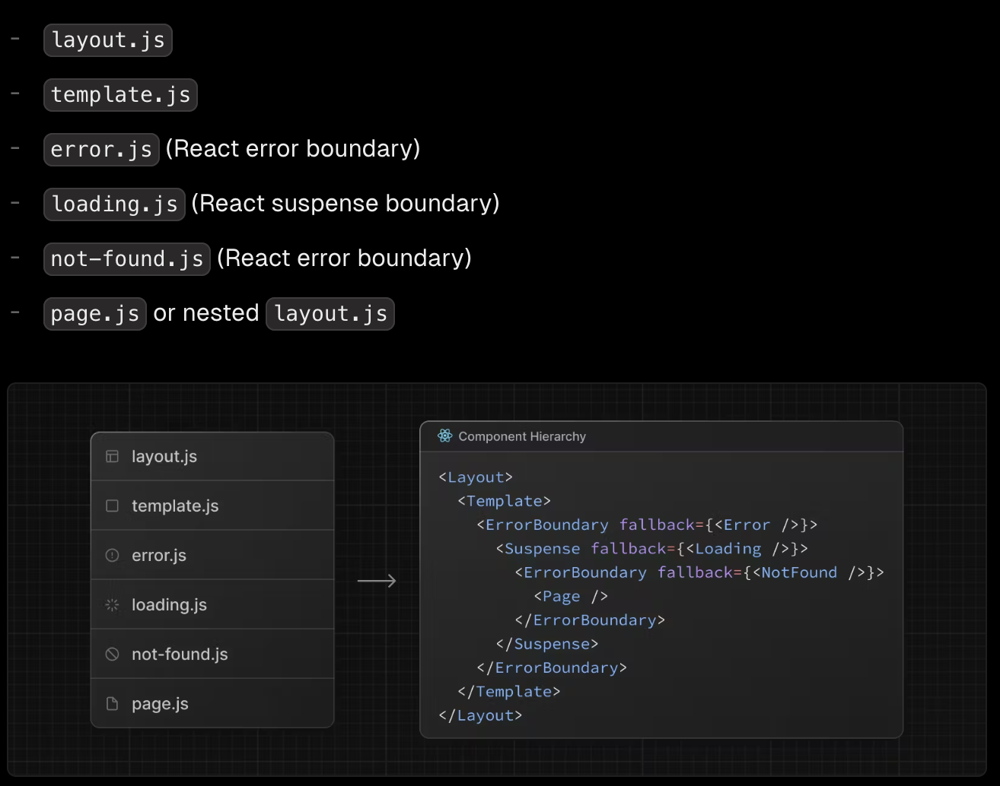
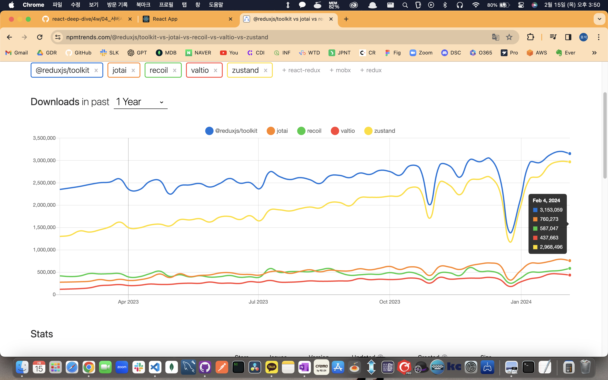

# 04. 서버 사이드 렌더링

## 4.1 서버 사이드 렌더링이란?

### 4.1.1 싱글 페이지 어플리케이션의 세상

#### SPA(Single Page Application) 란?

- 렌더링과 라우티엥 필요한 대부분의 기능을 서버가 아닌 브라우저의 JS 에 의존하는 방식
- 서버에서 HTML 을 내려 받지 않고, 하나의 페이지의 JS 에 의해 모두 작어이 처리 되는 방식
- 초기에 큰 JS 파일을 다운 받아야 하지만, 한번 로딩 된 이후에는 사용자에게 훌륭한 UI/UX 를 제공할 수 있다

#### 전통적인 방싱의 어플리케이션과 싱글 페이지 어플리케이션의 작동 비교

- 전통적 방식의 어플리케이션은 화면 전환시 서버에서 다시 HTML 을 받아서 그리기 때문에 부자연스러운 모습을 보인다
- 반면 SPA 는 최초 한번 리소스를 다운 받으면 페이지 전환 시 추가 다운로드 없이 페이지 전환이 일어나므로 깔끔한 모습을 보인다 (Ex, Gmail 페이지)

#### 싱글 페이지 렌더링 방식의 유행과 JAM 스택의 등장

- 과거 PHP 나 JSP 기반의 웹 어플리케이션은 대부분 서버 사이드 렌더링으로 이루어졌으며, JS 는 사용자에게 추가적인 기능을 제공하는 보조적인 수단으로 사용이 되었다
- 2010년경 Backbone.js, Angular.js, Knockout.js 등이 등장하면서 JS 로도 MV + @ 프레임워크를 구현이 가능해 짐
- 결국 JS 의 기능이 커짐에 따라 다른 많은 것들을 신경 써야하는 서버 사이드 렌더링 방식이 아닌 JS 로만 구성 된 프레임워크로 작성 된 SPA 가 인기를 끌게 됨
- JAM(JS, API, MarkUp) 스택이 점차 확산되어 LAMP(Linux, Apache, MySQL, PHP) 를 대체하기 시작
- Node.js 의 고도화에 따라 백엔드 또는 API 도 JS 로 개발하는 MEAN, MERN 스택이 인기를 끔(MongoDB, Express, Angular, React, Node.js)

#### 새로운 패어다임의 웹서비스를 향한 요구

- 웹페이지에서 요구되는 사항이 점점 더 커짐에 따라 JS 리소스의 크기가 커져 결국 웹페이지 로딩의 속도가 과거에 비해 차이가 없거나 느려지는 문제가 발생
- 이를 해결하기 위해 등장한 방식이 SSR(SSR, Sever Side Rendering) 이다

### 4.1.2 서버 사이드 렌더링이란?

#### 서버 사이드 렌더링의 장점

- 사용자가 최초 페이지에 진입 했을 때 페이지에 유의미한 정보(FCP, First Contentful Paint)가 그려지는 시간이 빠르다.
  - SPA 의 경우 JS 다운로드 후, HTTP 통신 작업이 완료 된 이후 페이지를 그리게 되므로 느리다
  - SSR 의 경우 HTTP 통신을 백엔드에서 하는 것이 더 빠르기도 하며, HTML 을 그리는 작업도 서버에서 직접 미리 그려서 내려주기 때문에 속도에서 이점을 가진다
  - 단, 서버가 충분한 리소스를 확보 하였을 때 이야기이다
- 검색 엔진(SEO, Serch Engine Ooptimization)과 SNS 공유 등 메타데이터 제공이 쉽다
  - 검색 엔진은 HTML 의 정적인 데이터를 분석하므로 SPA 의 JS 의 데이터는 읽을 수 없어, SEO 및 메타 데이터 제공에 약점을 가진다
- 누적 레이아웃 이동이 적다
  - 사용자에게 FCP 를 보여준 이후 뒤늦게 어떤 HTML 정보가 추가 되거나, 삭제되어 화면이 갑자기 변하는 부정적 사용자 경험이 줄어든다.
  - 기사 페이지에서 기사를 읽고 있는데, 위 배너가 갑자기 로딩되어 글이 아래로 덜컥 이동하는 현상 같은 것
  - 다만, SSR 을 이용한다고 해서 누적 레이아웃 이동으로 부터 완전히 자유로울 순 없다
- 사용자의 디바이스 성능에 비교적 자유롭다
- 보안에 좀 더 안전하다
  - 주요 로직이 서버에서 전부 작동되어 전달 되므로, 보안에 안정적이다

#### 서버 사이드 렌더링의 단점

- 소스코드 작성 시 항상 서버를 고려해야 한다
  - 기존 CSR에서 사용하던 window 객체 또는 sessionStorage 과 같이 브라우저에만 있는 객체 사용이 제한된다
  - 외부 의존 라이브러리 역시 서버에 대한 고려가 필요하다
- 적절한 서버가 구축되어 있어야 한다
  - 사용자의 수, 요청에 따라 적절히 대응할 수 있는 서버를 구축 해야만 함
  - 서버 장애에 대한 대응과, 분산 처리등에 대해서도 신경을 써서 개발이 필요하다
- 서비스 지연에 따른 문제
  - CSR 은 통신 지연이 일어나도 어떤 화면이라도 뜬 상태가 되지만, SSR 은 아무런 화면이 안뜨는 현상이 생길 수 있으므로 각별한 주의가 필요하다

### 4.1.3 SPA 와 SSR 을 모두 알아야 하는 이유

#### SSR 역시 만능이 아니다

- 서버에 무거운 작업을 모두 미루는 것이 능사가 아니다, 잘못된 설계로 인해서 성능 저하는 물론 관리를 두 곳 모두 해야하는 문제 역시 발생 가능하다

#### SPA 와 SSR 어플리케이션

- 가장 뛰어난 SPA 는 SSR 로 생성되는 MPA(Multi Page Application) 보다 낫다
  - 최초 렌더링 부분만 최적화하여 보여주고, 나머지는 게으른 로디응로 렌더링 하도록 처리 -> 뛰어난 성능과 매끄러운 사용자 경험 제공 가능
- 평균적인 SPA 는 MPA 보다 느리다
  - 성능 최적화가 안된 SPA 는 서버에서 빠르게 렌더링이 되는 MPA 보다 느릴 가능성이 높다
  - MPA 라우팅으로 인한 문제를 해결하기 위한 API 들
    - 페인트 홀딩(Paint Holding) : 같은 출처의 라우팅은 새로운 화면을 그릴 때 빈 화면이 아닌 이전 페이지의 모습을 잠깐 보여주는 방법
    - Back Forward Cache(BFCache) : 브라우저 앞, 뒤로 가기 실행 시 캐시에 저장된 페이지를 보여주는 기법
    - Shared Element Transitions : 페이지 라우팅 발생 시, 동일 요소는 콘텍스트를 유지하여 부드럽게 보여주는 기법

\*\* [p. 268] MPA 에서 라우팅으로 인해 발생하는 문제를 해결하기 위한 API 를 SPA 에서는 JS 와 CSS 의 도움을 받아서 상당한 노력을 통해 기울여야 한다고 하는데, 진짜 그런가요?

\*\* 개인적으로 사용자 디바이스가 정말 안좋은게 아닌 이상에는 오히려 반대가 아닌가 싶습니다. 통신 상황이 안좋다면 오히려 SSR 이 더 안좋은 유저 경험을 준다고 이미 책에서 밝히고 있으며, 페인트 홀딩, BFCache, Shared Element Transitions 은 SPA 프레임 워크에서 신경을 오히려 안써도 되는 부분 아닌가 싶어서 의문이 남네요. 다들 어떻게 생각하시나요?

#### 현재의 서버사이드 헨더링

- 기존 LAMP 방식은 모든 렌더링을 서버에 의존했지만, 요즘은 최초 진입시에는 SSR 로 렌더링된 적은 리소스의 HTML 을 받아서 빠르게 화면을 보여주고 SEO 도 만족을 시켜준다. 그리고 사용자가 최초 진입 된 페이지를 보는 동안 받아진 JS 를 로딩하여 나머지 동작은 SPA 처럼 동작한다

### 4.1.4 정리

- 최근에는 SPA 와 SSR 의 장점을 전 부 알고, 좋은 사용자 경험을 위해 두 가지 방법을 모두 이해하고 필요에 맞게 사용하는 것이 중요하다.

## 4.2 서버 사이드 렌더링을 위한 리액트 API 살펴보기

### 4.2.1 renderToString

- 리액트 컴포넌트를 랜더링해서 HTML 문자열로 반환하는 함수로 가장 기초적인 SSR API 이다

```jsx
const result = ReactDOMServer.renderToString(
  React.createElement('div', { id: 'root' }, <SampleComponent />);
)
```

- 결과물은 아래와 같이 반환된다

```html
<div id="root" data-reactroot="">
  <div>hello</div>
  <ul>
    <li>apple</li>
    <li>banana</li>
    <li>peach</li>
  </ul>
</div>
```

- 빠르게 브라우저가 HTML 을 그릴 수 있도록 제공해 주는 것이 목적이기 때문에 해당 API 는 이벤트 핸들러와 같은 JS 는 포함이 안되는 것을 볼 수 있다
- data-reactroot="" 속성을 통해 컴포넌트의 루트 엘리먼트가 무엇인지를 식별하여, 이후 JS 를 실행하기 위한 기반이 된다

### 4.2.2 renderToStaticMarkup

- 리액트 컴포넌트를 HTML 로 만드는 renderToString 과 매우 유사한 함수
- 단, 리액트에서만 사용하는 추가적인 DOM 속성을(data-reactroot="" 같은 것) 만들지 않아 크기를 약간 줄일 수 있는 장점이 있다
- 따라서, useEffect 와 같은 브라우저 API 사용이 불가능하다

```html
<div id="root">
  <div>hello</div>
  <ul>
    <li>apple</li>
    <li>banana</li>
    <li>peach</li>
  </ul>
</div>
```

### 4.2.3 renderToNodeStream

- renderToString 과 동일한 결과물을 만들어내지만 두가지 차이를 가진다
- 브라우저에서 사용이 불가능
- 결과물이 string 이 아닌 Node.js 에 의존하는 ReadableStream 로 만들어진다
- 결과물이 스트림으로 들어오기 때문에 데이터가 클 경우 작은 Chunk 로 분할하여 가져온게 된다. 따라서 HTML 의 크기가 클경우 작은 Chunk 로 분리되어 작성되므로 이점을 가진다
- 대부분 널리 알려진 리액트 SSR 프레임워크는 해당 API 를 채택

### 4.2.4 renderToStaticNodeStream

- renderToNodeStream 의 결과물에서 renderToStaticMarkup 과 마찬가지로 리액트 JS 에 필요한 속성만 빼는 API

### 4.2.5 hydrate

- renderToString, renderToNodeStream 로 생성된 HTML 컨텐츠에 JS 핸들러나 이벤트를 붙이는 역할
- 기본적으로 랜더링된 HTML 이 있다는 가정하에, 이벤트를 붙이는 작업을 실행한다

```jsx
import * as ReactDOM from 'react-dom' import App from './App';

// containerId를 가리키는 element는 서버에서 렌더링된 HTML의 특정 위치를 의미한다.
// 해당 element를 기준으로 리액트 이벤트 핸들러를 붙인다.
const element = document.getElementById(containerId);

ReactDOM.hydrate(<App />, element);
```

- 리액트 관련 정보가 없는 순수한 HTML 정보가 전달 될 경우?

```html
<!DOCTYPE html>
  <head>
    <title>React App</title>
  </head>

  <body>
  <!-- root에 아무런 HTML도 없다. -->
    <div id="root"></div>
  </body>
</html>
```

```jsx
function App() {
  return <span>안녕하세요.</span>;
}
import * as ReactDOM from "react-dom";
import App from "./App";
const rootElement = document.getElementById("root");

// Warning: Expected server HTML to contain a matching <span> in <div>.
// at span // at App ReactDOM.hydrate(<App />, rootElement)
```

- span 요소가 있는 것을 가정하고 작동되는 hydrate 이므로 주석과 같은 경거 문구가 출력
- 다만, 경고가 출력 될 뿐 실행은 되는데 위와 같은 불일치가 발생하면 hydrate 가 렌더링한 결과물을 기준으로 웹페이지를 그리기 때문이다 => 물론 잘못된 사용법이다
- hydrate 가 아무리 빨리 끝나도 시간이 걸리므로 시간을 기록하는 기능등에는 불일치가 발생할 수 밖에 없다
- 이러한 에러를 해결하기 위해서는 해당 요소에 suppressHydrationWarning 을 추가하여 경고를 제거 가능

```jsx
<div suppressHydrationWarning>{new Date().getTime()}</div>
```

### 4.2.6 서버 사이드 렌더링 예제 프로젝트

### 4.2.7 정리

- SSR 구현을 위해서는 서버에서 다뤄야 할 것들이 많아 복잡하다
- 따라서, 리액트 팀에서도 적절한 프레임 워크 사용을 권한다

## 4.3 Next.js 톺아보기

\*\* 리액트도 아직 볼게 많은데, 굳이 SSR 과 Next 가 여기 나오는 이유는 좀 이해가 안가네요. 오히려 머리 속만 더 복잡해지는 느낌입니다

\*\* 아마도 책 완성 단계에서 워낙 Next 랑 SSR 이 핫해지다보니 급하게 넣은게 아닌가 하는 의심이...

### 4.3.1 Next.js 란?

- Vercel 에서 만든 리액트 기반 풀스택 프레임 워크
- PHP 대용으로 사용되기 위해 개발을 했다고 언급할 정도로 서버 사이드 렌더링을 염두에 둔 프레임워크
- 과거 리액트 내부에서 SSR 을 위해 개발하다 중지 되었던 react-page 의 방향성을 유지

### 4.3.2 Next.js 시작하기

- npx-create-next-app 명령어로 프로젝트 생서

#### next.config.js

- Next 의 환경설정을 담당

```ts
/** @type {import('next').NextConfig} */
const nextConfig = {
  reactStrictMode: true,
  swcMinifi: true,
};
```

- /\*_ @type {import('next').NextConfig} _/ : 타입 스크립트의 타입 도움을 받기 위한 코드
- reactStrictMode : 리액트의 엄격 모드, 잠재적인 문제를 개발자에게 알리기 위한 도구
- swcMinify : 번들링과 컴파일을 빠르게 수행하기 위해 만든 SWC 를 사용하여, 코드 최소화 작업을 진행. Babel 의 대용이다. Rust 로 구성된 SWC 로 인하여 속도가 더 빠르다

#### pages/\_app.tsx

- 전체 페이지의 시작점

\*\* v14 에서는 page.tsx 가 해당 역할을 한다

#### pages/\_document.tsx

- HTML 를 초기화 하는 부분
- SEO 에 필요한 정보나 Title 등을 담을 수 있다
- crate-next-app 으로는 생성이 되지 않는다

\*\* v14 에서는 layout.tsx 가 해당 역할을 한다

#### pages/\_error.tsx

- 클라이언트 또는 서버에서 발생하는 500 에러는 담담하기 위한 페이지
- crate-next-app 으로는 생성이 되지 않는다

#### pages/404.tsx

- 404 페이지를 정의하는 파일
- 따로 정의하지 않으면, next 에서 기본 제공하는 페이지로 작동한다

#### pages/500.tsx

- 서버에서 발생하는 에러를 핸들링하는 페이지
- \_error.tsx 와 500.tsx 가 동시에 존재하면 500.tsx 가 우선하여 실행된다

#### pages/index.tsx

- pages 폴더의 하위 폴더명을 주소 값으로 사용 가능, 해당 폴더의 index.tsx 파일이 해당 주소 값에 대응
- 폴더 내부의 다른 파일명은 해당 주소의 하위 주소로 참조 가능
- /pages/hello.tsx => localhost:3000/hello 대응
- /pages/test/hello.tsx => localhost:3000/test/hello 대응

- v13 에서 App Router 의 적용으로 구조가 변경 되었다
- 이제는 pages 폴더가 app 폴더로 대체 되었으며, index.tsx 의 역할을 page.tsx 가 대신한다
- app/test/page.tsx => localhost:3000/test 대응
- 또한 기존의 파일명이 바로 주소에 대응되는 구조는 지원하지 않으며, layout.tsx -> template.tsx 의 순서로 구조를 가진다



#### 서버 라우팅과 클라이언트 라우팅의 차이

- Next 는 CSR 과 SSR 을 동시에 지원한다
- 사용자에게 최선의 경험을 제공하기 위해 최초 페이지는 SSR 을 사용하고, 페이지 이동이나 변화는 CSR 의 장점을 사용한다

#### 페이지에서 getServerSideProps 를 제거하면 어떻게 될까?

```tsx
export default function Hello() {
  console.log(typeof window === "undefined" ? "서버" : "클라이언트");

  return <>hello</>;
}

// 만약 아래 부분을 제거하면?
export const getServerSideProps = () => {
  return {
    props: {},
  };
};
```

- getServerSideProps 가 제거되면 서버에서 실행이 필요 없는 페이지로 처리되어 빌드시에 별도로 페이지 빌드를 하지 않는다

\*\* getServerSideProps 도 안알려주고 이런걸 알려주면... next 모르는 사람은 어쩌라는 것인지...

#### /pages/api/hello.ts

- Next 는 서버이므로 간단한 형태의 백엔드 api 구성이 가능
- BFF(Backend for Frontend) 형태로 활용하거나, 자체로 풀스택 어플리케이션 구축, CORS 이슈 우회등을 위해 사용이 가능하다

### 4.3.3 Data Fetching

#### getStaticPaths 와 getStaticProps

- 사용자, 통신에 관계 없이 정적으로 결정된 페이지를 보여주고자 할 때 사용되는 함수

```tsx
import { GetStaticPaths, GetStaticProps } from "next";

export const getStaticPaths: GetStaticPaths = async () => {
  return {
    paths: [{ params: { id: "1" } }, { params: { id: "2" } }],
    fallback: false,
  };
};

export const getStaticProps: GetStaticProps = async ({ params }) => {
  const { id } = params;
  const post = await fetchPost(id);
  return {
    props: { post },
  };
};

export default function Post({ post }: { post: Post }) {
  // post로 페이지를 렌더링한다.
}
```

- /pages/post/[id] 가 접근 가능한 정적 페이지를 구성하는 코드
- params 로 1, 2 만 정의되어 있으므로 /post/3 이 호출되면 404 페이지가 반환
- 미리 서버에서 예상되는 요청에 맞는 HTML 페이지를 만들어 놓기 때문에 빠른 응답이 가능하다
- 정적인 데이터만 제공하는 블로그 글, 약관 등을 빠르게 제공하는데 사용이 가능하다

#### getServerSideProps

- 서버에서 실행되는 함수로 무조건 페이지 진입 전에 함수를 실행한다
- props 로 전달이 가능한 값은 JSON 형태로 직렬화가 가능해야만 함. class 나 Date 는 전달 불가능
- 서버에서만 실행 되므로 window, document 등 사용 불가
- 브라우저와는 달리 자신의 호스트 유추가 불가능 하므로 완전한 주소로만 api 요청이 가능 (/api/test 와 같은 주소 사용 불가)
- 해당 함수가 실행이 완료 되기 전까지는 사용자에게 어떠한 HTML 도 보여줄 수 없다
- 조건에 따라 다른 페이지로 보내고 싶다면 redirect 를 사용 가능

```tsx
export const getServerSideProps: GetServerSideProps = async (context) => {
  const {
    query: { id = '' },
  } = context const post = await fetchPost(id.toString());

  if (!post) {
    redirect: {
      destination: '/404'
    }
  }

  return {
    props: { post },
  }
}
```

#### getInitialProps

- getStaticProps, getServerSideProps 가 나오지 전의 유일한 수단
- 대부분의 경우에는 getStaticProps, getServerSideProps 를 사용을 권장
- 해당 함수는 서버와 클라이언트 모두에서 사용이 가능하므로 이러한 특징을 반드시 감안하여 코드를 작성해야만 한다
- 레거시에서 사용을 대비하여 알아둘 것

### 4.3.4 스타일 적용하기

#### 전역 스타일

- \_app.tsx 에 적용
- v14 이후에는 app/layout.tsx 에 적용

#### 컴포넌트 레벨 CSS

- [name].moudule.css 같은 명명 규칙만 준수하면 된다

#### SCSS 와 SASS

- 기존과 동일하게 사용 가능

#### CSS-in-JS

- JS 내부에 스타일시트를 삽입하는 방법
- styled-jsx, styled-components, Emotion, Linaria 등등
- styled-components 의 경우 HTML 에 스타일을 입히는 것이 아니라 CSSOM 트리에 직접 삽입하므로 속도면의 이점이 있다
- next 와 swc 사용을 원하면 styled-jsx, styled-components, emotion 중 하나 쓸 것
- 단, v14 에서는 지원이 잘 안된다는 이슈가 있음

### 4.3.5 \_app.tsx 응용하기

### 4.3.6 next.config.js 살펴보기

- bathPath : 기본 주소에 원하는 주소를 추가하는 기능
- swcMinifiy : swc 를 이용해 코드 압축 여부 설정
- poweredByHeader : 응답 헤더에 next 관련 헤더를 넣을지 말지 결정하는 옵션, 보안 관련해서는 끄는 것을 추천
- redirects : 특정 주소를 다른 주소로 보내고 싶을 때 사용, 정규식 지원
- reactStrictMode : 리액트에서 제공하는 엄격 모드 적용 여부
- assetPrefix : 빌드 결과물을 호스트가 아닌 다른 CDN 에 업로드하고자 할 때 해당 부분에 CDN 주소 명시 필요

### 4.3.7 정리

* * *

# 05. 리액트와 상태 관리 라이브러리

## 5.1 상태 관리는 왜 필요한가?

- 상태는 어떠한 의미를 지닌 값이면 어플리케이션의 시나리오에 따라 지속적으로 변경될 수 있는 값을 의미한다
- UI : 상호 작용이 가능한 모든 요소의 현재 값
- URL : 브라우저에 의해 관리되고 있는 상태 값
- Form: 폼의 상태, 로딩 / 제출 / 접근 가능여부 / 값의 유효성
- 서버에서 가져온 값

### 5.1.1 리액트 상태 관리의 역사

#### Flux 패턴의 등장

- 리액트로 작성 된 어플리케이션의 크기가 방대해짐에 따라 상태를 관리 추적하는 것에 어려움이 발생
- 페이스북 팀은 상태 관리 어려움의 원인을 양방향 데이터 바인딩이라고 보고, 단방향으로 데이터 흐름을 변경하는 것을 제안하는데 이것이 바로 Flux 패턴이다
- Action -> Dispatcher -> Store -> View 의 방향
- 이러한 단방향 흐름은 상태의 관리 및 추적에는 유리했지만, 사용자의 입력에 따라 데이터를 갱신하고 화면을 업데이트 하는 코드도 추가가 되는 불편함이 존재

#### 시장 지배자 리덕스의 등장

- 리덕스는 Flux 구조에 Elm 아키텍쳐를 도입하여 시장을 지배
- Elm 은 데이터를 Model, View, Update 라는 단방향 흐름으로 강제하여 어플리케이션의 상태를 안정적으로 관리
- 다만 해당 기능을 사용하기 위해 많은 보일러 플레이트 코드가 필요하다는 단점이 존재

#### Context API 와 useContext

- Props Drilling 등의 문제 해결을 위해 16.3 버전에서 Context API 를 출시

#### 훅의 탄생, 그리고 React Query 와 SWR

- 16.8 버전에서 함수 컴포넌트에 사용 가능한 훅 API 를 추가
- 훅으로 인하여 state 관리가 단순화 되어 React Query 와 SWR 라는 통신 요청에 특화된 상태 관리 라이브러리가 탄생
- 리덕스에 비해 보일러 플레이트 코드를 줄일 수 있는 장점이 존재

#### Recoil, Zustand, Jotai, Valtio 에 이르기까지

- 리덕스에 이어 훅을 이용하여 작은 크기의 상태를 효율적으로 관리하는 상태관리 라이브러리가 탄생

### 5.1.2 정리

## 5.2 리액트 훅으로 시작하는 상태 관리

### 5.2.1 가장 기본적인 방법: useState 와 useReducer

- useState 와 useReducer 를 사용하면 간단한 상태 관리가 가능
- 하지만 훅을 사용할 때 마다 컴포넌트 별로 초기화 되므로 컴포넌트 별로 다른 상태를 가지게 되어, 해당 컴포넌트에서만 상태가 유효하다는 한계점이 존재
- 아래와 같이 상태를 한단계 끌어올리는 방법이 존재하지만, 상태를 자식에게 props 로 전달해야하는 불편함이 발생

```jsx
function Counter1({ counter, inc }: { counter: number, inc: () => void }) {
  return (
    <>
      <h3>Counter1: {counter}</h3>
      <button onClick={inc}>+</button>
    </>
  );
}

function Counter2({ counter, inc }: { counter: number, inc: () => void }) {
  return (
    <>
      <h3>Counter2: {counter}</h3>
      <button onClick={inc}>+</button>
    </>
  );
}

function Parent() {
  const { counter, inc } = useCounter();
  return (
    <>
      <Counter1 counter={counter} inc={inc} />
      <Counter2 counter={counter} inc={inc} />
    </>
  );
}
```

### 5.2.2 지역 상태의 한계를 벗어나보자: useState의 상태를 바깥으로 분리하기

- 상태를 클로저에 맡기는 것이 아니라, JS 실행 문맥 내에서 초기화가 가능하도록 분리해보기

```tsx
// counter.ts
export type State = { counter: number };

// 상태를 아예 컴포넌트 밖에 선언했다. 각 컴포넌트가 이 상태를 바라보게 할 것이다.
let state: State = { counter: 0 };

// getter
export function get(): State {
  return state;
}

// useState와 동일하게 구현하기 위해 게으른 초기화 함수나 값을 받을 수 있게 했다.
type Initializer<T> = T extends any ? T | ((prev: T) => T) : never;

// setter
export function set<T>(nextState: Initializer<T>) {
  state = typeof nextState === "function" ? nextState(state) : nextState;
}

// Counter
function Counter() {
  const state = get();

  function handleClick() {
    set((prev: State) => ({ counter: prev.counter + 1 }));
  }

  return (
    <>
      <h3>{state.counter}</h3>
      <button onClick={handleClick}>+</button>
    </>
  );
}
```

- 하지만 해당 코드는 상태값의 변경은 정상적으로 작동되나 컴포넌트가 리렌더링되지 않아 문제가 발생한다
- 해당 문제를 해결하기 위해, 외부 state 값을 컴포넌트 내부의 useState 의 인수로 전달하는 방식으로 해결

```tsx
function Counter1() {
  const [count, setScount] = useState(state);

  function handleClick() {
    // 외부에서 선언한 set 함수 내부에서 다음 상태값을 연산한 다음, 그 값을 로컬 상태값에도 넣기
    set((prev: State) => {
      const newState = { counter: prev.counter + 1 };
      // setCount 의 호출로 리렌더링 발생
      setCount(newState);
      // return 으로 업데이트 된 상태값을 외부 상태에 반영
      return newState;
    });
  }

  return (
    <>
      {/* 컴포넌트 내부의 state 인 count 사용 */}
      <h3>{count.counter}</h3>
      <button onClick={handleClick}>+</button>
    </>
  );
}
```

- 위와 같은 코드는 작동은 하지만 외부에서 관리하는 state 를 다시 컴포넌트 내부에서 state 로 선언하여 사용하는 등의 문제가 발생한다
- 또한, 액션이 발생한 컴포넌트는 리렌더링이 발생하지만 다른 컴포넌트에서 외부 상태값을 참조하고 있을 경우 해당 컴포넌트는 다시 렌더링이 발생하기 전까지는 변경된 상태값 적용이 안된다
- 이를 해결하기 위해서는 별도의 기능을 하는 createStore, useStore 등의 코드를 만들어서 사용해야만 한다
- 이와 비슷한 기능은 React 의 useSubscription 을 통해 구현되어 있다

\*\* [p. 367] 이거 코드 길게 잘 써놨는데.... 흐음 애매하네요 ㅎㅎㅎ
\*\* 막상 리덕스는 알알려주는....

### 5.2.3 useState 와 Context를 동시에 사용해 보기

- 스토어를 사용하는 경우 스토어가 여러개가 되면 컴포넌트에서 어떤 스토어를 사용해야하는지 판단하기 어려운 단점이 존재
- Context 를 이용하여 스토어를 컴포넌트에 주입하면, 위의 문제를 해결할 수 있다
- 대부분의 상태관리 라이브러리는 위와 같은 방식으로 구성되어 있으며, 아래의 장점을 가진다
  - useState, sueReducer 와 같이 지역적 사용이 아닌 글로벌 활용이 가능하다
  - 상태가 변경되면 참조하고 있는 모든 컴포넌트의 렌더링이 발생한다

### 5.2.4 상태관리 라이브러리 Recoil, Jotai, Zustand 알아보기

- Recoil, Jotai 는 Context 와 Provider 그리고 훗을 기반으로 작은 상태를 효율적으로 관리하기 좋음
- Zustand 는 하나의 큰 스토어를 기반으로 상태를 관리하기 좋음. Context 가 아닌 클로저를 기반으로 스토어가 생성됨

#### 페이스북이 만든 상태 관리 라이브러리 Recoil

- 리액트를 위한 Atomic 상태 관리 라이브러리, 하지만 아직 베타
- 리액트의 v18 에 맞추어 동시성 렌더링, 서버 컴포넌트, Streaming SSR 지원 이후에 1.0.0 을 배포 예정
- RecoilRoot 를 최상단에 선언에 하나의 스토어를 만들고 Atom 이라는 상태 단위를 스토어에 등록
- Recoil 의 훅을 통해 상태 변화를 구독하고 값이 변하면 리렌더링을 통해 Atom 의 값을 참조

- 예시 코드

```jsx
import {
  RecoilRoot,
  atom,
  selector,
  useRecoilState,
  useRecoilValue,
} from "recoil";

// Recoil 파트
const counterState = atom({
  key: "counterState",
  default: 0,
});

function Counter() {
  const [, setCount] = useRecoilState(counterState);

  function handleBtnClick() {
    setCount((count) => count + 1);
  }

  return (
    <>
      <button onClick={handleBtnClick}>+</button>
    </>
  );
}

const isBiggerThen10 = selector({
  key: "above10State",
  get: ({ get }) => {
    console.log(get(counterState));
    return get(counterState) >= 10;
  },
});

function Count() {
  const count = useRecoilValue(counterState);
  const biggerThen10 = useRecoilValue(isBiggerThen10);

  return (
    <>
      <h3>{count}</h3>
      <p>10 보다 큰가? : {JSON.stringify(biggerThen10)}</p>
    </>
  );
}

function App() {
  return (
    <div className="App">
      <RecoilRoot>
        <Counter />
        <Count />
      </RecoilRoot>
    </div>
  );
}

export default App;
```

##### 특징

- 메타에서 만드는 만큼 리액트의 신기능들을 가장 잘 지원할 것으로 예상
- 리덕스와 달리 redux-saga 나 redux-thunk 를 사용하지 않아도 비동기 작업을 지원
- 아직 정식 버전이 아니므로 사용에 있어서 주의 필요

#### Recoil 에서 영감을 받은, 그러나 조금 더 유연한 Jotail

- Recoil 과 마찬가지로 Atomic 스타일의 상태 관리 라이브러리이며 작은 단위의 상태를 위로 전파할 수 있는 구조
- atom 을 통해 상태를 선언하면 해당 상태는 컴포넌트 외부에서도 사용이 가능하다. 따라서 RecoilRoot 로 하위 컴포넌트를 감쌀 필요가 없다
- Recoil 대비 간결한 코드, 객체 참조를 통해 문자열 key 값 없이 상태값 관리 가능
- 그외의 API 및 localStorage 연동, Next, React Native 등 다양한 기능을 지원
- 정식 버전이므로 상용 어플리케이션에 적용 가능

- 예시 코드

```jsx
import { atom, useAtom, useAtomValue } from "jotai";

const counterState = atom(0);

function Counter() {
  const [, setCount] = useAtom(counterState);

  const handleBtnClick = () => setCount((count) => count + 1);

  return (
    <>
      <button onClick={handleBtnClick}>+</button>
    </>
  );
}

const isBiggerThen10 = atom((get) => get(counterState) >= 10);

function Count() {
  const count = useAtomValue(counterState);
  const biggerThen10 = useAtomValue(isBiggerThen10);

  return (
    <>
      <h3>{count}</h3>
      <p>10 보다 큰가? : {JSON.stringify(biggerThen10)}</p>
    </>
  );
}

export default function JotailComponent() {
  return (
    <div>
      <h2>조타이</h2>
      <Counter />
      <Count />
    </div>
  );
}
```

\*\* 리코일은 10보다 biggerThan 이 >= 10 이고 Jotai 는 왜 > 10 이죠? ㅋㅋㅋㅋㅋ
\*\* [p. 383] 리코일 코드에서 key 는 또 above10State 고.... 오락가락 하시네여

#### 작고 빠르면 확장에도 유연한 Zustand

- Redux 에서 영감을 받아 만든 Flux 타입 상태 관리 라이브러리, 따라서 하나의 큰 스토어를 기반으로 상태를 관리한다
- 코드가 제일 간결하고 사용이 쉽다
- 라이브러리의 코드의 용량 자체도 작아서 작고 빠르다
- API 가 간단한 구조를 가진다면 Zustand 는 좋은 선택지이다

- 예시 코드

```jsx
import { create } from "zustand";

const useCounterStore = create((set) => ({
  count: 1,
  inc: () => set((state) => ({ count: state.count + 1 })),
  dec: () => set((state) => ({ count: state.count - 1 })),
}));

export default function ZustandComponent() {
  const { count, inc, dec } = useCounterStore();

  const biggerThan10 = String(count >= 10);

  return (
    <div>
      <h2>Zustand</h2>
      <button onClick={inc}>+</button>
      <button onClick={dec}>-</button>
      <h3>{count}</h3>
      <p>10 보다 큰가? : {biggerThan10}</p>
    </div>
  );
}
```

\*\* 전 redux 로 배워서 그런지 zustand 가 압도적으로 편해 보입니다! 다들 어찌 생각하시나요?

### 5.2.5 정리



- 상황에 맞는, 그리고 프레임워크의 변화에 따르게 대응하는 라이브러리를 선택하는 것이 유리하다!

\*\* 근데 리덕스나 발티오 같은건 안가르쳐 주나요?? 그래도 쉐어 1위인데?

\*\* Zustand 연습하자!

