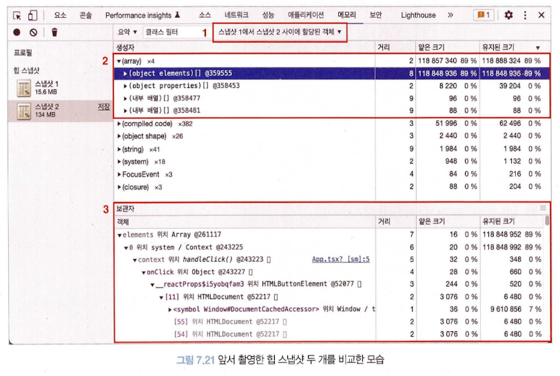
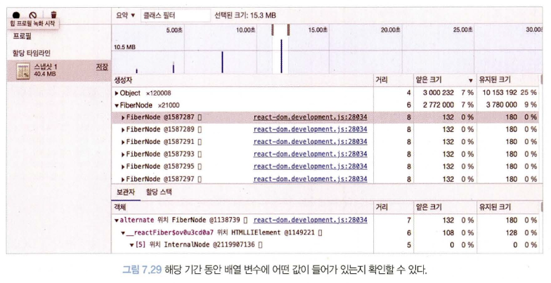
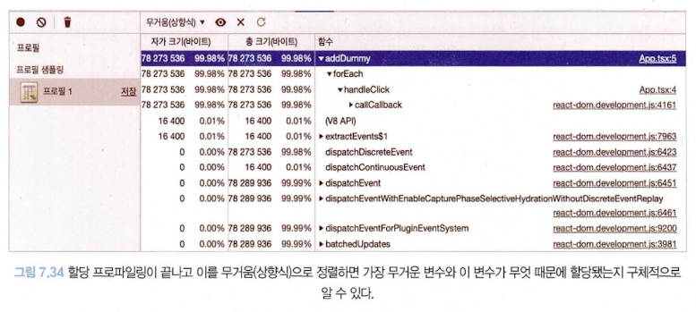

## 6장. 리액트 개발 도구로 디버깅하기

### 컴포넌트 개발 도구

**Components**

- 정적인 현재 리액트 컴포넌트 트리의 내용을 디버깅하기 위한 도구
- **16.8 버전 이하 :** 함수 선언식 또는 표현식으로 선언되지 않은 컴포넌트는 **명칭 추론 불가능**을 이유로 문제가 발생
- **18.6 버전 이후 :** 16.8 버전에서 ‘일부 명칭을 추론할 수 없는 Anymous’가 \_cs, \_c5 등으로 개선됨.
  그러나, 임의로 명칭이 선언되었기 때문에, **컴포넌트를 기명 함수로 변경**하는 방법을 지향한다.
- 컴포넌트를 익명 함수로 선언하기 곤란한 경우, 혹은 함수명과는 별개로 특별한 명칭을 부여해 명시적으로 확인이 필요한 경우 displayName을 사용하면 좋다.
  그러나 이는 빌드 도구가 사용하지 않는 코드로 인식해 삭제할 가능성이 있기 때문에, 개발 모드에서만 제한적으로 참고하는 것이 좋다.

**Profiler**

- 리액트가 렌더링하는 과정에서 발생하는 상황을 확인하기 위한 도구
- **프로파일링 메뉴 :** 리액트가 렌더링할 대 어떤 일이 벌어지는지 확인할 수 있는 도구
- **Flamegraph :** 랜더 커밋별로 어떠한 작업이 일어났는지 나타내는 도구. 너비가 넓을수록 해당 컴포넌트를 렌더링하는 데 오래 걸렸다는 것을 의미
- **Ranked :** 해당 커밋에서 렌더링하는 데 오랜 시간이 걸린 컴포넌트를 순서대로 나열한 그래프
- **Timeline :** 시간이 지남에 따라 컴포넌트에서 어떤 일이 일어났는지를 확인할 수 있는 도구. 시간의 흐름에 따라 리액트가 작동하는 내용을 추적하는데 유용

## 7장. 크롬 개발자 도구를 활용한 애플리케이션 분석

### 네트워크 탭

- 불필요한 요청 또는 중복되는 요청이 없는지
- 웹페이지 구성에 필요한 리소스 크기가 너무 크지 않은지
- 리소스를 불러오는 속도는 적절한지 또는 너무 속도가 오래 걸리는 리소스는 없는지
- 리소스가 올바른 우선순위로 다운로드되어 페이지를 자연스럽게 만들어가는지

### 메모리 탭

- 애플리케이션에서 발생하는 메모리 누수, 속도 저하, 혹은 웹페이지 프리징 현상을 확인할 수 있는 유용한 도구

**힙 스냅샷**



- 해당 시점의 메모리 내용만 촬영하는 프로파일링 기법
- 현재 시점의 메모리 상황을 알고 싶을 때

> **# 얕은 크기와 유지된 크기**
>
> - 얕은 크기 : 객체 자체가 보유하는 메모리 바이트의 크기
> - 유지된 크기 : 해당 객체 자체뿐만 아니라 다른 부모가 존재하지 않는 모든 자식 객체들의 크기까지 더한 값
>
> ```jsx
> var counter = 0
> var instances = []
>
> func Y() {
> 	this.j = 5
> }
>
> func X() {
> 	this.i = counter++
> 	this.y = new Y()
> }
>
> export default func App() {
> 	func handleClick() {
> 		instances.push(new X())
> 	}
>
> 	return <button onClick={handleClick}>+</button>
> }
> ```
>
> 스냅샷을 통해 X는 유지된 크기가 100, 얕은 크기가 52로 선언됨 ( Y를 제외하고 X라는 객체 자체의 크기는 52 / Y 객체의 크기는 48)
>
> ⇒ 메모리 누수를 찾을 때는 얕은 크기(객체 자체의 크기)는 작으나 유지된 크기(객체가 참조하고 있는 모든 객체들의 크기)가 큰 객체를 찾아야 함.
>
> ⇒ 해당 객체가 복잡한 참조 관계를 가지고 있다는 뜻. 이러한 객체가 오랜 시간 동안 메모리에 남아있다면 그로 인해 많은 메모리를 점유하고 있을 수 있음

- useMemo나 useCallback과 같은 의존성이 있는 값들이 정말로 렌더링 사이에 그대로 유지되는지 육안으로 직접 확인 가능 (스냅샷 사이에 해당 훅으로 감싼 값들이 재생성되지 않았기 때문)

**타임라인 할당 계측**



- 시간의 흐름에 따라 메모리의 변화를 살펴보고 싶을 때
- 메모리 변화를 일으킨 변수가 무엇인지, 그리고 해당 변수가 어느 정도 크기를 차지하고 있는지 등을 확인
- 특정 변수를 클릭 해 **전역 변수로 저장**을 누르면 해당 변수가 무슨 값을 가지고 있는 객체인지 확인 가능

**할당 샘플링**



- 메모리 공간을 차지하고 있는 자바스크립트 함수를 보고 싶을 때
- 할당 계측과의 유사점 : 시간의 흐름에 따라 발생하는 메모리 점유를 확인할 수 있다
- 할당 계측과의 차이점 : 자바스크립트 실행 스택별로 분석할 수 있고, 이 분석을 함수 단위로 한다
- 프로파일링할 때 브라우저에 주는 부담을 최소화할 수 있어 장시간에 걸쳐 디버깅을 수행해야 할 때 유리

⇒ 즉, 아래와 같은 경우엔 할당 샘플링을 활용하는 것이 좋다

- 메모리 누수가 짐작되지만 정확히 어디에서 발생하는지 확인하기 어려워 힙 스냅샷을 촬용해 비교하기 어려운 경우,
- 오랜 기간 메모리 누수가 의심되어 프로파일링을 장기간 수행해야 하는 경우

### Next.js 환경 디버깅하기

**디버그 모드 실행**

```jsx
"dev" : NODE_OPTIONS= ’ --inspect ’ next dev
```

**Next.js 서버에 트래픽 유입시키기**

- 사용자가 서서히 유입되면서 메모리 누수가 발생하는 경우가 많음
- 따라서 서버에 직접 트래픽을 발생시켜서 확인하는 편이 제일 확실한 방법
- 아래 코드를 터미널에서 실행시켜, 사용자의 트래픽이 서버로 몰리는 상황을 시뮬레이션해 볼 수 있음

```jsx
>> ab -k -c 50 -n 10000 "http://127.0.0.1:3000/"
// http://127.0.0.1:3000/을 향해 한 번에 50개의 요청을 총 10,000회 시도한다
// ab : 단순히 요청을 수행하는 것뿐만 아니라 요청으로부터 응답받는 데 걸린 시간, 바이트 크기 등 다양한 정보 확인 가능
```
