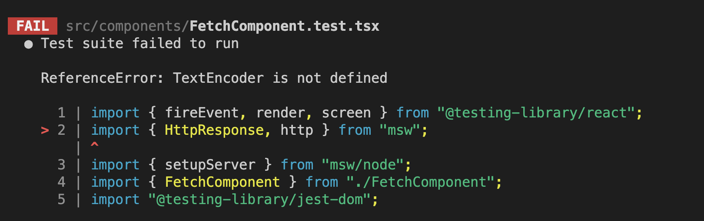
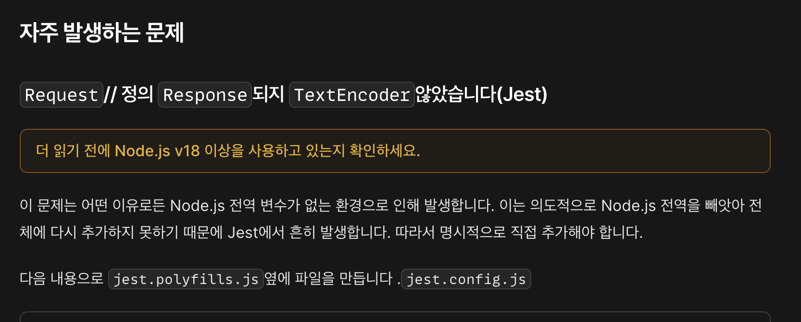
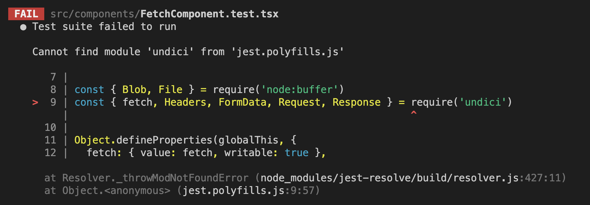
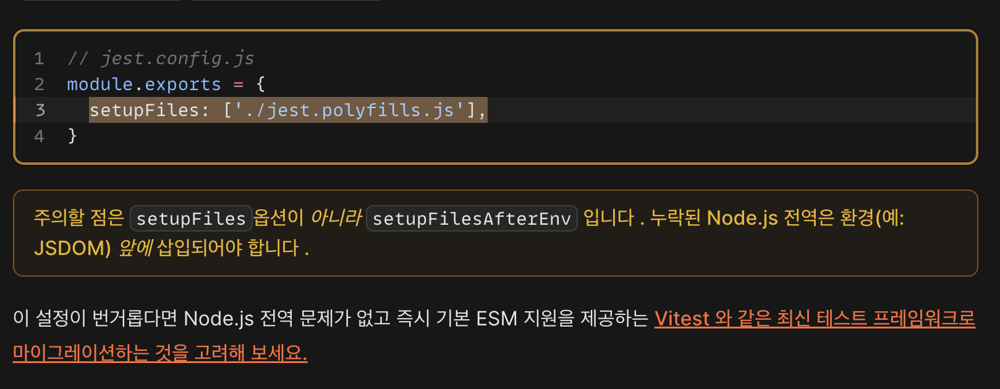
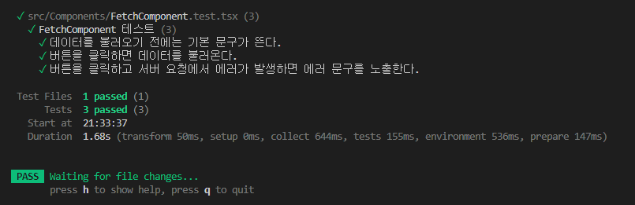

# JEST 관련 에러

- 단, React 18 버전으로 넘어오면서 약간의 warning 이 생기는 문제 발생 중

- 책에 나온 코드

```js
it("영문과 숫자만 입력된다.", () => {
  const { input } = setup();
  const inputValue = "안녕하세요123";

  // 사용자의 입력을 흉내내는 메서드, 사용자가 키보드로 타이핑을 하는 것을 테스트 가능
  userEvent.type(input, inputValue);

  expect(input.value).toEqual("123");
});
```

- userEvent 사용시 발생하는 Warning 상황


- React 18 이상 버전에서 실제 문제 없이 작동하는 코드

```js
it("영문과 숫자만 입력된다.", () => {
  const { input } = setup();
  const inputValue = "안녕하세요123";

  // fireEvent 로 처리해야 문제가 생기지 않음
  fireEvent.change(input, { target: { value: inputValue } });

  expect(input.value).toEqual("123");
});
```

- fireEvent 로 변경 후, 정상 작동하는 상황


- 아마도, Testing Library 의 경우 테스트 이외의 상황에서 컴포넌트의 변화가 발생하면 테스트 결과가 맞아도 위와 같은 Warining 을 발생하는 것을 확인 가능
- userEvent 의 경우 fireEvent 의 input 이 여러번 발생하는 구조이므로, setText 가 계속 적으로 컴포넌트를 업데이트 하는 상황이 발생하여 생기는 에러로 추측
- 따라서 userEvent.type 이 아닌 fireEvent.change 로 한번에 값의 변화를 주고 테스트 하면 정상 테스트가 되는 것을 확인 가능

  - 아이디어 참고 : https://kentcdodds.com/blog/fix-the-not-wrapped-in-act-warning
  - 한번 쯤 보면 매우 좋을듯, 컴포넌트의 모든 상태 변화에 대한 이해를 바탕으로 테스트를 작성해야 한다는 점
  - 실제 사례를 보면, 비동기로 상태를 반영하기 때문에 promise 를 테스트 상황에서 예외 처리하는 것을 볼 수 있다

  - 실제 해결 사례 내용 : https://github.com/testing-library/react-testing-library/issues/1051
  - React 18 버전으로 업데이트 되면서 생긴 문제라는 것으로 보아 리액트의 변화 사항을 testing-library 가 반영하지 못한 상태로 추측

- 문제 해결을 위해 참고한 블로그들

  - https://flyingsquirrel.medium.com/testing-library-react%EC%9D%98-act%EB%8A%94-%EC%96%B8%EC%A0%9C-%EC%8D%A8%EC%95%BC%ED%95%A0%EA%B9%8C-c6036a8cd4b3

  - https://kentcdodds.com/blog/common-mistakes-with-react-testing-library
  - https://seongry.github.io/2021/06-20-common-mistakes-with-rty/
  - https://kentcdodds.com/blog/fix-the-not-wrapped-in-act-warning
  - https://github.com/kentcdodds/fix-act-warning-demos/blob/main/src/__tests__/username-form.js

# 비동기 컴포넌트에서 msw 이슈를 해결하기 위해 이리저리 삽질한 Story

- CRA + MSW 2.0 버전에서의 이슈로 인하여, 2.0 문법을 사용하면 특정 모듈이 import 가 안되는 이슈가 발생
- 해결을 위해 다양한 접근을 했지만, 모두다 제대로 동작하지 않는 이슈 발생
- CRA 를 사용하지 않기 위해, Vite 를 사용하여 번들링
- Vite 에, jest, msw 등등을 설치하고 테스트
- Vite 에서 jest 사용을 위한 설정 참고
  - https://xionwcfm.tistory.com/369
- 그래서 실행을 했으나, 아래와 같은 이슈 발생



- 이를 해결하기 위해 msw 공식 문서를 확인



- node v20 사용중 & jest.polifills.js 적용, 그러나



- 그래서 찾아보니 CRA 이슈로 node 환경에서 global 이 제대로 안불러와지는 문제라고 한다. 그래서 더 찾아보니



## 결론, vitest 로 갈아탈 타이밍이다

# Vite & Vitest 로 해당 코드를 돌리기 위해 삽질한 결과물

- vite 로 프로젝트 생성

```bash
# npm 6 이하 버전 일 경우
npm create vite@latest [프로젝트 명] --template react-ts
# npm 7 이상 버전일 경우
npm create vite@latest [프로젝트 명] -- --template react-ts

# 직접 선택을 원할 경우, 아래의 명령어로 만들고 프로젝트명, 언어 및 프레임워크 선택 가능
npm create vite@latest
```

- 필요 모듈 설치 (msw, vitest, jsdom, @testing-library/react, @testing-library/jest-dom)

```bash
npm i -D msw vitest jsdom @testing-library/react @testing-library/jest-dom
```

- test 스크립트 추가

```json
 "scripts": {
    "dev": "vite",
    "build": "tsc && vite build",
    "lint": "eslint . --ext ts,tsx --report-unused-disable-directives --max-warnings 0",
    "preview": "vite preview",
    // 추가
    "test": "vitest"
  },
```

- vite.confing.ts 에 테스트를 위한 세팅 필요

```ts
import { defineConfig } from "vite";
import react from "@vitejs/plugin-react";

export default defineConfig({
  plugins: [react()],
  // test 파트 추가 필요
  test: {
    globals: true,
    environment: "jsdom",
  },
});
```

- msw 2.0 버전으로 코드 마이그레이션 (https://mswjs.io/docs/migrations/1.x-to-2.x)

- 기존 jest 에서 사용하던 명령어를 vitest 라이브러리 것으로 교체

```tsx
import {
  afterAll,
  afterEach,
  beforeAll,
  beforeEach,
  describe,
  expect,
  it,
} from "vitest";
```

- 하지만, 아직 코드 내부에서 사용하는 몇몇 명령어는 이전의 라이브러리 것 사용 필요
- 위의 라이브러리를 사용하지 않으면, 몇몇 에러 발생 (expect().toBeInTheDocument() 같은 명령어 사용 불가)

```tsx
import { fireEvent, render, screen } from "@testing-library/react";
import "@testing-library/jest-dom";
```

- 테스트 수행

```bash
npm run test
```



## [p. 526] TDD 에 대한 의견은 어떠신가요?
