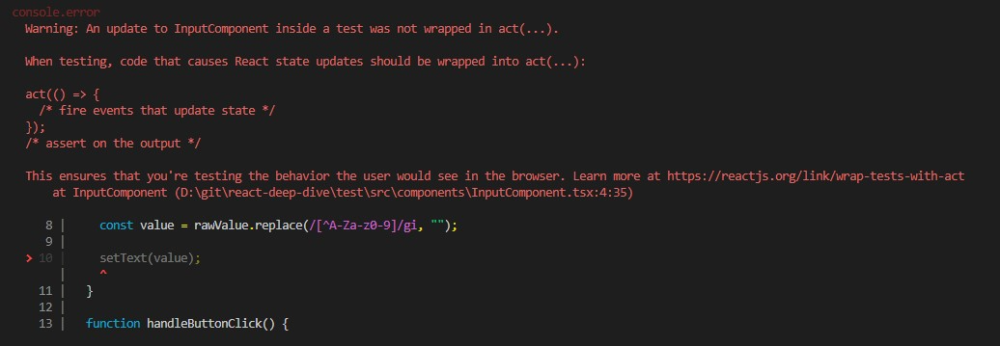
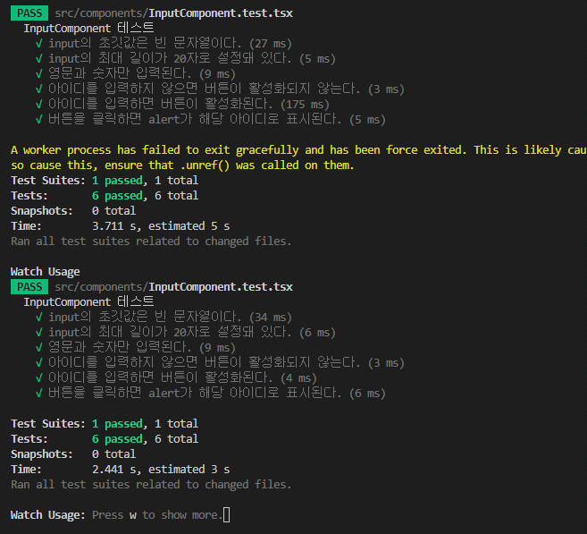

# 08. 좋은 리액트 코드 작성을 위한 환경 구축하기

## 8.1 ESLint 를 활용한 정적 코드 분석

### 8.1.1 ESLint 살펴보기

#### ESLint 는 어떻게 코드를 분석할까?

1. JS 를 문자열로 읽는다
2. JS 를 분석할 수 있는 Parser 인 espee 를 사용하여 코드를 구조화 한다
3. 2번에서 구조화한 트리(Abstract Syntax Tree)를 기준으로 각종 규칙을 대조
4. 규칙과 대조했을 때 이를 위반한 코드를 Report or Fix

### 8.1.2 eslint-plugin 과 eslint-config

#### eslint-plugin

- 다양한 ESLint 규칙을 모아놓은 패키지

#### eslint-config

- ESLint 관련 설정을 제공하는 패키지

##### eslint-config-airbnb

- Airbnb 에서 만들었으며, 500여 명의 개발자가 유지보수하는 가장 유명한 규칙

##### @@titicaca/triple-config-kit

- 트리플에서 유지 관리하는 패키지
- Airbnb 의 룰을 따르지 않고, 기본적인 규칙을 제공

##### eslint-config-next

- Next.js 를 위한 듀칙 제공

### 8.1.3 나만의 ESLint 규칙 만들기

#### Import React 를 제거하기 위한 ESLint 규칙 만들기

```js
module.exports = {
  rules: {
    "no-restrict-imports": [
      "error",
      {
        paths: [
          {
            name: "react",
            importNames: ["default"],
            message: "Import React from 'react'는 17버전 부터 필요 없습니다!",
          },
        ],
      },
    ],
  },
};
```

#### 완전히 새로운 규칙 만들기: new Date 를 금지시키는 규칙

```js
/**
 * @type {import('eslint').Rule.RuleModule}
 */

module.exports = {
  meta: {
    type: "suggestion",
    docs: { description: "disallow use of the new Date()", recommended: false },
    fixable: "code",
    schema: [],
    messages: {
      message:
        "new Date()는 클라이언트에서 실행 시 해당 기기의 시간에 의존적이라 정확하지 않습니다. 현재 시간이 필요하다면 ServerDate()를 사용해 주세요.",
    },
  },
  create: function (context) {
    return {
      NewExpression: function (node) {
        if (node.callee.name === "Date" && node.arguments.length === 0) {
          context.report({
            node: node,
            messageId: "message",
            fix: function (fixer) {
              return fixer.replaceText(node, "ServerDate()");
            },
          });
        }
      },
    };
  },
};
```

### 8.1.4 주의할 점

#### Prettier 와의 충돌

#### 규칙에 대한 예외 처리, 그리고 React-hooks/no-exhaustive-deps

- 일부 코드에서 특정 규칙을 임시로 제외시키고 싶다면, eslint-disable-주석 사용 필요

```js
// 특정 줄만 제외
console.log("hello world"); // eslint-disable-line no-console

// 다음 줄 제외
// eslint-disable-next-line no-console
console.log("hello world");

// 특정 여러 줄 제외
/* eslint-disable no-console */
console.log("JavaScript debug log");
console.log("eslint is disabled now");
/* eslint-enable no-console */

// 파일 전체에서 제외
/* eslint-disable no-console */
console.log("hello world");
```

- useEffect 나 useMemo 의 의존성 배열을 예외 처리하는 eslint-disable-line no-exhaustive-deps 를 자주 사용할 가능성이 높은데 잠재적 버그 유발이 가능하므로 주의가 필요하다.
- 그 외에 type-script 에서 any 를 강제로 사용하기 위한 typescript-eslint/no-explicit-any 도 마찬가지다

#### ESLint 의 버전 충돌

- 서로 다른 버전의 ESLint 가 설치 되어 있으면, 에러가 발생하므로 ESLint 의 의존성을 배포 의존성(peerDependecies)로 설정해 두는 것을 권장

### 8.1.5 정리

- 버그 예방, 공통된 코드 스타일 등등 사용을 권장
- 사용은 안하더라도 사용법은 알아 둘 것!

## 8.2 리액트 팀이 권장하는 리액트 테스트 라이브러리

### 8.2.1 React Testing Library 란?

- DOM Testing Library 를 기반으로 만들어진 테스팅 라이브러리.
- jsdom 을 사용하여 nodes.js 환경에서 HTML 과 DOM 을 사용할 수 있게 하여 테스팅을 수행한다
- 실제로 브라우저를 구동하여 컴포넌트를 렌더링하지 않고도, 해당 컴포넌트가 제대로 렌더링 되었는지를 확인하는 방식으로 테스팅 수행

### 8.2.2 JS 테스트의 기초

1. 테스트할 함수나 모듈 선정
2. 함수나 모듈이 반환하기 기대하는 값 설정
3. 함수나 모듈의 실제 반환값을 계산
4. 3번과 2번을 비교
5. 비교 결과가 같지 않을 경우 에러 발생

- 테스트 결과를 확인할 수 있도록 도와주는 라이브러리 = 어설션(Assertion) 라이브러리
- 다만, 테스트를 위해서는 복잡한 일련의 과정이 필요하고 이를 지원하는 것이 테스팅 프레임워크. 대표저긍로 Jest, Mocha, Karma, Jasmine 등이 존재한다

#### Jest

- 예시 코드

```js
// math.js
function sum(a, b) {
  return a + b;
}

module.exports = {
  sum,
};

// math.test.js

const { sum } = require("./math");

test("두 인수가 덧셈이 되어야 한다.", () => {
  expect(sum(1, 2)).toBe(3);
});

// 에러 발생 테스트
test("두 인수가 덧셈이 되어야 한다.", () => {
  expect(sum(2, 2)).toBe(3);
});
```

- Node.js 의 Assertion 을 쓴 것과는 다르게 테스트를 통해 걸린 시간, 무엇이 성공하고 실패하였는지 등등 자세한 정보를 제공

### 8.2.3 리액트 컴포넌트 테스트 코드 작성하기

#### HTML 요소를 확인하는 방법

- getBy : 인수의 조건에 맞는 요소를 반환, 요소가 없거나 2개 이상이면 에러 발생
- getAllBy : 인수의 조건에 맞는 요소를 반환, 요소가 복수개여도 문제 없음
- findBy : getBy 와 같은 역할을 하지만, Promise 를 반환. 기본적으로 1000ms 의 시간을 가지며 비동기 액션 이후의 요소를 검사할 때 사용한다. getBy 와 마찬가지로 복수의 요소를 검사할 땐 findAllBy 를 사용
- queryBy : 인수의 조건에 맞는 요소를 반환하지만, 못찾으면 에러가 아닌 null 을 반환. 에러를 발생시키고 싶지 않은 경우 사용한다. 역시 복수의 요소 검사는 queryAllBy 를 사용

#### 정적 컴포넌트

- 별도의 상태가 존재하지 않으면 같은 결과를 반환하는 정적 컴포넌트의 테스트 방법은 쉽다

- 정적 컴포넌트 코드

```tsx
import { memo } from "react";

const AnchorTagComponent = memo(function AnchorTagComponent({
  name,
  href,
  targetBlank,
}: {
  name: string;
  href: string;
  targetBlank?: boolean;
}) {
  return (
    <a
      href={href}
      target={targetBlank ? "_blank" : undefined}
      rel="noopener noreferrer"
    >
      {name}
    </a>
  );
});

export default function StaticComponent() {
  return (
    <>
      <h1>Static Component</h1> <div>유용한 링크</div>
      <ul data-testid="ul" style={{ listStyleType: "square" }}>
        <li>
          <AnchorTagComponent
            targetBlank
            name="리액트"
            href="https://reactjs.org"
          />
        </li>
        <li>
          <AnchorTagComponent
            targetBlank
            name="네이버"
            href="https://www.naver.com"
          />
        </li>
        <li>
          <AnchorTagComponent name="블로그" href="http://yceffort.kr" />
        </li>
      </ul>
    </>
  );
}
```

- 테스트 코드

````tsx
import { render, screen } from "@testing-library/react";
import StaticComponent from "./StaticComponent";

beforeEach(() => {
  // eslint-disable-next-line
  render(<StaticComponent />);
});

describe("링크 확인", () => {
  it("링크가 3개 존재한다.", () => {
    const ul = screen.getByTestId("ul");
    // eslint-disable-next-line
    expect(ul.children.length).toBe(3);
  });

  it("링크 목록의 스타일이 square 다.", () => {
    const ul = screen.getByTestId("ul");
    expect(ul).toHaveStyle("list-style-type: square");
  });
});

describe("리액트 링크 테스트", () => {
  it("리액트 링크가 존재한다", () => {
    const reactLink = screen.getByText("리액트");
    expect(reactLink).toBeVisible();
  });

  it("리액트 링크가 올바른 주소로 존재한다", () => {
    const reactLink = screen.getByText("리액트");
    expect(reactLink.tagName).toEqual("A");
    expect(reactLink).toHaveAttribute("href", "https://reactjs.org");
  });
});

describe("네이버 링크 테스트", () => {
  it("네이버 링크가 존재한다", () => {
    const naverLink = screen.getByText("네이버");
    expect(naverLink).toBeVisible();
  });

  it("네이버 링크가 올바른 주소로 존재한다", () => {
    const naverLink = screen.getByText("네이버");
    expect(naverLink.tagName).toEqual("A");
    expect(naverLink).toHaveAttribute("href", "https://www.naver.com");
  });
});

describe("블로그 링크 테스트", () => {
  it("블로그 링크가 존재한다", () => {
    const blogLink = screen.getByText("블로그");
    expect(blogLink).toBeVisible();
  });

  it("블로그 링크가 올바른 주소로 존재한다", () => {
    const blogLink = screen.getByText("블로그");
    expect(blogLink.tagName).toEqual("A");
    expect(blogLink).toHaveAttribute("href", "https://yceffort.kr");
  });

  it("블로그는 같은 창에서 열려야 한다", () => {
    const blogLink = screen.getByText("블로그");
    expect(blogLink).not.toHaveAttribute("target");
  });
});```


```tsx
// 컴포넌트 파트
<ul data-testid="ul" style={{ listStyleType: "square" }}>
  <li>
    <AnchorTagComponent targetBlank name="리액트" href="https://reactjs.org" />
  </li>
</ul>;

// 테스트 코드 파트
describe("링크 확인", () => {
  it("링크가 3개 존재한다.", () => {
    const ul = screen.getByTestId("ul");
    // eslint-disable-next-line
    expect(ul.children.length).toBe(3);
  });
});
````

- 데이터 셋을 활용하여 테스트를 좀 더 편리하게 할 수 있다
- 컴포넌트 파트에서 테스트가 필요한 요소에 data 로 시작하는 HTML 속성을 넣고, getByTestId 메서드를 사용하여 테스트

- 아래와 같이 data 를 사용하면 아래와 같은 시나리오에서 더 유용하에 사용 가능

- data 셋 적용 전 코드, 모든 button 요소에 onClick 함수를 붙여 주므로 메모리 낭비가 심하다

```jsx
export default function App() {
  function handleClickButton(index: number) {
    return function (_: MouseEvent<HTMLButtonElement>) {
      console.log(index);
    };
  }
  return (
    <ul>
      {Array.from({ length: 10 }).map((_, index) => (
        <li>
          <button onClick={handleClickButton(index)}>{index + 1}</button>
        </li>
      ))}
    </ul>
  );
}
```

- data 셋 적용 후 코드, 해당 요소의 data-id 속성을 읽어서 리턴하면 되므로 메모리 절약이 가능

```jsx
export default function App() {
  function handleButtonClick(e: MouseEvent<HTMLUListElement>) {
    if (e.target instanceof HTMLButtonElement) {
      // dataset.id는 해당 요소의 data-id 값이다.
      console.log(e.target.dataset.id);
    }
  }
  return (
    <ul onClick={handleButtonClick}>
      {Array.from({ length: 10 }).map((_, index) => (
        <li>
          <button data-id={index + 1}>{index + 1}</button>{" "}
        </li>
      ))}
    </ul>
  );
}
```

#### 동적 컴포넌트

- 테스트용 컴포넌트 코드

```tsx
import { useState } from "react";

export function InputComponent() {
  const [text, setText] = useState("");

  function handleInputChange(event: React.ChangeEvent<HTMLInputElement>) {
    const rawValue = event.target.value;
    const value = rawValue.replace(/[^A-Za-z0-9]/gi, "");

    setText(value);
  }

  function handleButtonClick() {
    alert(text);
  }

  return (
    <>
      <label htmlFor="input">아이디를 입력하세요.</label>
      <input
        aria-label="input"
        id="input"
        value={text}
        onChange={handleInputChange}
        maxLength={20}
      />
      <button onClick={handleButtonClick} disabled={text.length === 0}>
        제출하기
      </button>
    </>
  );
}
```

- 테스트 코드

```tsx
import { act, fireEvent, render } from "@testing-library/react";
import userEvent from "@testing-library/user-event";
import { InputComponent } from "./InputComponent";

describe("InputComponent 테스트", () => {
  const setup = () => {
    // eslint-disable-next-line
    const screen = render(<InputComponent />);
    const input = screen.getByLabelText("input") as HTMLInputElement;
    const button = screen.getByText(/제출하기/i) as HTMLButtonElement;

    return {
      input,
      button,
      ...screen,
    };
  };

  it("input의 초깃값은 빈 문자열이다.", () => {
    const { input } = setup();

    expect(input.value).toEqual("");
  });

  it("input의 최대 길이가 20자로 설정돼 있다.", () => {
    const { input } = setup();

    expect(input).toHaveAttribute("maxlength", "20");
  });

  it("영문과 숫자만 입력된다.", () => {
    const { input } = setup();
    const inputValue = "안녕하세요123";

    // 사용자의 입력을 흉내내는 메서드, 사용자가 키보드로 타이핑을 하는 것을 테스트 가능
    userEvent.type(input, inputValue);

    expect(input.value).toEqual("123");
  });

  it("아이디를 입력하지 않으면 버튼이 활성화되지 않는다.", () => {
    const { button } = setup();

    expect(button).toBeDisabled();
  });

  it("아이디를 입력하면 버튼이 활성화된다.", () => {
    const { button, input } = setup();
    const inputValue = "helloworld";

    userEvent.type(input, inputValue);

    expect(input.value).toEqual(inputValue);
    expect(button).toBeEnabled();
  });

  it("버튼을 클릭하면 alert가 해당 아이디로 표시된다.", () => {
    const alertMock = jest
      .spyOn(window, "alert")
      .mockImplementation((_: string) => undefined);

    const { button, input } = setup();
    const inputValue = "helloworld";

    userEvent.type(input, inputValue);
    fireEvent.click(button);

    expect(alertMock).toHaveBeenCalledTimes(1);
    expect(alertMock).toHaveBeenCalledWith(inputValue);
  });
});
```

- userEvent.type : 사용자가 타이핑하는 것을 흉내 내는 메서드. fireEvent 와는 달리 여러 이벤트를 순차적으로 실행하여 좀 더 자세하게 사용자의 동작을 흉내 낸다.
- fireEvent 로는 단발 동작만 테스트 가능하므로 maxLength 20 을 확인하기 위해서 userEvent 를 사용
  - 단, React 18 버전으로 넘어오면서 약간의 warning 이 생기는 문제 발생 중
- jest.spyOn : 실행과 관련된 정보만 얻고 싶을 때 사용하는 메서드. 실제로 테스트 메서드에 영향을 미치지 않고 테스트를 할 수 있다
- mockImplementation : 테스트하고자 하는 메서드의 mocking 을 도와준다. node.js 환경에서 없는 window.alert 에 대한 테스트를 위해 사용

- 책에 나온 코드

```js
it("영문과 숫자만 입력된다.", () => {
  const { input } = setup();
  const inputValue = "안녕하세요123";

  // 사용자의 입력을 흉내내는 메서드, 사용자가 키보드로 타이핑을 하는 것을 테스트 가능
  userEvent.type(input, inputValue);

  expect(input.value).toEqual("123");
});
```

- userEvent 사용시 발생하는 Warning 상황
  

- React 18 이상 버전에서 실제 문제 없이 작동하는 코드

```js
it("영문과 숫자만 입력된다.", () => {
  const { input } = setup();
  const inputValue = "안녕하세요123";

  // fireEvent 로 처리해야 문제가 생기지 않음
  fireEvent.change(input, { target: { value: inputValue } });

  expect(input.value).toEqual("123");
});
```

- fireEvent 로 변경 후, 정상 작동하는 상황
  

- 아마도, Testing Library 의 경우 테스트 이외의 상황에서 컴포넌트의 변화가 발생하면 테스트 결과가 맞아도 위와 같은 Warining 을 발생하는 것을 확인 가능
- userEvent 의 경우 fireEvent 의 input 이 여러번 발생하는 구조이므로, setText 가 계속 적으로 컴포넌트를 업데이트 하는 상황이 발생하여 생기는 에러로 추측
- 따라서 userEvent.type 이 아닌 fireEvent.change 로 한번에 값의 변화를 주고 테스트 하면 정상 테스트가 되는 것을 확인 가능

  - 아이디어 참고 : https://kentcdodds.com/blog/fix-the-not-wrapped-in-act-warning
  - 한번 쯤 보면 매우 좋을듯, 컴포넌트의 모든 상태 변화에 대한 이해를 바탕으로 테스트를 작성해야 한다는 점
  - 실제 사례를 보면, 비동기로 상태를 반영하기 때문에 promise 를 테스트 상황에서 예외 처리하는 것을 볼 수 있다

  - 실제 해결 사례 내용 : https://github.com/testing-library/react-testing-library/issues/1051
  - React 18 버전으로 업데이트 되면서 생긴 문제라는 것으로 보아 리액트의 변화 사항을 testing-library 가 반영하지 못한 상태로 추측

- 문제 해결을 위해 참고한 블로그들

  - https://flyingsquirrel.medium.com/testing-library-react%EC%9D%98-act%EB%8A%94-%EC%96%B8%EC%A0%9C-%EC%8D%A8%EC%95%BC%ED%95%A0%EA%B9%8C-c6036a8cd4b3

  - https://kentcdodds.com/blog/common-mistakes-with-react-testing-library
  - https://seongry.github.io/2021/06-20-common-mistakes-with-rty/
  - https://kentcdodds.com/blog/fix-the-not-wrapped-in-act-warning
  - https://github.com/kentcdodds/fix-act-warning-demos/blob/main/src/__tests__/username-form.js

#### 비동기 이벤트가 발생하는 컴포넌트

- 테스트용 컴포넌트 코드

```tsx
import { MouseEvent, useState } from "react";

interface TodoResponse {
  userId: number;
  id: number;
  title: string;
  completed: false;
}

export function FetchComponent() {
  const [data, setData] = useState<TodoResponse | null>(null);
  const [error, setError] = useState<number | null>(null);
  async function handleButtonClick(e: MouseEvent<HTMLButtonElement>) {
    const id = e.currentTarget.dataset.id;
    const response = await fetch(`/todos/${id}`);

    if (response.ok) {
      const result: TodoResponse = await response.json();
      setData(result);
    } else {
      setError(response.status);
    }
  }
  return (
    <div>
      <p>{data === null ? "불러온 데이터가 없습니다." : data.title}</p>
      {error && <p style={{ backgroundColor: "red" }}>에러가 발생했습니다</p>}
      <ul>
        {Array.from({ length: 10 }).map((_, index) => {
          const id = index + 1;
          return (
            <button key={id} data-id={id} onClick={handleButtonClick}>
              {`${id}번`}
            </button>
          );
        })}
      </ul>
    </div>
  );
}
```

- 테스트 코드

```js
import { fireEvent, render, screen } from "@testing-library/react";
import { rest } from "msw";
import { setupServer } from "msw/node";

import { FetchComponent } from ".";

const MOCK_TODO_RESPONSE = {
  userId: 1,
  id: 1,
  title: "delectus aut autem",
  completed: false,
};

const server = setupServer(
  rest.get("/todos/:id", (req, res, ctx) => {
    const todoId = req.params.id;

    if (Number(todoId)) {
      return res(ctx.json({ ...MOCK_TODO_RESPONSE, id: Number(todoId) }));
    } else {
      return res(ctx.status(404));
    }
  })
);

beforeAll(() => server.listen());
afterEach(() => server.resetHandlers());
afterAll(() => server.close());

beforeEach(() => {
  render(<FetchComponent />);
});

describe("FetchComponent 테스트", () => {
  it("데이터를 불러오기 전에는 기본 문구가 뜬다.", async () => {
    const nowLoading = screen.getByText(/불러온 데이터가 없습니다./);
    expect(nowLoading).toBeInTheDocument();
  });

  it("버튼을 클릭하면 데이터를 불러온다.", async () => {
    const button = screen.getByRole("button", { name: /1번/ });
    fireEvent.click(button);
    const data = await screen.findByText(MOCK_TODO_RESPONSE.title);
    expect(data).toBeInTheDocument();
  });

  it("버튼을 클릭하고 서버 요청에서 에러가 발생하면 에러 문구를 노출한다.", async () => {
    server.use(
      rest.get("/todos/:id", (req, res, ctx) => {
        return res(ctx.status(503));
      })
    );

    const button = screen.getByRole("button", { name: /1번/ });
    fireEvent.click(button);

    const error = await screen.findByText(/에러가 발생했습니다/);
    expect(error).toBeInTheDocument();
  });
});
```

- msw 와 CRA 상의 문제로 vitest 사용 필요
- 참고 할것, https://mswjs.io/docs/migrations/1.x-to-2.x
- 참고한 문서들
  - https://github.com/mswjs/msw/issues/1810
  - https://github.com/react-dnd/react-dnd/issues/3443
  - https://stackoverflow.com/questions/49263429/jest-gives-an-error-syntaxerror-unexpected-token-export

### 8.2.4 사용자 정의 훅 테스트하기

- 훅을 테스트하기 위해서는 컴포넌트에 훅을 삽입하면, 훅 이외의 것을 테스트 하는 환경을 갖춰야 하므로 훅만을 테스트하기 위해서 @testing-library/react-hooks 를 활용
- 18 이전 버전 에서는 별도로 import 해줘야 하지만, 18 버전 이후로는 @testing-library/react 에 통합
- renderHook 이라는 메서드로 테스트용 컴포넌트를 가상으로 만들고, 해당 컴포넌트에 대해 훅의 규칙을 위반하는지 테스트한다

- useEffectDebugger 코드

```tsx
import { useEffect, useRef, DependencyList } from "react";
export type Props = Record<string, unknown>;
export const CONSOLE_PREFIX = "[useEffectDebugger]";

export default function useEffectDebugger(
  componentName: string,
  props?: Props
) {
  const prevProps = useRef<Props | undefined>();

  useEffect(() => {
    if (process.env.NODE_ENV === "production") {
      return;
    }

    const prevPropsCurrent = prevProps.current;

    if (prevPropsCurrent !== undefined) {
      const allKeys = Object.keys({ ...prevProps.current, ...props });

      const changedProps: Props = allKeys.reduce<Props>((result, key) => {
        const prevValue = prevPropsCurrent[key];
        const currentValue = props ? props[key] : undefined;

        if (!Object.is(prevValue, currentValue)) {
          result[key] = {
            before: prevValue,
            after: currentValue,
          };
        }

        return result;
      }, {});

      if (Object.keys(changedProps).length) {
        // eslint-disable-next-line no-console
        console.log(CONSOLE_PREFIX, componentName, changedProps);
      }
    }

    prevProps.current = props;
  });
}
```

- useEffectDebbuger 커스텀 훅을 사용하는 컴포넌트 코드

```tsx
import { useState } from "react";
import useEffectDebugger from "./useEffectDebugger";

function Test(props: { a: string; b: number }) {
  const { a, b } = props;
  useEffectDebugger("TestComponent", props);
  return (
    <>
      <div>{a}</div> <div>{b}</div>
    </>
  );
}
function TestUseEffectDebugger() {
  const [count, setCount] = useState(0);
  return (
    <>
      {" "}
      <button onClick={() => setCount((count) => count + 1)}>up</button> <Test
        a={count % 2 === 0 ? "짝수" : "홀수"}
        b={count}
      />{" "}
    </>
  );
}
export default TestUseEffectDebugger;
```

- 실제 useEffectDubugger 커스텀 훅을 테스트하는 코드

```tsx
import { renderHook } from "@testing-library/react";
import useEffectDebugger, { CONSOLE_PREFIX } from "./useEffectDebugger";

const consoleSpy = jest.spyOn(console, "log");
const componentName = "TestComponent";

describe("useEffectDebugger", () => {
  afterAll(() => {
    // eslint-disable-next-line
    // @ts-ignore
    process.env.NODE_ENV = "development";
  });

  it("props 가 없으면 호출되지 않는다", () => {
    renderHook(() => useEffectDebugger(componentName));

    expect(consoleSpy).not.toHaveBeenCalled();
  });

  it("최초에는 호출되지 않는다", () => {
    const props = { hello: "world" };

    renderHook(() => useEffectDebugger(componentName, props));

    expect(consoleSpy).not.toHaveBeenCalled();
  });

  it("props 가 변경되지 않으면 호출되지 않는다", () => {
    const props = { hello: "world" };

    const { rerender } = renderHook(() =>
      useEffectDebugger(componentName, props)
    );

    expect(consoleSpy).not.toHaveBeenCalled();

    rerender();

    expect(consoleSpy).not.toHaveBeenCalled();
  });

  it("props 가 변경되면 다시 호출한다", () => {
    const props = { hello: "world" };

    const { rerender } = renderHook(
      () => useEffectDebugger(componentName, props),
      {
        initialProps: {
          componentName,
          props,
        },
      }
    );

    const newProps = { hello: "world2" };

    rerender({ componentName, props: newProps });

    expect(consoleSpy).not.toHaveBeenCalled();
  });

  it("process.env.NODE_ENV 가 production 이면 호출되지 않는다", () => {
    // eslint-disable-next-line
    // @ts-ignore
    process.env.NODE_ENV = "production";

    const props = { hello: "world" };

    const { rerender } = renderHook(
      () => useEffectDebugger(componentName, props),
      {
        initialProps: {
          componentName,
          props,
        },
      }
    );

    const newProps = { hello: "world2" };

    rerender({ componentName, props: newProps });

    expect(consoleSpy).not.toHaveBeenCalled();
  });
});
```

- 해당 커스텀 훅은 props 가 변경되는 특정 상황에만 console.log 를 띄우는 커스텀 훅이므로 console.log 를 기준으로 테스트를 한다
- jest 의 spyOn 을 사용하여, 테스트 환경에서 console.log 가 실행되는지를 테스트

### 8.2.5 테스트를 작성하기에 앞서 고려해야 할 점

- 테스트 커버리지는 만능이 아니다!
- Test Driven Development 로 개발을 하더라도 프론트 엔드는 사용자의 입력을 100% 커버할 수 없기 때문에 모든 상황을 대비하는 테스트 코드 작성은 어렵다
- 때로는 TDD 대신 QA 를 믿고, 빠르게 개발할 수 밖에 없는 상황이 있다
- 서비스의 가장 중요한 부분과, 취약점을 파악하고 개발 & 테스트 하는 것이 중요하다

### 8.2.6 그 박에 해볼 만한 여러 가지 테스트

- 유닛 테스트 : 분리된 환경에서 유닛과 컴포넌트의 동작 테스트
- 통합 테스트 : 유닛 테스트를 통과한 것들을 묶어서 테스트
- 엔드 투 엔드 : 실제 동작하는 환경을 가정하고 모든 상황을 테스트

\*\* [p. 526] TDD 에 대한 의견은 어떠신가요? 실제로 TDD 기반으로 개발해보신 경험이 있으신가요?
