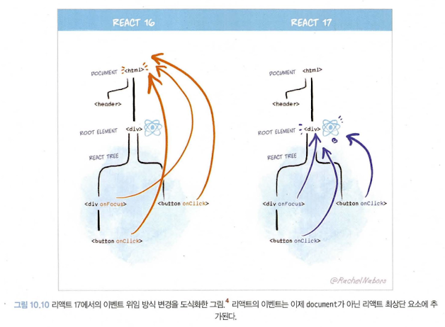
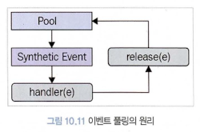
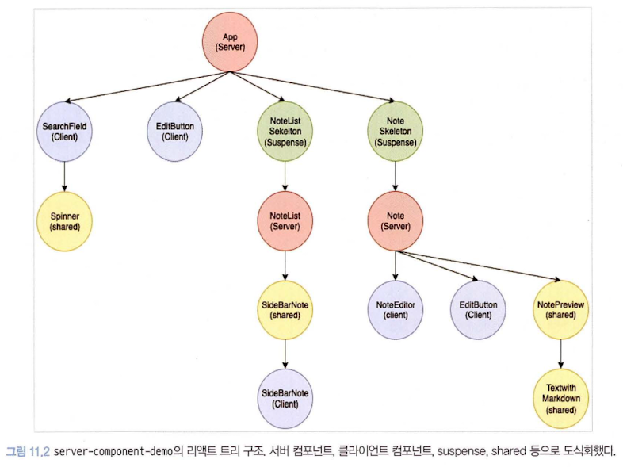

## 10장. 리액트 17과 18의 변경 사항 살펴보기

### 리액트 17 버전

16 버전과 다르게 새롭게 추가된 기능이 없으며 호환성이 깨지는 변경 사항, 즉 기존에 사용하던 코드의 수정을 필요로 하는 변경 사항을 최소화했다.

1. **리액트의 점진적인 업그레이드**
- 리액트는 ‘유의적 버전’을 기반으로 업데이트를 거치고 있었다. 즉, 새로운 버전이 릴리스되면 이전 버전에서의 API 제공을 완전히 중단해 버리고, 전체 애플리케이션을 새롭게 업그레이드를 해야 했다.
- 그러나 이제 ‘점진적인 업그레이드’가 가능해진다. 즉, 전체 애플리케이션 트리는 리액트 17이지만 일부 트리와 컴포넌트에 대해서만 리액트 18을 선택할 수 있다.
- 일종의 업데이트를 위한 업데이트
- 리액트 17 애플리케이션은 내부에서 리액트 16을 게으르게(lazy) 불러온다. 불러오는 과정에서 리액트 16을 위한 별도의 루트 요소를 만들고, 여기에 불러온 리액트 16 모듈을 렌더링하는 구조로 구성돼있다. 이렇게 불러온 결과, 서로 렌더링하는 과정에서 버전의 불일치로 인한 에러도 발생하지 않고 하나의 웹 사이트에서 두 개의 리액트가 존재할 수 있다.

2. **이벤트 위임 방식의 변경**
- 이벤트 위임 : 리액트는 이벤트 핸들러를 해당 이벤트 핸들러를 추가한 각각의 DOM 요소에 부탁하는 것이 아니라, 이벤트 타입(click, change) 당 하나의 핸들러를 루트에 부착한다. 즉, 이벤트 단계의 원리를 활용해 이벤트를 상위 컴포넌트에만 붙이는 것을 의미한다.
- 이벤트 구성 단계:
    - 캡쳐(capture) : 이벤트 핸들러가 트리 최상단 요소에서부터 시작해서 실제 이벤트가 발생한 타깃 요소까지 내려가는 것
    - 타깃(target) : 이벤트 핸들러가 타깃 노드에 도달하는 단계. 이 단계에서 이벤트가 호출된다.
    - 버블링(bubbling) : 이벤트가 발생한 요소에서부터 시작해 최상위 요소까지 다시 올라간다.
- 리액트는 최초 릴리스부터 이벤트 위임을 적극적으로 사용했으나, 16버전까지는 모두 document에서 수행되고 있었다.
- 그러나 17부터는 이벤트 위임이 모두 리액트 컴포넌트 최상단 트리, 즉 루트 요소로 바뀌었다.
- 점진적인 업그레이드 지원, 그리고 다른 바닐라 자바스크립트 코드 또는 jQuery 등이 혼재돼 있는 경우 혼란을 방지하기 위해서다. 즉, 이벤트 버블링으로 인한 혼선을 방지할 수 있다.



3. **import React from ‘react’가 더 이상 필요 없다: 새로운 JSX transform**
- JSX는 브라우저가 이해할 수 있는 코드가 아니므로 바벨이나 타입스크립트를 활용해 JSX를 실행하기 위해 일반적인 자바스크립트로 변환하는 과정이 꼭 필요하다.
- 16버전 까지는 이러한 JSX 변환을 사용하기 위해 코드 내에서 React를 사용하는 구문이 없더라도 `import React from ‘react’`가 필요했다.
- 그러나 17부터는 이러한 import 구문 없이도 변환할 수 있게 됐다. 이로써 번들링 크기를 약간 줄일 수 있고, 컴포넌트 작성을 더욱 간결하게 해준다.
- 한 번에 모두 삭제하는 방볍은
    
    ```jsx
    npx react-codemod update-react-imports
    ```
    

4. **이벤트 풀링 제거**
- 리액트에는 이벤트를 처리하기 위한 SyntheticEvent라는 이벤트가 있는데, 이 이벤트는 브라우저의 기본 이벤트를 한 번 더 감싼 이벤트 객체다. 리액트는 이렇게 브라우저 기본 이벤트가 아닌 한 번 래핑한 이벤트를 사용하기 때문에 이벤트가 발생할 때마다 이 이벤트를 새로 만들어야 했고, 그 과정에서 항상 새로 이벤트를 만들 때마다 메모리 할당 작업이 일어날 수밖에 없다. 또한 메모리 누수를 방지하기 위해 이렇게 만든 이벤트를 주기적으로 해제해야 하는 번거로움도 있다.
- 여기서 이벤트 풀링이란 SyntheticEvent 풀을 만들어서 이벤트가 발생할 때마다 가져오는 것을 의미한다.
- 이벤트 풀링의 원리
    1. 이벤트 핸들러가 이벤트를 발생시킨다.
    2. 합성 이벤트 풀에서 합성 이벤트 객체에 대한  참조를 가져온다.
    3. 이 이벤트 정보를 합성 이벤트 객체에 넣어준다.
    4. 유저가 지정한 이벤트 리스너가 실행된다.
    5. 이벤트 객체가 초기화되고 다시 이벤트 풀로 돌아간다.
    
    
    
- 비동기 코드로 이벤트 핸들러에 접근하기 위해서는 별도의 메모리 공간에 합성 이벤트 객체를 할당해야 한다는 점, 그리고 모던 브라우저에서는 이와 같은 방식이 성능 향상에 크게 도움이 안 된다는 점 때문에 이러한 이벤트 풀링 개념이 삭제됐다.

5. **useEffect 클린업 함수의 비동기 실행**
- 16버전 까지는 동기적으로 처리됐다. 때문에 이 클린업 함수가 완료되기 전까지는 다른 작업을 방해하므로 불필요한 성능 저하로 이어지는 문제가 존재했다.
- 그러나 17 버전 부터는 화면이 완전히 업데이트된 이후에 클린업 함수가 비동기적으로 실행된다. 이로써 약간의 성능적인 이점을 볼 수 있게 됐다.

6. **컴포넌트의 undefined 반환에 대한 일관적인 처리**
- 리액트 16에서 forwardRef나 memo에서 undefined를 반환하는 경우에는 별다른 에러가 발생하지 않는다는 문제가 있었다.
- 그러나 17부터는 에러가 정상적으로 발생한다.

### 리액트 18 버전

‘동시성 지원’이 가장 큰 변경점이다.

1. **새로 추가된 훅, useId**
- useId : 컴포넌트별로 유니크한 값을 생성하는 새로운 훅
- 17버전 : 컴포넌트 내부에서 사용할 수 있는 유니크한 값을 생성하는 것은 생각보다 쉽지 않은 일이다. 재사용하는 경우도 고려해야 하며, 서버 사이드 렌더링 환경에서 하이드레이션이 일어날 때도 서버와 클라이언트가 동일한 값을 가져야 에러가 발생하지 않으므로 이러한 점도 고려해야 한다.
- 18버전 : useId를 사용해 클라이언트와 서버에서 불일치를 피하면서 컴포넌트 내부의 고유한 값을 생성할 수 있게 됐다.
- useId가 생성하는 값은 :로 감싸져 있는데, 이는 CSS 선택자나 querySelector에서 작동하지 않도록 하기 위한 의도적인 결과다.

2. **새로 추가된 훅, useTransition**
- useTransition : UI 변경을 가로막지 않고 상태를 업데이트할 수 있는 리액트 훅
- 상태 업데이트를 긴급하지 않은 것으로 간주해 무거운 렌더링 작업을 조금 미룰 수 있으며, 사용자에게 조금 더 나은 사용자 경험을 제공할 수 있다.
- 리액트 18의 변경사항의 핵심 중 하나인 ‘동시성(concurrency)’을 다룰 수 있는 새로운 훅이다.
- useTransition과 같은 동시성을 지원하는 기능을 사용하면 느린 렌더링 과정에서 로딩 화면을 보여주거나 혹은 지금 진행 중인 렌더링을 버리고 새로운 상태값으로 다시 렌더링하는 등의 작업을 할 수 있게 된다. 이는 앱의 성능을 향상시킬 뿐만 아니라 사용자에게 좀 더 자연스러운 서비스를 경험할 수 있게 해준다.
- 컴포넌트에서만 사용 가능한 훅이다. 훅을 사용할 수 없는 상황이라면 단순히 startTransition을 바로 import할 수 있다.
- useTransition 사용시 주의점
    - startTransition 내부는 반드시 setState와 같은 상태를 업데이트하는 함수와 관련된 작업만 넘길 수 있다.
    - startTransition으로 넘겨주는 상태 업데이트는 다른 모든 동기 상태 업데이트로 인해 실행이 지연될 수 있다.
    - startTransition으로 넘겨주는 함수는 반드시 동기 함수여야 한다.

3. **새로 추가된 훅, useDeferredValue**
- useDeferredValue : 리액트 컴포넌트 트리에서 리렌더링이 급하지 않은 부분을 지연할 수 있게 도와주는 훅
- 특정 시간동안 발생하는 이벤트를 하나로 인식해 한 번만 실행하게 해주는 ‘디바운스’와 비슷하지만 디바운스 대비 useDeferredValue만이 가진 장점이 몇가지 있다.
- 디바운스는 고정된 지연 시간을 필요로 하지만 useDeferredValue는 고정된 지연 시간 없이 첫 번째 렌더링이 완료된 이후에 이 useDeferredValue로 지연된 렌더링을 수행한다. 그러므로 이 지연된 렌더링은 중단할 수도 있으며, 사용자의 인터랙션을 차단하지도 않는다.
- useDeferredValue와 useTransition은 방식에만 차이가 있을 뿐, 지연된 렌더링을 한다는 점에서는 모두 동일한 역할을 하는 것을 알 수 있다.
- 낮은 우선순위로 처리해야 할 작업에 대해 직접적으로 상태를 업데이트할 수 있는 코드에 접근할 수 있다면 useTransition
- 컴포넌트의 props와 같이 상태 업데이트에 관여할 수는 없고 오로지 값만 받아야 하는 상황이라면 useDeferredValue

4. **새로 추가된 훅, useSyncExternalStore**
- useSubscription의 구현이 리액트 18에 이르러서 useSyncExternalStore로 대체되었다.
- 테어링(tearing) : 리액트에서는 하나의 state 값이 있음에도 서로 다른 값(보통 state나 props의 이전과 이후)을 기준으로 렌더링되는 현상
- 리액트 17에서는 테어링이 일어날 여지가 없었다. 그러나 리액트 18에서는 앞서 useTransition, useDeferredValue 훅처럼 렌더링을 일시 중지하거나 뒤로 미루는 등의 최적화가 가능해지면서 동시성 이슈가 발생할 수 잇다.
- 물론, 리액트에서 관리하는 state라면 useTransition이나 useDeferredValue 예제와 같이 내부적으로 이러한 문제를 해결하기 위한 처리를 할 수 있지만 리액트에서 관리할 수 없는 외부 데이터 소스에서라면 문제가 달라진다.
- 리액트에서 관리할 수 없는 외부 데이터 소스란 리액트의 클로저 범위 밖에 있는, 관리 범위 밖에 있는 값들을 말한다. 글로벌 변수, document.body, window.innerWidth, DOM, 리액트 외부에 상태를 저장하는 외부 상태 관리 라이브러리 등이 모두 여기에 해당한다.
- 이 외부 데이터 소스에 리액트에서 추구하는 동시성 처리가 추가돼있지 않다면 테어링 현상이 발생할 수 있는데, 이 문제를 해결하기 위한 훅이 바로 useSyncExternalStore이다.
- 첫 번째 인수는 subscribe로, 콜백 함수를 받아 스토어에 등록하는 용도로 사용된다. 스토어에 있는 값이 변경되면 이 콜백이 호출돼야한다. 그리고 useSyncExternalStore는 이 훅을 사용하는 컴포넌트를 리렌더링한다.
- 두 번째 인수는 컴포넌트에 필요한 현재 스토어의 데이터를 반환하는 함수다. 이 함수는 스토어가 변경되지 않았다면 매번 함수를 호출할 때마다 동일한 값을 반환해야 한다. 스토어에서 값이 변경됐다면 이 값을 이전 값과 Object.is로 비교해 정말로 값이 변경됐다면 컴포넌트를 리렌더링한다.
- 마지막 인수는 옵셔널 값으로, 서버 사이드 렌더링 시에 내부 리액트를 하이드레이션하는 도중에만 사용된다. 서버 사이드에서 렌더링되는 훅이라면 반드시 이 값을 넘겨줘야 하며, 클라이언트의 값과 불일치가 발생할 경우 오류가 발생한다.

5. **새로 추가된 훅, useInsertionEffect**
- 기본적인 훅 구조는 useEffect와 동일하다. 다만 차이점은 실행 시점인데, useInsertionEffect는 DOM이  실제로 변경되기 전에 동기적으로 실행된다. 이 훅 내부에 스타일을 삽입하는 코드를 집어넣음으로써 브라우저가 레이아웃을 계산하기 전에 실행될 수 있게끔 해서 좀 더 자연스러운 스타일 삽입이 가능해진다.
- useLayoutEffect는 모든 DOM의 변경 작업이 다 끝난 이후에 실행되는 반면 useInsertionEffect는 이러한 DOM의 변경 작업 이전에 실행된다. 이러한 차이는 브라우저가 다시금 스타일을 입혀서 DOM을 재계산하지 않아도 된다는 점에서 매우 크다고 볼 수 있다.
- 라이브러리를 작성하는 경우가 아니라면 참고만 하고 실제 애플리케이션 코드에는 가급적 사용하지 않는 것이 좋다.

6. **react-dom/client**
- 클라이언트에서 리액트 트리를 만들 때 사용되는 API가 변경됐다.
- createRoot : render 메서드를 대체할 새로운 메서드다.
- hydrateRoot : 서버 사이드 렌더링 애플리케이션에서 하이드레이션을 하기 위한 새로운 메서드다.
- 이 두 API는 새로운 옵션인 onRecoverableError를 인수로 받는다. 이 옵션은 리액트가 렌더링 또는 하이드레이션 과정에서 에러가 발생했을 때 실행하는 콜백 함수다.

7. **react-dom/server**
- rederToPipeableStream : 리액트 컴포넌트를 HTML로 렌더링하는 메서드. 스트림을 지원하는 메서드로, HTML을 점진적으로 렌더링하고 클라이언트에서는 중간에 script를 삽입하는 등의 작업을 할 수 있다. 이를 통해 서버에서는 Suspense를 사용해 빠르게 렌더링이 필요한 부분을 먼저 렌더링할 수 있고, 값비싼 연산으로 구성된 부분은 이후에 렌더링되게끔 할 수 있다. rederToPipeableStream을 쓰면 최초에 브라우저는 아직 불러오지 못한 데이터 부분을 Suspense의 fallback으로 받는다.
- 기존 renderToNodeStream의 문제는 무조건 렌더링을 순서대로 해야 하고, 그리고 그 순서에 의존적이기 때문에 이전 렌더링이 완료되지 않는다면 이후 렌더링도 끝나지 않는다는 것이다. 이에 지연된다는 문제가 있다. 그러나 rederToPipeableStream를 활용하면 순서나 오래 걸리는 렌더링에 영향받을 필요 없이 빠르게 런더링을 수행할 수 있게 된다.
- renderToReadableStream : rederToPipeableStream이 Node.js 환경에서의 렌더링을 위해 사용된다면, renderToReadableStream은 웹 스트림을 기반으로 작동한다는 차이가 있다.

8. **자동 배치(Automatic Batching)**
- 리액트가 여러 상태 업데이트를 하나의 리렌더링으로 묶어서 성능을 향상시키는 방법을 의미한다.
- 리액트 17 이하의 과거 버전의 경우 이벤트 핸들러 내부에서는 이러한 자동 배치 작업이 이뤄지고 있었지만 Promise, setTimeout 같은 비동기 이벤트에서는 자동 배치가 이뤄지고 있지 않았다. 즉, 동기와 비동기 배치 작업에 일관성이 없었다.
- 이를 보완하기 위해 리액트 18 버전부터는 루트 컴포넌트를 createRoot를 사용해서 만들면 모든 업데이트가 배치 작업으로 최적화할 수 있게 됐다.
- 이러한 자동 배치를 리액트 18에서도 하고 싶지 않거나 이러한 작동 방식이 기존 코드에 영향을 미칠 것으로 에상된다면 flushSync를 사용하면 된다.

9. **더욱 엄격해진 엄격 모드**
- 리액트의 엄격 모드
    - 더 이상 안전하지 않은 특정 생명주기를 사용하는 컴포넌트에 대한 경고
    - 문자열 ref 사용 금지
    - findDOMNode에 대한 경고 출력
    - 구 Context API 사용 시 발생하는 경고
    - 예상치 못한 부작용 검사
- 리액트 18에서 추가된 엄격모드
    - 컴포넌트가 마운트 해제된 상태에서도 (컴포넌트가 렌더링 트리에 존재하지 않는 상태에서도) 컴포넌트 내부의 상태값을 유지할 수 있는 기능을 제공할 예정

10. **Suspense 기능 강화**
- Suspense : 컴포넌트를 동적으로 가져올 수 있게 도와주는 기능
- React.lazy는 컴포넌트를 첫 번째 렌더링 시에 불러오지 않고, 최초 렌더링 이후에 컴포넌트를 지연시켜 불러오는 역할을 한다.
- Suspense는 React.lazy를 통해 지연시켜 불러온 컴포넌트를 렌더링하는 역할을 한다.
- 즉, 지연 컴포넌트를 로딩하기 전에는 fallback을 보여주고, 이 lazy로 불러온 컴포넌트가 지연 로딩이 완료되면 fallback 대신 비로소 해당 컴포넌트를 보여주게 된다.
- 이처럼 lazy와 Suspense는 한 쌍으로 사용됐고, 애플리케이션에서 상대적으로 중요하지 않은 컴포넌트를 분할해 초기 렌더링 속도를 향상시키는 데 많은 도움을 줬다.
- 그러나 18 이전의 Suspense는 몇 가지 문제점이 있었다.
    - 기존의 Suspense는 컴포넌트가 아직 보이기도 전에 useEffect가 실행되는 문제가 존재했다.
    - Suspense는 서버에서 사용할 수 없었다.
- 리액트 18에서 변경된 Suspense의 내용은 다음과 같다.
    - 아직 마운트되기 직전임에도 effect가 빠르게 실행되는 문제가 수정됐다.
    - Suspense로 인해 컴포넌트가 보이거나 사라질 때도 effect가 정상적으로 실행된다.
    - Suspense를 이제 서버에서도 실행할 수 있게 된다.
    - Suspense 내에 스로틀링이 추가됐다.

11. **인터넷 익스플로러 지원 중단에 따른 추가 폴리필 필요**

12. **그 밖에 알아두면 좋은 변경사항**
- 이제 컴포넌트에서 undefined를 반환해도 에러가 발생하지 않는다. undefined 반환은 null 반환과 동일하게 처리된다.
- 이와 마찬가지로 `<Suspense fallback={undefined}>`도 null과 동일하게 처리된다.
- renderToNodeStream이 지원 중단됐다. 그 대신 renderToPipeableStream을 사용하는 것이 권장된다.

## 11장. Next.js 13과 리액트 18

### app 디렉터리의 등장

- 13 버전 이전까지는 페이지 공통으로 무언가를 집어 넣을 수 있는 곳은 `_document`와 `_app`이 유일하다.
    - `_document` : 페이지에서 쓰이는 태그를 수정하거나, 서버 사이드 렌더링 시 styled-components 같은 일부 CSS-in-JS를 지원하기 위한 코드를 삽입하는 제한적인 용도로 사용된다.
    - `_app` : 페이지를 초기하기 위한 용도로 사용된다.
- Next.js 12 버전까지는 무언가 페이지 공통 레이아웃을 유지할 수 있는 방법은 `_app`이 유일했다.
- 그러나 이 방식은 `_app`에서밖에 할 수 없어 제한적이고, 각 페이지별로 서로 다른 레이아웃을 유지할 수 있는 여지도 부족하다.
- 이러한 레이아웃의 한계를 극복하기 위해 나온 것이 Next.js의 app 레이아웃이다.

1. **라우팅**
- 기존에 page로 정의하던 라우팅 방식이 app 디렉터리로 이동했다.
- 파일명으로 라우팅하는 것이 불가능해졌다. 즉, 폴더명까지만 주소로 변환된다.

***layout.js**

- layout은 주소별 공통 UI를 포함할 수 있을 뿐만 아니라 `_document`와 `_app`을 대신해 웹페이지를 시작하는 데 필요한 공통 코드를 삽입할 수도 있다.
- 또한 layout.js를 통해 `_document.jsx`에서만 처리할 수 있었던 부자연스러움이 사라졌다.
- layout에서 주의해야 할 점은
    - layout은 app 디렉터리 내부에서는 예약어다.
    - layout은 children을 props로 받아서 렌더링해야 한다. 레이아웃이므로 당연히 그려야 할 컴포넌트를 외부에서 주입받고 그려야 한다.
    - layout 내부에는 반드시 export default로 내보내는 컴포넌트가 있어야 한다.
    - layout 내부에서도 API 요청과 같은 비동기 작업을 수행할 수 있다.

***page.js**

- page가 받는 props는 다음과 같다.
    - params : 옵셔널 값으로, 동적 라우트 파라미터를 사용할 경우 해당 파라미터에 값이 들어온다.
    - searchParams : URL에서 `?a=1`과 같은 URLSearchParams를 의미한다. 이 값은 layout에서는 제공되지 않는다. layout은 페이지 탐색 중에는 리렌더링을 수행하지 않기 때문이다.
- page는 다음과 같은 규칙을 가지고 있다.
    - page도 역시 app 디렉터리 내부의 예약어다.
    - page도 역시 내부에는 반드시 export default로 내보내는 컴포넌트가 있어야 한다.
    

***error.js**

- 해당 라우팅 영역에서 사용되는 공통 에러 컴포넌트다.
- 에러 정보를 담고 있는 `error: Error` 객체와 에러 바운더리를 초기화할 `reset: () ⇒ void를 props`로 받는다.
- 한 가지 명심해야 할 점은, 에러 바운더리는 클라이언트에서만 작동하므로 error 컴포넌트도 클라이언트 컴포넌트여야 한다는 점이다.
- 그리고 이 error 컴포넌트는 같은 수준의 layout에서 에러가 발생할 경우 해당 error 컴포넌트로 이동하지 않는다는 점도 명심해야 한다.
- Layout에서 발생한 에러를 처리하고 싶다면 상위 컴포넌트의 error를 사용하거나, app의 루트 에러 처리를 담당하는 app.global-error.js 페이지를 생성하면 된다.

***not-found.js**

- 특정 라우팅 하위의 주소를 찾을 수 없는 404 페이지를 렌더링할 때 사용된다.
- 전체 애플리케이션에서 404를 노출하고 싶다면 app/not-found.js를 생성해 사용하면된다.
- 이 컴포넌트는 서버 컴포넌트로 구성하면 된다.

***loading.js**

- 리액트 Suspense를 기반으로 해당 컴포넌트가 불러오는 중임을 나타낼 때 사용할 수 있다.
- ‘use client’ 지시자를 사용해 클라이언트에서 렌더링되기 할 수도 있다.

***route.js**

- 이전까지 지원하지 못했던 /pages/api에 대한 /app 디렉터리 내부의 지원도 추가됐다.
- 디렉터리가 라우팅 주소를 담당하며 파일명은 route.js로 통일됐다.
- 파일 내부에 REST API의 get, post와 같은 메서드명을 예약어로 선언해두면 HTTP 요청에 맞게 해당 메서드를 호출하는 방식으로 작동한다.
- 한 가지 흥미로운 점은 app/api 외에 다른 곳에서 선언해도 작동한다는 것이다.
- route.ts가 존재하는 폴더 내부에는 page.tsx가 존재할 수 없다. 만약 두 파일이 존재한다면 경고 메시지가 뜬다.
- route의 함수들이 받을 수 있는 파라미터는 다음과 같다.
    - request : NextRequest 객체이며, fetch의 Request를 확장한 Next.js만의 Request라고 보면 된다. API 요청과 관련된 cookie, headers 등 뿐만 아니라 nextUrl 같은 주소 객체도 확인할 수 있다.
    - context : params만을 가지고 있는 객체이며, 동적 라우팅 파라미터 객체가 포함돼 있다. 이 객체는 Next.js에서 별도 인터페이스를 제공하지 않으므로 주소의 필요에 따라 원하는 형식으로 선언하면 된다.

### 리액트 서버 컴포넌트

리액트 서버 컴포넌트는 서버 사이드 렌더링과 완전히 다른 개념이다.

**기존 리액트 컴포넌트와 서버 사이드 렌더링의 한계**

- 리액트의 모든 컴포넌트는 클라이언트에서 작동하며, 브라우저에서 자바스크립트 코드 처리가 이뤄진다.
- 서버 사이드 렌더링은, 미리 서버에서 DOM을 만들어 오고, 클라이언트에서는 이렇게 만들어진 DOM을 기준으로 하이드레이션을 진행한다. 이후 브라우저에서는 상태를 추적하고, 이벤트 핸들러를 DOM에 추가하고, 응답에 따라 렌더링 트리를 변경하기도 한다.
- 서버 사이드 렌더링 구조는 다음과 같은 **한계점**이 있다.
    1. 자바스크립트 번들 크기가 0인 컴포넌트를 만들 수 없다.
    2. 백엔드 리소스에 대한 직접적인 접근이 불가능하다.
    3. 자동 코드 분할(code split)이 불가능하다 : 코드 분할이란 하나의 거대한 코드 번들 대신, 코드를 여러 작은 단위로 나눠 필요할 때만 동적으로 지연 로딩함으로서 앱을 초기화하는 속도를 높여주는 기법을 말한다. 일반적으로 리액트는 lazy를 사용해 구현해왔다.
        
        그러나 lazy는 몇 가지 단점이 있다.
        
        1. 일일이 lazy로 감싸는 것을 기억해야 하기 때문에, 누락하는 경우가 발생할 수 있다.
        2. 해당 컴포넌트가 호출되고 if문을 판단하기 전까지 어떤 지연 로딩한 컴포넌트를 불러올 지를 결정할 수 없다. 이는 지역 로딩으로 인한 성능 이점을 상쇄해버리는 결과를 만들고만다.
    4. 연쇄적으로 발생하는 클라이언트와 서버의 요청을 대응하기 어렵다 : 최초의 컴포넌트의 요청과 렌더링이 끝나기 전까지는 하위 컴포넌트의 요청과 렌더링이 끝나지 않는다. 그만큼 서버에 요청하는 횟수도 늘어나고, 불필요한 렌덜이까지 발생한다.
    5. 추상화에 드는 비용이 증가한다.
- 서버 사이드 렌더링의 한계점을 쭉 살펴본다면 모든 문제는 리액트가 클라이언트 중심으로 돌아가기 때문에 발생하는 문제라는 것을 알 수 있다.
- **서버 사이드 렌더링**은 정적 콘텐츠를 빠르게 제공하고, 서버에 있는 데이터에 손쉽게 제공할 수 있는 반면 사용자의 인터렉션에 따른 다양한 사용자 경험을 제공하긴 어렵다.
- **클라이언트 사이드 렌더링**은 사용자의 인터렉션에 따라 정말 다양한 것들을 제공할 수 있지만 서버에 비해서 느리고 데이터를 가져오는 것도 어렵다.
- 이러한 두 구조의 장점을 모두 취하고자 하는 것이 바로 **리액트 서버 컴포넌트**다.

**서버 컴포넌트란?**

- 하나의 언어, 하나의 프레임워크, 그리고 하나의 API와 개념을 사용하면서 서버와 클라이언트 모두에서 컴포넌트를 렌더링할 수 있는 기법을 의미한다.
- 즉, 일부 컴포넌트는 클라이언트에서, 일부 컴포넌트는 서버에서 렌더링되는 것이다.
- 클라이언트 컴포넌트는 서버 컴포넌트를 import할 수 없다. 클라이언트는 서버 컴포넌트를 실행할 방법이 없기 때문에(서버 환경이 브라우저에는 존재하지 않으므로) 컴포넌트를 호출할 수 없다.
- 서버 컴포넌트와 클라이언트 컴포넌트가 있으며 동시에 두 군데에서 모두 사용할 수 있는 공용 컴포넌트가 있다.
    1. 서버 컴포넌트
        - 요청이 오면 그 순간 서버에서 딱 한 번 실행될 뿐이므로 상태를 가질 수 없다. 따라서 리액트에서 상태를 가질 수 있는 useState, useReducer 등의 훅을 사용할 수 없다.
        - 렌더링 생명주기도 사용할 수 없다. 한 번 렌더링되면 그걸로 끝이기 때문이다. 따라서 useEffect, useLayoutEffect를 사용할 수 없다.
        - 앞의 두 가지 제약사항으로 인해 effect나 state에 의존하는 사용자 정의 훅 또한 사용할 수 없다. 다만 effect나 state에 의존하지 않고 서버에서 제공할 수 있는 기능만 시용하는 훅이라면 충분히 사용 가능하다.
        - 브라우저에서 실행되지 않고 서버에서만 실행되기 때문에 DOM API를 쓰거나 window, document 등에 접근할 수 없다.
        - 데이터베이스, 내부 서비스, 파일 시스템 등 서버에만 있는 데이터를 async/await으로 접근할 수 있다. 컴포넌트 자체가 async한 것이 가능하다.
        - 다른 서버 컴포넌트를 렌더링하거나 div, span, p 같은 요소를 렌더링하거나, 혹은 클라이언트 컴포넌트를 렌더링할 수 있다.
    2. 클라이언트 컴포넌트
        - 브라우저 환경에서만 실행되므로 서버 컴포넌트를 불러오거나, 서버 전용 훅이나 유틸리티를 불러올 수 없다.
        - 그러나 앞의 코드에서 본 것처럼 서버 컴포넌트가 클라이언트 컴포넌트를 렌더링하는데, 그 클라이언트 컴포넌트가 자식으로 서버 컴포넌트를 갖는 구조는 가능하다. 그 이유는 클라이언트 입장에서 봤을 때 서버 컴포넌트는 이미 서버에서 만들어진 트리를 가지고 있을 것이고, 클라이언트 컴포넌트는 이미 서버에서 만들어진 그 트리를 삽입해서 보여주기만 하기 때문이다. 따라서 서버 컴포넌트와 클라이언트 컴포넌트를 중첩해서 갖는 위와 같은 구조로 설계하는 것이 가능하다.
    3. 공용 컴포넌트(shared components)
        - 이 컴포넌트는 서버와 클라이언트 모두에서 사용할 수 있다.
- 리액트는 모든 것을 다 공용 컴포넌트로 판단한다. 즉, 모든 컴포넌트를 다 서버에서 실행 가능한 것으로 분류한다.
- 클라이언트 컴포넌트라는 것을 명시적으로 선언하려면 파일의 맨 첫 줄에 ‘use client’라고 작성해두면 된다.

**서버 사이드 렌더링과 서버 컴포넌트의 차이**

- **서버 사이드 렌더링**은 응답받은 페이지 전체를 HTML로 렌더링하는 과정을 서버에서 수행한 후 그 결과를 클라이언트에 내려준다.
- 그리고 이후 클라이언트에서 하이드레이션 과정을 거쳐 서버의 결과물을 확인하고 붙이는 등의 작업을 수행한다.
- 목적은 초기에 인터랙션은 불가능하지만 정적인 HTML을 빠르게 내려주는 데 초점을 두고 있다.
- 따라서 여전히 초기 HTML이 로딩된 이후에는 클라이언트에서 자바스크립트 코드를 다운로드하고, 파싱하고, 실행하는 데 비용이 든다.
- 둘은 대체제가 아닌 상호보완하는 개념으로 봐야 할 것이다.

**서버 컴포넌트는 어떻게 작동하는가?**



1. 서버가 렌더링 요청을 받는다. 서버가 렌더링 과정을 수행해야 하므로 리액트 서버 컴포넌트를 사용하는 ㅗㅁ든 페이지는 항상 서버에서 시작된다. 즉, 루트에 있는 컴포넌트는 항상 컴포넌트다.
2. 서버는 받은 요청에 따라 컴포넌트를 JSON으로 직렬화(serialize)한다. 이때 서버에서 렌더링할 수 있는 것은 직렬화해서 내보내고, 클라이언트 컴포넌트로 표시된 부분은 해당 공간을 플레이스홀더 형식으로 비워두고 나타낸다. 브라우저는 이후에 이 결과물을 받아서 다시 역질렬화한 다음 렌더링을 수행한다.
3. 브라우저가 리액트 컴포넌트 트리를 구성한다. 브라우저가 서버로 스트리밍으로 JSON 결과물을 받았다면 이 구문을 다시 파싱한 결과물을 바탕으로 트리를 재구성해 컴포넌트를 만들어 나간다.

**리액트 서버 컴포넌트의 작동 방식의 특별한 점은?**

- 먼저 서버에서 클라이언트로 정보를 보낼 때 스트리밍 형태로 보냄으로써 클라이언트가 줄 단위로 JSON을 읽고 컴포넌트를 렌더링할 수 있어 브라우저에서는 되도록 빨리 사용자에게 결과물을 보여줄 수 있다.
- 컴포넌트들이 하나의 번들러 작업에 포함돼 있지 않고 각 컴포넌트별로 번들링이 별개로 돼 있어 필요에 따라 컴포넌트를 지연해서 받거나 따로 받는 등의 작업이 가능해졌다.
- 서버 사이드 렌더링과는 다르게 결과물이 HTML이 아닌 JSON 형태로 보내진 것 또한 주목해 볼 만하다.

**Next.js에서의 리액트 서버 컴포넌트**

- 서버 컴포넌트는 클라이언트 컴포넌트를 불러올 수 없으며, 클라이언트 컴포넌트는 서버 컴포넌트를 children props로 받는 것만 가능하다.
- page.js와 layout.js는 반드시 서버 컴포넌트여야 하며, 서버 컴포넌트의 제약을 받는다.
1. 새로운 fetch 도입과 getServerSideProps, getStaticProps, getInitialProps의 삭제
    - 모든 데이터 요청은 웹에서 제공하는 표준 API인 fetch를 기반으로 이뤄진다.
    - fetch API를 확장해 같은 서버 컴포넌트 트리 내에서 동일한 요청이 있다면 재요청이 발생하지 않도록 요청 중복을 방지했다.
    - 해당 fetch 요청에 대한 내용을 서버에서는 렌더링이 한 번 끝날 때까지 캐싱하며, 클라이언트에서는 별도의 지시자나 요청이 없는 이상 해당 데이터를 최대한 캐싱해서 중복된 요청을 방지한다.
2. 정적 렌더링과 동적 렌더링
    - 과거 Next.js에는 getStaticProps를 활용해 서버에서 불러오는 데이터가 변경되지 않는 경우에 정적으로 페이지를 만들어 제공할 수 있는 기능이 있었다. 이 기능을 활용하면 해당 주소로 들어오는 경우 모든 결과물이 동일하기 때문에 CDN에서 캐싱해 기존 서버 사이드 렌더링보다 더 빠르게 데이터를 제공할 수 있다는 장점이 있었다.
    - Next.js 13에서는 정적인 라우팅에 대해서는 기본적으로 빌드 타임에 렌더링을 미리 해두고 캐싱해 재사용할 수 있게끔 해뒀고, 동적인 라우팅에 대해서는 서버에 매번 요청이 올 때마다 컴포넌트를 레더링하도록 변경했다.
    - 동적인 주소지만 특정 주소에 대해서 캐싱하고 싶은 경우, 즉 과거 Next.js에서 제공하는 getStaticProps를 흉내내고 싶다면, 새로운 함수인 generateStaticParams를 사용하면 된다.
3. 캐시와 mutating, 그리고 revalidating
    - 캐시를 전체적으로 무효화하고 싶다면 router에 추가된 refresh 메서드로 `router.refresh();`를 사용하면 된다.
    - 이는 브라우저를 새로고침하는 등 브라우저의 히스토리에 영향을 미치지 않고, 오로지 서버에서 루트부터 데이터를 전체적으로 가져와서 갱신하게 된다.
4. 스트리밍을 활용한 점진적인 페이지 불러오기
    - 서버 사이드 렌더링은 요청받은 페이지를 모두 렌더링해서 내려줄 때까지는 사용자에게 아무것도 보여줄 수 없으며, 사용자는 빈 페이지만 보게 된다.
    - 하이드레이션 과정을 거쳐야만 비로소 사용자가 사용할 수 있는 페이지가 된다.
    - 문제는 이 모든 작업이 순차적으로 다 완료돼야만 페이지 하나를 온전하게 볼 수 있다는 것이다.
    - 이를 해결하기 위해서 HTML을 작은 단위로 쪼개서 완성되는 대로 클라이언트로 점진적으로 보내는 **스트리밍**이 도입됐다.
    - 스트리밍을 통해 모든 데이터가 로드될 때까지 기다리지 않더라도 먼저 데이터가 로드되는 컴포넌트를 빠르게 보여주는 방법이 가능하다.
    - 이는 사용자가 일부라도 페이지와 인터랙션을 할 수 있다는 것을 의미하며, 나아가 핵심 웹 지표인 최초 바이트까지의 시간(TTFB: Time To First Byte)과 최초 콘텐츠풀 페인팅(FCP: First Contentful Paint)을 개선하는 데 큰 도움을 준다.
    - 스트리밍을 활용할 수 있는 방법은
        - 경로에 loading.tsx 배치
        - Suspense 배치
        
        가 있다.
        

**웹팩의 대항마, 터보팩의 등장(beta)**

- 웹팩 대비 최대 700배, Vite 대비 최대 10배 빠르다

**서버 액션(alpha)**

- API를 굳이 생성하지 않더라도 함수 수준에서 서버에 직접 접근해 데이터 요청 등을 수행할 수 있는 기능
- 서버 컴포넌트와 다르게, 특정 함수 실행 그 자체만을 서버에서 수행할 수 있다는 장점이 있다.
- 실행 결과에 따라 다양한 작업을 수행할 수도 있다.
- 서버 액션을 활성화하려면 next.config.js에서 실험 기능을 활성화해야 한다.
- 서버 액션을 만들려면 먼저 함수 내부 또는 파일 상단에 클라이언트 선언과 비슷하게 ‘use server’ 지시자를 선언해야 한다. 그리고 함수는 반드시 aync여야 한다.
    
    ```jsx
    async function serverAction() {
     "use server";
     // 서버에 바로 접근하는 코드
    }
    ```
    
    ```jsx
    // 이 파일 내부의 모든 내용이 서버 액션으로 간주된다.
    'user server'
    
    export async function myAction() {
    	// ...
    	// 서버에 바로 접근하는 코드
    }
    ```
    
- 서버 액션이 수행할 수 있는 작업은
    - form의 action
    - input의 submit과 image의 formAction
    - startTransition과의 연동
    - server mutation이 없는 작업
- 전통적인 서버 기반 웹 애플리케이션(php)과 크게 다를 바 없어 보이지만, 주목해야 할 가장 큰 차이는 모든 과정이 페이지 새로고침이 없이 수행된다는 것이다.
- 한 가지 더 주목해야 할 것은 revalidatePath다. 이는 인수로 넘겨받은 경로의 캐시를 초기화해서 해당 URL에서 즉시 새로운 데이터를 불러오는 역할을 한다. Next.js에서는 이를 server mutation(서버에서의 데이터 수정)이라고 하는데, server mutation으로 실행할 수 있는 함수는 다음과 같다.
    - redirect : 특정 주소로 리다이렉트 할 수 있다.
    - revalidatePath : 해당 주소의 캐시를 즉시 업데이트한다.
    - revalidateTag : 다양한 fetch 요청을 특정 태그 값으로 구분할 수 있으며, 이 특정 태그가 추가된 fetch 요청을 모두 초기화한다.
- useTransition을 사용하면 얻을 수 있는 장점 중 하나는 이전과 동일한 로직을 구현하면서도 page 단위의 loading.jsx를 사용하지 않아도 된다는 것이다.
- 서버 액션은 클라이언트 컴포넌트 내에서 정의될 수 없다.
- 서버 액션을 Import하는 것뿐만 아니라, props 형태로 서버 액션을 클라이언트 컴포넌트에 넘기는 것 또한 가능하다.

**Next.js에서 사용하는 fetch에서 주는 cache 옵션**

- force-cache : 캐시가 존재한다면 해당 캐시값을 반환하고, 캐시가 존재하지 않으면 서버에서 데이터를 불러와 가져온다.(기본값)
- no-store : 캐시를 절대 사용하지 않고, 매 요청마다 새롭게 값을 불러온다.
- `fetch(https://…, { next: { revalidate: false | 0 | number } } });` : 캐시를 초 단위로 줄 수 있다.
- 정적으로 미리 빌드해두는 것뿐만 아니라 캐시를 활용하는 것도 가능하다.
- 이러한 방식을 Next.js에서는 ‘Incremental Static Regeneration’이라고 하는데, 정적으로 생성된 페이지를 점진적으로 갱신하는 것을 의미한다.

**로딩, 스트리밍, 서스펜스**

- 스트리밍과 리액트의 서스펜스를 활용해 컴포넌트가 렌더링 중이라는 것을 나타낼 수 있다.
- loading과 Suspense 모두 동일한 방식으로 작동하며, Suspense가 조금 더 개발자가 원하는 형태로 쪼개서 보여줄 수 있다는 차이만 있다.