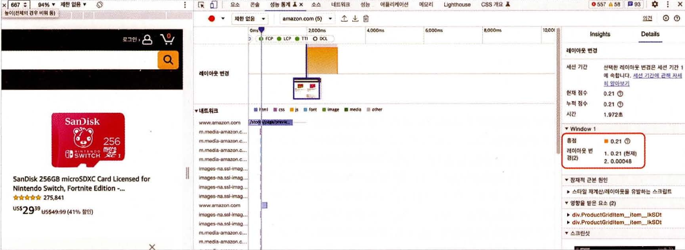
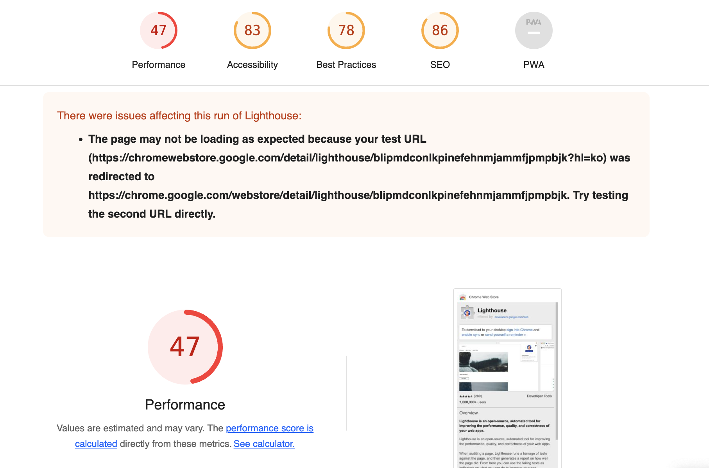
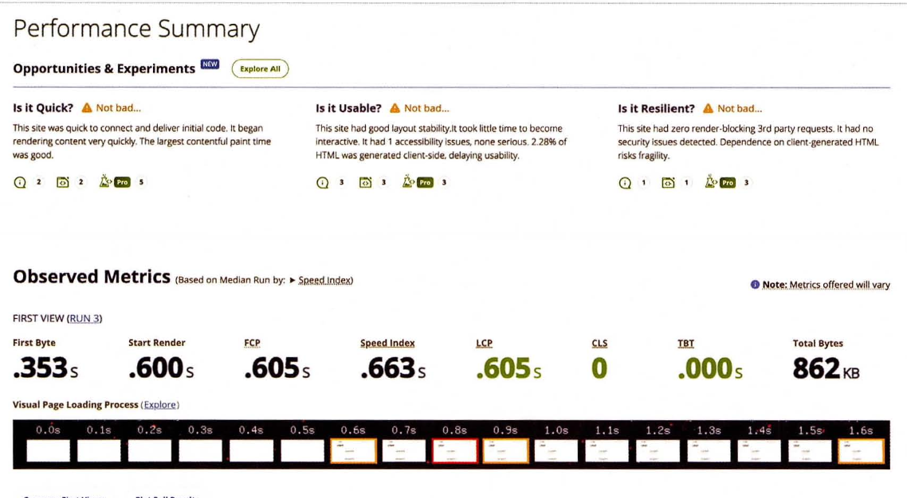

# 12. 모든 웹 개발자가 관심을 가져야 할 핵심 웹 지표

## 12.1 웹 사이트와 성능

- 웹 사이트의 성능이 미치는 영향
  1. 1초 내로 로딩되는 사이트는 5초 내로 로딩되는 사이트보다 전자상거래 전환율(실제 구매로 이어지는 고객의 비율)이 2.5배 더 높다
  2. 0 ~ 5초의 범위에서, 1초 로딩이 늦어질수록 전환율은 4.42%씩 떨어진다. 즉, 5초 이상 느려지면 전환율은 20% 가까이 떨어진다
  3. 페이지 로드 시간이 0 ~ 2초 사이인 페이지에서 가장 높은 전환율을 달성할 수 있다
- 사용자가 성능에 민감함
  1. 소비자의 70%는 페이지 속도가 온라인 커머스 사이트를 방문하는데 영향을 미침
  2. 절반 가까운 사람이 더욱 빠르게 로딩할 수 있다면 애니메이션과 동영상이 필요 없음
- 구글에서 낸 웹사이트의 성능에 관한 통계
  1. 전체 웹페이지를 표시하는데 필요한 최적의 평균 리소스 요청 수는 50회 미만이다(한 페이지를 로딩하는데 50회 미만의 요청이 발생해야 한다)
  2. 평균적으로 웹 페이지 전체를 요청하는데 15.3초가 걸린다
  3. 인간의 뇌와 신경계를 분석한 결과, 페이지 로드 시간이 1초에서 10초로 늘어날수록 모바일 사이트를 이탈할 확률이 123% 증가한다.
  4. 요즘 웹사이트의 성능은 전세계 사용자의 대부분이 모바일을 3G가 아닌 4G로 사용하고 있음에도 불구하고, 대부분의 모바일 사이트는 여전히 느리고 너무 많은 요소 때문에 비대해졌다
- 많은 개발자들이 성능에 대해 큰 관심을 기울이지 않음
  1. 개발자가 쓰는 기기는 훨씬 성능이 좋고 네트워크 환경도 안정적임
  2. 성능 개선 작업은 기능 개발에 비하여 눈에 띄는 성능 향상을 기대하기 어려움

## 12.2 핵심 웹 지표란?

> 구글에서 만든 지표로, 웹 사이트에서 뛰어난 사용자 경험을 제공하는데 필수적인 지표

- 구글에서 핵심 엡 지표로 꼽는 지표
  1. 최대 콘텐츠풀 페인트(LCP: Largest Contentful Paint)
  2. 최초 입력 지연(FID: First Input Delay)
  3. 누적 레이아웃 이동(CLS: Cumulative Layout Shift)
- 핵심은 아니지만, 특정 문제를 진단하는데 사용 가능한 지표
  1. 최초 바이트까지의 시간(TTFB: Time To First Byte)
  2. 최초 콘텐츠풀 시간(FCP: First Contentful Paint)

## 12.3 최대 콘텐츠풀 페인트(LCP)

### 정의

> 페이지가 처음으로 로드를 시작한 시점부터 뷰포트 내부에서 가장 큰 이미지 또는 텍스트를 렌더링하는데 걸리는 시간

- 뷰포트: 사용자에게 노출되는 화면
- 최대 콘텐츠풀 페인트란 사용자의 기기가 노출하는 뷰포트 내부에서 가장 큰영역을 차지하는 요소가 렌더링되는데 얼마나 걸리는지 측정하는 지표
- 고려되는 요소
  - `<lmg>`
  - `<svg>` 내부의 `<lmage>`
  - poster 속성을 시용하는 `<video>`
  - `url()`을 통해 불러온 배경 이미지가 있는 요소
  - 텍스트와 같이 인라인 텍스트 요소를 포함하고 있는 블록 레벨 요소
    - 이 블록 레벨 요소에는 `
`, `
` 등이 포함

### 의미

- 사용자에게 있어 로딩이란 뷰포트 영역에 보이는 부분을 기준으로 메인 컨텐츠가 화면에 완전히 전달되는 속도로 로딩이 완료됐다고 체감하는 시간과 비슷하게 측정

  ⇒ 사용자에게 페이지의 정보를 화면에 전달하는 속도를 객좐적으로 판단하기 위한 것

### 예제

1. 최초에 헤더가 가장 먼저 노출됨 그러므로 최대 콘텐츠풀 페인트는 헤더
2. 그 다음 바둑판 메뉴가 도출됨. 이 영역은 헤더보다 크기 때문에 초대 콘텐츠풀 페인트가 헤더에서 이 바둑판 메뉴로 바뀜
3. 시간이 지나고 콘텐츠가 로딩되면서 최대 콘텐츠풀 페인트는 가운데 사진 영역으로 바뀜
4. 3번에서 현재 최대 콘텐츠풀 페인트인 영역은 이미지 로딩이 필요한데, 아직 이미지 로딩이 끝나지 않음
5. 최대 콘텐츠풀 페인트 영역 내부의 이미지 로딩이 마침내 끝나면서 최대 콘텐츠풀 페인트 지표가 기록

### 기준 점수

- 좋은 점수는 2.5초 내로 응답
- 보통 점수는 4초 이내로 응답
- 그 이상이 걸리면 나쁨

### 개선 방안

**텍스트는 언제나 옳다**

- 최대 콘텐츠풀 페인트 예상 영역에 이미지가 아닌 문자열을 넣는 것

**이미지는 어떻게 불러올 것인가?**

- `<svg>` 내부의 ``가 로딩이 완료되기 전까지 최대 콘텐츠풀 페인트가 완료되지 않음

## 12.4 최초 입력 지연(FID)

### 정의

> 웹사이트의 반응성을 측정하는 지표

- 사용자가 클릭을 비롯한 웹사이트와 상호작용할 수 없다면 사용자는 웹사이트가 느리다고 생각함

### 의미

- 이벤트가 발생하는 시점에 최대한 메인 스레드가 다른 작업을 처리할 수 있도록 여유를 만들어둬야 사용자에게 빠른 반응성을 보장함
- RAIL: 구글이 정의한 사용자 경험 4가지
  - Response: 사용자의 입력에 대한 반응 속도. 50ms 미만으로 이벤트를 처리할 것
  - Animation: 애니메이션의 각 프레임을 10ms 이하로 생성할 것
  - Idle: 유휴 시간을 극대화해 페이지가 50ms 이내에 사용자 입력에 응답하도록 할 것
  - Load: 5초 이내에 콘텐츠를 전달하고 인터랙션을 준비할 것

### 예제

최초 사용자 입력 후 지연이 발생하는 웹사이트의 성능을 분석한 예제

- 메인 스레드가 작업 중인 시점에 클릭 이벤트가 일어났고, 클릭 이벤트는 메인 스레드가 이전에 하던 작업을 다 마무리하고 나서야 비로소 실행 가능
- 이벤트 핸들러의 실행 시간을 측정하고 싶다면 Event Timing API를 사용하는 것이 좋음

### 기준 점수

- 좋은 점수는 100ms 이내로 응답이 와야함
- 보통 점수는 300ms 이내로 응답이 와야함
- 그 이상이 걸리면 나쁨

### 개선 방안

- 실행에 오래 걸리는 긴 작업을 분리
- 자바스크립트 코드 최소화
- 타사 자바스크립트 코드 실행의 지연

  ⇒ 대부분 웹페이지 로드에 중요한 자원이 아니므로 `<script>`의 `async`와 `defer`를 이용해 지연 불러오기를 하는 것이 좋음

## 12.5 누적 레이아웃 이동(CLS)

### 정의

> 페이지의 생명주기 동안 발생하는 모든 예기치 않은 이동에 대한 지표를 계산하는 것

### 의미

- 사용자의 가시적인 콘텐츠에 영향을 미쳐야 하기 때문에 뷰포트 내부의 요소에 대해서만 측정
- 최초 렌더링이 시작된 위치에서 만약 레이아웃의 이동이 발생한다면 누적 레이아웃 이동 점수로 기록
- 사용자 액션으로 인해 발생한 레이아웃 이동은 점수에 포함되지 않음

### 예제

- 크롬 개발자도구의 ‘Performance insights’ 메뉴를 보먼 배너 노출로 인한 레이아웃 이동이 한 차례 발생했다는 것을 확인 가능

### 기준 점수

- 좋은 점수는 0.1 이내
- 보통 점수는 0.25 이하
- 그 이상은 나쁜 점수

### 개선 방안

- 삽입이 예상되는 요소를 위한 추가적인 공간 확보
- 폰트 로딩 최적화
- 적절한 이미지 크기 설정

### 핵심 웹 지표는 아니지만 성능 확인에 중요한 지표들

**최초 바이트까지의 시간(Time To First Byte, TTFB)**

> 브라우저가 웹페이지의 첫 번째 바이트를 수신하는데 걸리는 시간

- 페이지를 요청했을 때 요청이 완전이 완료되는데 걸리는 시간을 측정하는 것이 아닌,
  최초의 응답이 오는 바이트까지가 얼마나 걸리는지를 측정
- SSR을 하고 있는 애플리케이션에서 주의 깊에 봐야 함

**최초 콘텐츠풀 페인트(First Contentful Paint, FCP)**

> 페이지가 로드되기 시작한 시점부터 페이지 콘텐츠의 일부가 화면에 렌더링될 떄까지의 시간을 측정

- 기준 점수
  - 좋은 점수는 1.8초 이내에 이루어진 것
  - 보통 점수는 3.0초 이내에 이루어진 것
  - 그 이후는 개선이 필요

# 13. 웹페이지의 성능을 측정하는 다양한 방법

## 13.1 애플리케이션에서 확인하기

### create-react-app

- reportWebVitials(): 웹에서 성능을 측정하기 위한 함수

  ⇒ 누적 레이아웃 이동(CLS), 최초 입력 지연(FID), 최초 콘텐츠풀 페인트(FCP), 최대 콘텐츠 페인팅(LCP), 첫 바이트까지의 시간(TIFB)을 측정히는 용도로 사용

  ⇒ web-vitals 라이브 러리

- PerformanceObserver: 웹페이지에서 다양한 성능을 측정할 수 있도록 도와주는 API

### create-next-app

- Next.js-hydration: 페이지가 서버 사이드에서 렌더링되어 하이드레이션하는데 걸린 시간
- Next.js-route-change-to-render: 페이지가 경로를 변경한 후 페이지를 렌더링을 시작하는 데 걸리는 시간
- Next.js-render: 경로 변경이 완료된 후 페이지를 렌더링하는 데 걸린 시간

## 13.2 구글 라이트하우스

> 별도의 애플리케이션 코드 수정이나 배포, 수집 없이도 지표를 수집할 수 있는 방법

- 구글에서 제공하는 웹 페이지 성능 측정 도구로, 오픈소스로 운영
- 기기 항목에서 측정하고자 하는 페이지 접근 환경 선택 가능
- 카테고리에서 확인하고 싶은 지표 선택 가능

### 구글 라이트하우스 - 탐색 모드

> 페이지에 접속했을 때부터 페이지 로딩이 완료될 때까지의 성능을 측정하는 모드

- 페이지를 처음부터 다시 불러와서 페이지 로딩이 끝날 때까지 각각의 지표를 수집

**성능**

> 웹 페이지의 성능과 관련된 지표를 확인할 수 있는 영역

- 핵심 웹 지표인 최초 콘텐츠풀 페인트(FCP), 최대 콘벤츠풀 페인트(LCP), 누적 레이아웃 이동(CLS)이 있음
- 그 외에도 Time to Interactive, Speed Index, Total Blocking Time이 있음

**접근성**

> 장애인 및 고령자 등 신체적으로 불편한 사람들이 일반적인 사용자와 동등하게 웹페이지를 이용할 수 있도록 보장하는 것

- 점수가 낮거나 미비한 부분이 확인 가능하며 어떻게 수정해야 하는지도 알려줌

**권장사항**

> 웹사이트를 개발할 때 고려해야 할 요소들을 얼마나 지키고 있는지 확인

- 보안, 표준 모드, 최신 라이브러리, 소스 맵 등 다양한 요소들이 포함되어 있음

**검색 엔진 최적화**

> 구글과 같은 검색엔진이 쉽게 웹페이지 정보를 가져가서 공개할 수 있도록 최적화되어 있는지 확인하는 것

- 문서를 크롤링하기 쉽게 만들었는지
- robots.txt가 유요한지
- 이미지와 링크에 설명 문자가 존재하는지
- `<meta>`나 `<title>` 등으로 페이지의 정보를 빠르게 확인할 수 있는지

### 구글 라이트하우스 - 기간 모드

> 실제 웹페이지를 탐색하는 동안 지표를 측정하는 것

- 기간 모드 시작을 누른 뒤 성능 측정을 원하는 작업 수행 후, 종료하면 그 사이 일어난 작업들에 대한 지표를 확인 가능

**흔적**

> View Trace를 변역한 것으로, 웹 성능을 추적한 기간을 성능 탭에서 보여줌

- 상세하게 시간의 흐름에 따라 어떻게 웹페이지가 로딩됐는지 보여줌

**트리맵**

> 페이지를 불러올 때 함께 로딩한 모든 리소스를 함께 모아서 볼 수 있음

- 전체 JS 리소스 중 어떤 파일이 전체 데이터 로딩 중 어느 정도를 차지했는지 비율로 확인 가능
- 실제 불러온 데이터의 크기를 확인 가능

### 구글 라이트하우스 - 스냅샷

> 탐색 모드와 유사하나, 현재 페이지 상태를 기준으로 분석

- 현재 상테에서 검색엔진의 최적화, 접근성, 성능 등을 분석 가능
- 페이지 로딩이 아닌 특정 페이지 특정상태를 기준으로 분석하고 싶다면 스냅샷 모드를 시용

## 13.3 WebPageTest

> 웹사이트 성능을 분석하는 도구로 가장 널리 알려진 도구

- 무료 기능도 있지만, 유료로 제공하는 분석 도구도 존재
- 제공하는 분석도구는 크게 다섯 가지로 나뉨
  - Site Performance: 웹사이트의 성능을 분석을 위한 도구
  - Core Web Vitals: 웹사이트의 핵심 웹 지표를 확인하기 위한 도구
  - Lighthouse: 구글 라이트하우스 도구
  - Visual Comparison: 2개 이상의 사이트를 동시에 실행해 시간의 흐름에 따른 로딩 과정을 비교하는 도구
  - Traceroute: 네트워크 경로를 확인하는 도구

### Performance Summary

- 측정 결과 페이지는 크게 세 가지 영역으로 나눠져 있으며, 자세한 영역은 클릭해서 확인 가능

### Opportunities & Experiments

- 최초 바이트까지의 시간(TTFB)을 점검
- 렌더링을 블로킹하는 JS가 있는지 확인
- 렌더링을 블로킹하는 CSS가 있는지 확인
- 최초 콘텐츠풀 페인트가 2.5초 이내인지 확인

### Filmstrip

> 웹사이트를 시간의 흐름에 따라 어떻게 그려졌는지, 이때 어떤 리소스가 불러와졌는지 볼 수 있는 메뉴

- 렌더링을 가로막는 리소스나 예상보다 일찍 실행되는 스크립트 등을 확인 가능

### Details

> Filmstrip에서 보여준 내용을 자세하게 보여주는 영역

- 각 요청에 대한 상세한 설명과 Filmstrip 메뉴에서의 추가적인 설명이 있음

### Web Vitials

> 최대 콘텐츠풀 페인트(LCP), 누적 레이이웃 이동(CLS), 총 블로킹 시간(TBT)에 대한 자세한 내용 확인 가능

- 어떻게 변화앴는지, 영향을 미쳤는지 상세하게 확인 가능

### Optimizations

> 최적화와 관련된 메뉴로, 리소스들이 얼마나 최적화돼 있는지 나타냄

- 확인 가능 내용
  - Keep-Alive 설정으로 서버와의 연결을 계속 유지하고 있는지
  - Gzip으로 리소스를 압축하고 있는지
  - 이미지를 적절하게 압축했는지
  - Progressive JPEG9으로 JPEG 이미지를 렌더링하고있는지
  - 리소스 캐시 정책이 올바르게 수립돼 있는지
  - 리소스가 CDN(ContentDeliveryNetwQrk을 거치고 있는지

### Content

> 웹사이트에서 제공하는 콘텐츠, 애셋을 종류별로 묶어 통계를 보여줌

- 애셋 종류별 크기와 로딩 과정을 확인 가능
- 시간의 흐름에 따라 렌더링을 거치면서 어떻게 애셋을 불러오는지 확인 가능

### Domains

> Content 메뉴에서 보여준 애셋들이 어느 도메인에서 왔는지 도메인별로 묶어서 확인 가능

- 해당 도메인별로 요청한 크기가 어느 정도인지 확인 가능
- 웹사이트 성격에 따라 다르지만, 중요 리소스는 웹사이트와 같은 곳에서 요청할수록 도메인 연결에 소요되는 비용을 줄일 수 있음

### Console Log

> 사용자가 웹페이지에 접속했을 때 console.log로 무엇이 기록됐는지 확인 가능

- 대부분의 경우 console.log는 사용자가 확인할 수 없음
- console.log 자체도 부하가 발생하는 작업이므로 가급적 기록하지 않아야 함

### Detected Technologies

> 웹사이트를 개발하는데 사용된 기술 확인 메뉴

- 어떤 작업을 하고 있는지 상세히 확인 가능

### Main-thread Processing

> Processing Breakdown에서 메인 스레드가 어떤 작업을 처리했는지 확인

- 유휴시간은 집계에 포함하지 않음
- 메인 스레드의 작업을 크게 스크립트 실행(Scripting), 레이이웃(Layout), 리소스 로딩(Loading), 페인팅(Painting), 기타의 총 다섯 가지로 분류
- 웹사이트 로딩을 위해 메인 스레드가 무슨 일을 확인하는지 참고 가능

### Lighthous Report

> 라이트하우스 리포트를 확인 가능

### 기타

- Image Analysis: 유명한 이미지 & 비디오 클라우드 서비스 업체인 Cloudinary로 연결되며, 해당 웹사이트에 어떠한 이미 지가 있는지, 그리고 이 이미지들이 최적화된다면 리소스를 어느 정도 아낄 수 있는지 보여줌
- Request Map: 웹시이트에서 요청이 어떻게 일어나고 있는지를 시각화 도구로 보여줌
- Data Cost: 각 국가별로 가장 저렴한 요금제를 기준으로 웹사이트를 로딩했을 때 실제로 얼마나 가격이 드는지 확인 가능
- Security Score: 유명한 보안업체인 Snyk에서 제공하는 기능으로 해당 사이트의 보안 취얃점에 대해 알려줌

## 13.4 크롬 개발자 도구

- 개발된지 오래 된 웹사이트이거나, 혹은 개발자와 운영자가 다른 경우, 혹은 변들만으로는 정확한 문제가 짐작이 되지 않을 경우 사용
- 시크릿창으로 웹사이트를 여는게 좋음

  ⇒ 일반 창에선 확장 프로그램들로 인해 성능 이슈를 파악하는데 도움이 될 수도 있음

### 성능 통계

- Performance Insights: 웹사이트의 성능을 자세하게 확인할 수 있는 도구

  - 해당 탭을 열고 성능을 측정하려면 뷰포트를 실제 사용자가 보는 크기만큼 설정하고 확인해야 함

    ⇒ 해당 탭 때문에 뷰포트가 잘리면 잘린만큼 측정됨

**Insights**

> 성능을 측정하는 기간동안 발생한 이벤트 중 눈여겨봐야 할 내용을 시간의 흐름에 따라 모아서 보여줌

**메인 메뉴**

> 성능을 측정하는 기간 동안 무슨 일이 일어나는지 확인할 수 있는 다양한 기능 제공

### 성능

> 성능 분석에 사용하기 위해 만들어진 탭

- Performance Insights 탭이 등장하기 이전부터 있던 탭
- Performance Insights에 비해 다소 내용이 어렵고 복잡하지만 그만큼 더 자세한 정보를 확인 가능

**메뉴**

- 원을 선택하면 성능 측정이 시작되며, 다시 누르면 종료됨

**요약**

- 측정 기간의 CPU, 네트워크 요청, 스크린샷, 메모리 점유율 등을 요약해서 볼 수 있음

**네트워크**

- 성능 측정 기간 동안에 발생한 모든 네트워크 요청 확인 가능
  - 파란색: HTML
  - 보라색 :CSS
  - 노란색: 자바스크립트
  - 초록색: 이미지
  - 회색: 기타(폰트, JSON 등)
- 그래프 읽는 법
  - 왼쪽 선은 연결을 시작되기 위한 기간을 나타냄
  - 대표 색상의 막대 그래프 중 색이 더 연한 왼쪽은 요칭을 보내고 최초 바이트가 오기까지의 대기시간을 의미
  - 대표 색상의 막대 그래프 중 색이 진한 오른쪽은 콘텐츠를 다운로드 하는데 걸리는시간을 의미
  - 마지막에 거의 안보이는 오른쪽 선은 메인스레드의 응답을 기다리는 시간인데, 이는 네트워크의 소요시간을 포함하지 않음

**Web vitals**

- 핵심 웹 지표 시점을 확인할 수 있는 영역

**소요 시간과 기본**

- 시간의 흐름에 따라 메인 스레드의 작업은 어떻게 이뤄졌는지, JS 힙 영역은 어떻게 변화하는지 등을 확인 가능
- 기본 탭에서는 현재 메인 스레드의 작업을 볼 수 있음
