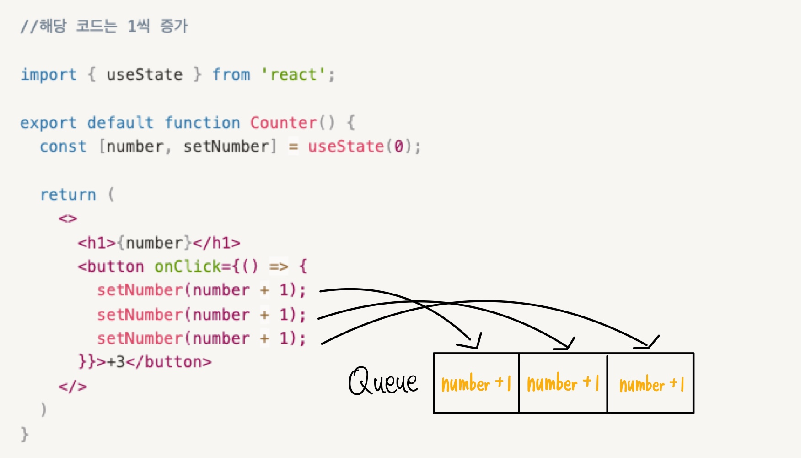
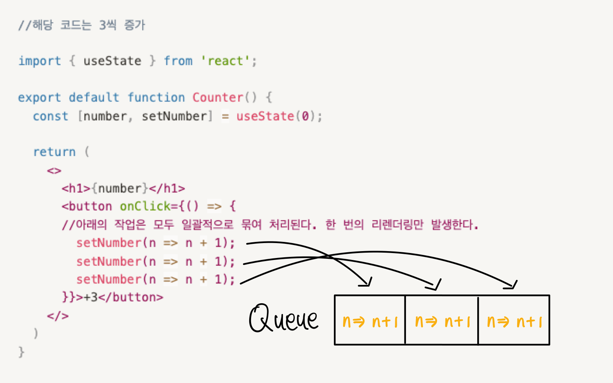

# Automatic Batching

- creatRoot와 함께 도입되었다.

## Batching

> React가 더 나은 성능을 위해 여러 개의 state 업데이트를 한 번에 리렌더링으로 묶어서 진행하는 것

### **예제 1**

```jsx
//해당 코드는 1씩 증가

import { useState } from 'react';

export default function Counter() {
  const [number, setNumber] = useState(0);

  return (
    <>
      <h1>{number}</h1>
      <button
        onClick={() => {
          setNumber(number + 1);
          setNumber(number + 1);
          setNumber(number + 1);
        }}
      >
        +3
      </button>
    </>
  );
}
```

### 예제 2

```jsx
//해당 코드는 3씩 증가

import { useState } from 'react';

export default function Counter() {
  const [number, setNumber] = useState(0);

  return (
    <>
      <h1>{number}</h1>
      <button
        onClick={() => {
          //아래의 작업은 모두 일괄적으로 묶여 처리된다. 한 번의 리렌더링만 발생한다.
          setNumber((n) => n + 1);
          setNumber((n) => n + 1);
          setNumber((n) => n + 1);
        }}
      >
        +3
      </button>
    </>
  );
}
```

예제 1 코드와 예제 2 코드 모두 버튼 클릭 시 3씩 증가하도록 useState를 사용해 작성하였다.

그러나 예제2 코드는 잘 동작하는 반면, 예제1 코드는 비동기처럼 마지막 setNumber만 실행된 것처럼 보여진다.

이러한 이유는 무엇일까?

이러한 이유는 batch에 존재한다.

### **동작**

1. 리액트는 이벤트 핸들러에 있는 다른 코드를 모두 실행하고, 해당 함수를 **리액트 큐**에 넣는다
2. 다음 렌더링에, 리액트는 큐를 모두 확인하고, **마지막으로 업데이트된 상태**를 준다

### **눈으로 보기**

**예제 1**



**예제 2**



### **동작 코드**

```jsx
export function getFinalState(baseState, queue) {
  let finalState = baseState;

  for (let update of queue) {
    if (typeof update === 'function') {
      finalState = update(finalState);
    } else finalState = update;
  }

  return finalState;
}
```

### **다른 예시**

```jsx
import { useState } from 'react';

export default function Counter() {
  const [number, setNumber] = useState(0);

  return (
    <>
      <h1>{number}</h1>
      <button
        onClick={() => {
          setNumber(number + 9);
          setNumber(number + 5);
          setNumber((n) => n + 1);
        }}
      >
        Increase the number
      </button>
    </>
  );
}
```

1. setNumber(number + 9)

   ⇒ number에 9를 더한 값으로 바꾸기

2. setNumber(number + 5)

   ⇒ number에 5를 더한 값으로 바꾸기

3. setNumber(n => n + 1)

   ⇒ 이전 큐에 있는 값에서 1을 더하기

   ⇒ (number + 5) +1

결과 : 6

## Automatic Batching을 사용하고 싶지 않다면?

### flushSync

- react-dom 라이브러리에 추가된 메서드로 **Auto Batching 을 무시하고** 즉시 DOM을 렌더링해준다.
- 공식문서에 따르면 성능이 크게 저하될 수 있으므로, 해당 메서드의 사용을 추천하진 않으며 (de-opt case), 필요한 상황이 있을 경우에만 사용할 것을 강조했다.

```jsx
import { flushSync } from 'react-dom';

function handleClick() {
  // React 는 flushSync 메서드가 실행되는 즉시 DOM을 업데이트 한다.
  flushSync(() => {
    setCounter((c) => c + 1);
  });
  // React 는 flushSync 메서드가 실행되는 즉시 DOM을 업데이트 한다.
  flushSync(() => {
    setFlag((f) => !f);
  });
}

// 따라서 해당 함수가 실행될 경우 React는 총 두 번의 리렌더링을 수행한다.
```

### 출처

https://react.dev/learn/state-as-a-snapshot

https://react.dev/learn/queueing-a-series-of-state-updates#challenges

https://react.dev/reference/react-dom/flushSync
